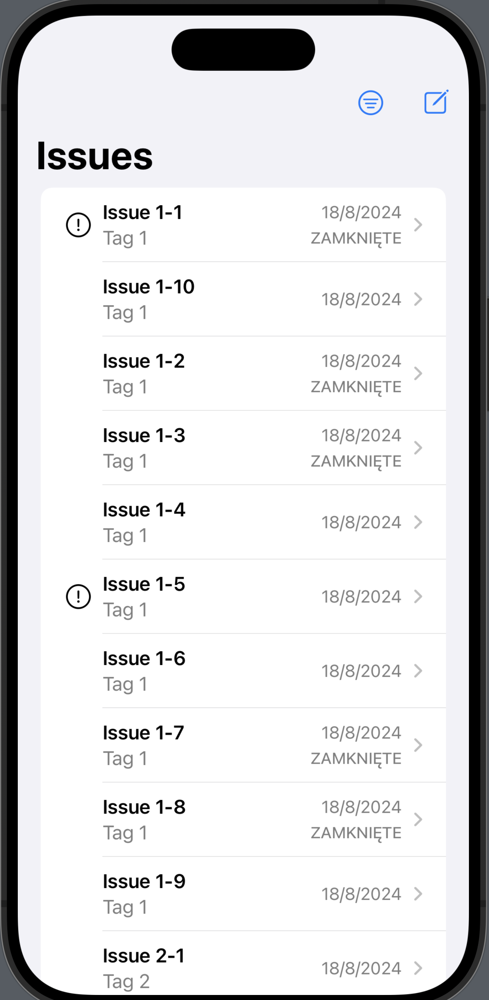
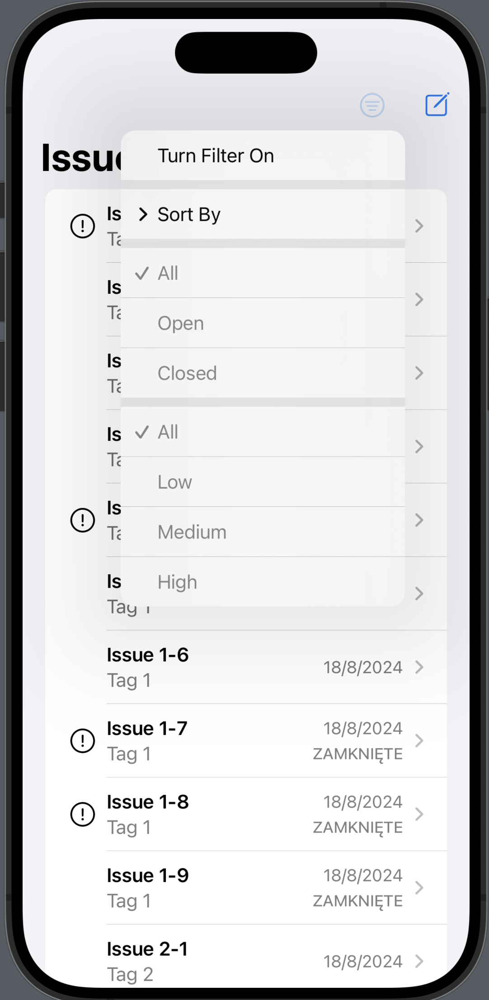
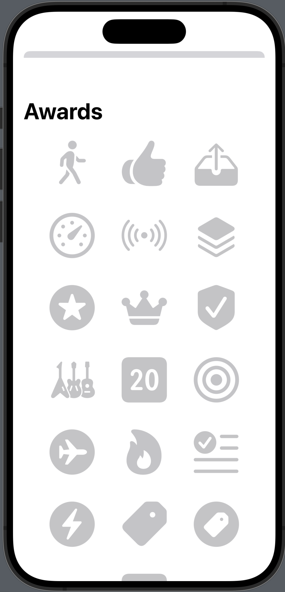

# Ultimate Portfolio CoreData

Tłumaczenie kursu 

https://www.hackingwithswift.com/plus/ultimate-portfolio-app/ultimate-portfolio-app-introduction


## 1. Aplikacja Ultimate Portfolio: Wprowadzenie

Chociaż jestem pewien, że chcesz natychmiast rozpocząć programowanie, daj mi kilka minut na przedstawienie celów tego kursu i wyjaśnienie, dlaczego różni się on od innych kursów, które napisałem.

### Szybkie linki
Najważniejsze kroki
Jedna aplikacja, krok po kroku
Co Cię interesuje?
Co jest potrzebne
Wydawanie w ratach
O naszej aplikacji

### Najważniejsze kroki
Zaraz wyjaśnię kilka rzeczy na temat tego kursu, ale jeśli jesteś niecierpliwy, oto zestaw kroków, które musisz absolutnie wykonać:

1. Uruchom Xcode. Potrzebujesz co najmniej Xcode 14.2, aby podążać za kursem.
2. Stwórz nowy projekt.
3. Wybierz zakładkę „Multiplatform” i szablon „App”.
4. Nazwij swój projekt – ja nazwałem mój „UltimatePortfolio”, ale to Twój projekt, więc nazwij go, jak chcesz.
   

Uwaga: Ponieważ mój projekt nazywa się UltimatePortfolio, mój główny plik Swift będzie nosił nazwę UltimatePortfolioApp.swift. Kiedy zobaczysz odniesienie do UltimatePortfolioApp.swift, powinieneś oczywiście otworzyć odpowiedni plik w swoim projekcie – ten, który ma @main przed strukturą App.

Proszę, nie zaznaczaj opcji „Use Core Data” ani „Include Tests”. Zrobimy to ręcznie, abyś dokładnie widział, jak to działa.

Po kliknięciu „Next” zostaniesz zapytany, gdzie zapisać projekt. Zostaniesz również zapytany, czy chcesz włączyć kontrolę wersji dla tego projektu – jeśli czujesz się komfortowo z używaniem kontroli wersji w Xcode, możesz zaznaczyć to pole, ale jeśli nie, krótko pokażę, jak używać Gita w terminalu, aby chronić swój kod.

To absolutne minimum, które musisz zrobić, aby rozpocząć projekt. W dalszej części tego artykułu przeprowadzę Cię przez plan tego, co będziemy robić – ponownie zalecam, abyś podążał krok po kroku!

### Jedna aplikacja, krok po kroku
Wiele tutoriali, które piszę, uczy kilku specyficznych rzeczy na raz, często osadzonych w projekcie aplikacji. Sama aplikacja jest wystarczająco miła, ponieważ pozwala zobaczyć kod w kontekście rzeczywistym, ale nie jest celem tutoriali – celem jest nauczenie Cię Core Data, haptyki lub czegoś innego, a aplikacja jest tylko dodatkowym elementem.

Ten kurs jest zupełnie inny, ponieważ będziemy budować tylko jedną aplikację przez cały czas. A zamiast tego, aby aplikacja była czymś przypadkowym w końcowym rezultacie, tym razem aplikacja jest rdzeniem kursu, ponieważ naszym celem jest stworzenie świetnego przykładu wielu różnych aspektów tworzenia aplikacji, a także czegoś, z czego będziesz dumny, umieszczając to na GitHubie jako część swojego portfolio.

To oznacza dwie rzeczy. Po pierwsze, oznacza to, że będziemy obejmować szeroki zakres tematów: ważne frameworki, takie jak SwiftUI i Core Data, różne integracje systemowe, takie jak Widgety, StoreKit i Spotlight, a także dobre praktyki programistyczne, takie jak testowanie, architektura, lokalizacja, organizacja projektów i dostępność.

Po drugie, oznacza to, że ważne jest, abyś zrozumiał, jak wszystko się ze sobą łączy, więc będziemy dużo mówić o tym, dlaczego coś robimy, a nie tylko jak – zabiorę Cię na kilka błędnych ścieżek, abyś mógł zobaczyć, gdzie leżą problemy, a następnie pokażę, jak je rozwiązać. Mam nadzieję, że to oznacza, że kiedy będziesz rozmawiać o swoim projekcie z pracodawcą, będziesz w stanie udzielić jasnych, poprawnych odpowiedzi na temat wyborów, które podjęliśmy.

Naszym celem nie jest stworzenie fantazyjnego interfejsu użytkownika, który wygląda świetnie na zrzutach ekranu, ale pokazanie, że rozumiesz, co jest potrzebne do stworzenia solidnego, niezawodnego oprogramowania. Oczywiście chcę, abyś stworzył coś, co wygląda dobrze, ale co ważniejsze w tym kursie, chcę, abyś stworzył coś, co działa dobrze – co pokazuje, że można na Tobie polegać przy tworzeniu ważnego, skomplikowanego kodu Swift.

Nic z tego nie powinno powstrzymać Cię przed zabawą z dostosowywaniem projektu tak bardzo, jak chcesz, po prostu nie będzie to moim priorytetem.

### Co Cię interesuje?
Ten kurs podzielony jest na trzy sekcje:

1. Budowanie rdzenia aplikacji, gdzie zajmiemy się SwiftUI, Core Data, architekturą, testowaniem, dostępnością, dokumentacją, siecią, lokalizacją i więcej.
2. Integracja z systemem, gdzie przyjrzymy się StoreKit, Core Spotlight, widgetom, powiadomieniom, haptyce i więcej.
3. Projektowanie dla każdej platformy, gdzie rozszerzymy naszą bazową aplikację iOS, aby działała równie dobrze na macOS i watchOS.

Tylko pierwsza sekcja jest wymagana. Ważne jest, aby każdy przeszedł przez pierwszą sekcję w całości i w odpowiedniej kolejności, ponieważ tam budujemy rdzeń naszej aplikacji.

Po ukończeniu pierwszej sekcji możesz przejść dowolną lub wszystkie z sekcji 2 lub 3, w dowolnej kolejności – są one wszystkie opcjonalne i w dużej mierze samodzielne. To jest miejsce, gdzie kurs staje się bardziej zabawny, ponieważ możesz dostosować swoją aplikację do portfolio, aby pasowała do tego, co Cię interesuje, i oznacza to również, że Twoja aplikacja będzie unikalna, ponieważ skupia się na rzeczach, na których Ci zależy.

Teraz, pierwsza sekcja jest zupełnie inna niż wszystko, co wcześniej nauczałem, ponieważ, jak zobaczysz, prowadzi to do fascynującego crescendo złego kodu. W moich regularnych tutorialach próbowałbym albo wprowadzić najlepsze praktyki po drodze, albo dostarczyć skrót, ponieważ ciągłe powtarzanie tego samego może być dość nużące.

Tutaj jednak zaczniemy od budowania dość naiwnej wersji aplikacji – bez testów, bez dokumentacji, bez lokalizacji, bez rzeczywistej struktury projektu i tak dalej. To wyprodukuje całkowicie użyteczną aplikację, którą mogłbyś wysłać do App Store, jeśli byś chciał, ale nie będzie to rodzaj aplikacji, która otrzyma pochwały, gdy będziesz o niej mówił podczas rozmowy kwalifikacyjnej.

Ale potem, gdy aplikacja będzie już zbudowana, zaczniemy ją krok po kroku naprawiać. Nie tylko pozwoli to na posiadanie aplikacji, która ma na przykład świetną internacjonalizację, ale również pokaże techniki potrzebne do zapewnienia świetnej internacjonalizacji w każdej aplikacji.

### Co jest potrzebne
Cały kurs został napisany przy użyciu Xcode 14 dla iOS 16, macOS Ventura i watchOS 9, ale powinien działać świetnie na przyszłych wersjach. Zaleca się posiadanie aktywnego konta w Programie Deweloperskim Apple, ale nie jest to konieczne poza czymś takim jak StoreKit.

Gorąco polecam zapisywanie swojej pracy w repozytorium kodu źródłowego, takim jak GitHub, po zakończeniu każdego kroku. Nie musi to być publiczne repozytorium; gdziekolwiek możesz umieścić kod, aby go zabezpieczyć, to dobry pomysł. Pokażę to raz, abyś mógł zobaczyć, jak to wygląda, ale później to już zależy od Ciebie.

Jeśli chodzi o Twoje umiejętności, chociaż będę wyjaśniał każdy krok naszego kodu po drodze, gorąco polecam ukończenie mojego kursu „100 Days of SwiftUI” przed rozpoczęciem, ponieważ moim celem nie jest omawianie wszystkich podstaw SwiftUI. Zamiast tego skupię się na bardziej interesujących rzeczach – dlaczego pewne wybory mają sens, jak dobrze strukturują kod i tak dalej.

### Wydawanie w ratach
To pierwszy raz, kiedy piszę kurs w odcinkach, więc to dla mnie prawdziwa przygoda. Oczywiście niektóre części kursu są znacznie łatwiejsze niż inne, więc dokładny harmonogram wydawniczy może się nieco zmieniać, ale to mój cel.

To oznacza, że mogę potrzebować wydać poprawki w trakcie kursu, na podstawie mojej zmiany zdania lub opinii czytelników. Oczywiście mam nadzieję, że to się nie zdarzy, ale

## 2 Projektowanie świetnego modelu

Prawie zawsze kluczem do uzyskania świetnej aplikacji jest uzyskanie świetnego modelu danych - decydowanie tak wcześnie, jak to możliwe, jakie dane chcesz przechowywać i jak każdy element odnosi się do innych elementów. Więc, zagłębimy się od razu w Core Data!

### Szybkie linki
Podstawy naszych danych
Zarządzanie dostępem do danych
Podstawy naszych danych

### Podstawy naszych danych
Naprawdę wierzę, że ważne jest prawidłowe zbudowanie modeli danych i dostępu do nich już na początku tworzenia aplikacji. Tak, często muszę z czasem doskonalić swoje modele i kod, ale nadal staram się na początku ustawić fundamenty. Nie będę udawać, że ta praca jest szczególnie ekscytująca, bo nie jest! Jednak jest ważna i daje nam solidną podstawę do budowy reszty naszej aplikacji.

Tworzymy aplikację do śledzenia błędów w kodzie, więc naszym najważniejszym typem danych jest konkretne zagadnienie, które chcemy śledzić. Na przykład, możemy zgłosić błąd dotyczący uszkodzonej funkcji w naszej aplikacji, ale gdybyś tworzył tę aplikację jako narzędzie do zarządzania listą zadań, byłoby to ogólne zadanie do wykonania, takie jak „podaj psom smakołyki”.

Jednak posiadanie wielu luźnych zagadnień sprawiłoby, że nasza aplikacja byłaby trudna w użyciu, ponieważ łatwo można by coś zgubić. Dlatego pozwolimy użytkownikowi tworzyć tagi i dołączać je do swoich zagadnień. Umożliwia to filtrowanie po konkretnym tagu, co znacznie ułatwia znajdowanie danych w aplikacji.

Zaczniemy więc od stworzenia nowego modelu danych, który będzie reprezentował te dwa elementy danych. Naciśnij Cmd+N, aby utworzyć nowy plik, a następnie wybierz Data Model i nazwij go Main.xcdatamodeld.

Już powiedziałem, że potrzebujemy dwóch odrębnych typów danych, więc dodaj dwie encje, nazywając pierwszą Issue, a drugą Tag. To informuje Core Data, że chcemy przechowywać zagadnienia i tagi jako osobne typy danych.

Następnie dodamy kilka atrybutów do każdego z nich, zaczynając od Issue. Co powinno mieć jedno zagadnienie? Oto kilka rzeczy, które przychodzą na myśl:

- Tytuł, który jest główną nazwą tego zagadnienia. Na przykład, możemy mieć tytuły takie jak „Napraw błąd VoiceOver na ekranie konta”.
- Opcjonalne dodatkowe szczegóły, dostarczające dodatkowego kontekstu dla zagadnienia, jeśli jest to potrzebne. Kontynuując przykład z VoiceOver, może to być „Gdy VoiceOver jest włączony, przycisk Zamknij jest nieprawidłowo odczytywany” lub podobne.
- Informacja o tym, jak ważne jest to zagadnienie w porównaniu z innymi. Na przykład, naprawa błędu VoiceOver prawdopodobnie będzie miała wysoki priorytet, podczas gdy naprawa niewłaściwego koloru może mieć niższy priorytet.
- Czy zagadnienie jest uznawane za zamknięte, czy nie, aby było jasne, jakie prace są nadal w toku.
- Kiedy zagadnienie zostało utworzone i zmodyfikowane, abyśmy mogli utrzymać zagadnienia w sensownej kolejności.

Możemy to mniej więcej wszystko umieścić bezpośrednio w Core Data jako atrybuty encji Issue. Atrybuty encji są podobne do właściwości w strukturach, chociaż jak zobaczysz, Core Data ma bardzo specyficzne wyobrażenie o tym, jak powinny wyglądać jego dane.

Upewnij się, że Issue jest zaznaczone na liście encji, a następnie kliknij mały przycisk + pod Atrybutami sześć razy. To doda sześć atrybutów, każdy z typem Undefined, ale zmień je na następujące:

- „title” z typem String.
- „content” z typem String.
- „priority” z typem Integer 16.
- „completed” z typem Boolean.
- „creationDate” z typem Date.
- „modificationDate” z typem Date.

Większość z tych atrybutów jest jasna, ale zauważ, że musimy być precyzyjni, jeśli chodzi o rodzaj całkowity, który przechowujemy w Core Data – nie ma prostego typu „Integer”, który mapuje na Int w Swift, ponieważ to by się różniło między platformami. Zamiast tego używamy Integer 16, co odpowiada Int16 w Swift, co jest najmniejszym rozmiarem, jaki możemy wybrać.

Oczywiście, chcielibyśmy tutaj przechowywać enum, ale nie jest to możliwe w Core Data, chyba że naprawdę zgłębisz jego wewnętrzne mechanizmy. Zamiast tego użyjemy pola „priority”, aby reprezentowało wartości od 0 (niski priorytet) do 2 (wysoki priorytet).

To kończy naszą encję Issue, więc teraz wybierz encję Tag. Jeśli pamiętasz, są to sposób grupowania powiązanych zagadnień, więc potrzebują tylko dwóch atrybutów: unikalnego identyfikatora i nazwy tagu. Dodaj nowy atrybut o nazwie „id” z typem UUID, a następnie kolejny atrybut o nazwie „name” z typem String – gotowe!

Prawie skończyliśmy z Core Data, ale są trzy dodatkowe rzeczy, które chciałbym zrobić.

Po pierwsze, atrybut modificationDate zagadnień powinien zawsze być ustawiony na czas ostatniej modyfikacji danego zagadnienia. Moglibyśmy to aktualizować sami, ale to zarówno uciążliwe, jak i łatwe do pomyłki. Lepszym pomysłem jest uczynienie tego atrybutu atrybutem pochodnym, który poprosi Core Data o automatyczne obliczenie jego wartości.

Aby to zrobić, wybierz modificationDate z listy atrybutów, otwórz inspektor modelu danych i zaznacz pole „Derived”. Pojawi się nowe pole tekstowe „Derivation”, w którym decydujemy, jak Core Data powinna automatycznie ustawić wartość tego atrybutu. Wpisz teraz() w tym polu, co mówi Core Data, aby użyła aktualnego czasu dla tego pola, aktualizując go za każdym razem, gdy zapisujemy zmiany dla tego obiektu.

Drugą rzeczą, którą zmienimy, jest powiedzenie Core Data, że chcemy, aby ten model danych był używany z CloudKit. Wymaga to kilku kroków, ale teraz ważne jest tylko jedno: musisz wybrać „Default” pod Konfiguracjami, a następnie użyć inspektora modelu danych, aby zaznaczyć pole „Used with CloudKit”.

Trzecią rzeczą, którą chciałbym zmienić, jest powiedzenie Core Data, że każde zagadnienie może mieć wiele tagów, a także każdy tag może mieć wiele zagadnień. Nazywa się to relacją i pozwala Core Data wykonać mnóstwo pracy za nas.

Aby utworzyć relację między zagadnieniami a tagami, najpierw upewnij się, że encja Issue jest zaznaczona, a następnie kliknij mały przycisk + pod nagłówkiem Relationships. Nowa relacja będzie miała domyślną nazwę „relationship”, ale proszę zmień jej nazwę na „tags”. Dla Destinacji zmień „No Value” na „Tag”.

Mam nadzieję, że nadal masz otwarty inspektor modelu danych, ponieważ musimy dokonać jednej małej zmiany w tej nowej relacji: gdzie jest napisane „Type: To One”, zmień to na „To Many”. To mówi Core Data, że jedno zagadnienie może mieć wiele dołączonych tagów.

Teraz, gdy powiedzieliśmy Core Data, że każde zagadnienie ma wiele tagów, możemy utworzyć odwrotną relację w encji Tag – „każdy tag ma wiele zagadnień”. Pozwala to nam na odczytanie zagadnień dla danego tagu, ale także znalezienie tagu, który jest dołączony do danego zagadnienia; możemy poruszać się po naszych danych w obu kierunkach.

Wybierz encję Tag i kliknij + pod Relationships. Nazwij tę relację „issues”, ustaw jej Destinację na Issue, a następnie zmień Inverse na „tags”. Zmień także jej Type na „To Many”, ponieważ każdy tag może mieć wiele zagadnień.

I to wszystko, jeśli chodzi o nasz model danych Core Data – nie musimy teraz robić nic więcej, ponieważ powiedzieliśmy systemowi wszystko, co powinien wiedzieć o naszym modelu danych.

### Zarządzanie dostępem do danych
Nasz model danych Core Data jest kompletny, więc kolejnym krokiem jest napisanie kodu, który pozwoli nam na dostęp  do tych danych w prosty, spójny sposób w całej aplikacji.

To często miejsce, w którym ludzie chcą używać singletonów – prosty wzorzec projektowy, który tworzy jedną instancję typu podczas uruchamiania aplikacji i ogranicza resztę kodu do korzystania z tej wspólnej instancji.

Singletony są szeroko używane na platformach Apple i często mają sens – jest singleton UIDevice, ponieważ to urządzenie, z którego korzystasz teraz, jest singleton UIApplication, ponieważ to aplikacja, która działa teraz, i tak dalej.

Jednak chociaż singletons są powszechne i często mają sens, mają ogromną wadę – są trudniejsze do testowania. Jeśli wszyscy dzielą to samo miejsce przechowywania danych, trudniej jest zapewnić czystą kartę za każdym razem, gdy test jest uruchamiany.

Dlatego stworzymy nową klasę o nazwie DataController, która będzie odpowiedzialna za konfigurację Core Data i obsługę większości naszych interakcji z nim.

Naciśnij Cmd+N, aby utworzyć nowy plik. Tym razem wybierz Swift File i nazwij go DataController.swift. Na początku będzie miał prosty import Foundation, ale zmień to, aby importować Core Data:

```swift
import CoreData
```

Ten kontroler danych będzie ewoluował z czasem, aby mieć różne zdolności do manipulowania danymi, ale na początek interesuje nas ładowanie niektórych danych Core Data, tworzenie przykładowych danych, abyśmy mieli coś do obejrzenia, usuwanie niechcianych danych i oczywiście zapisywanie tych zmian, aby zostały zachowane.

To wymaga kilku kroków, więc rozłóżmy to na małe części, zaczynając od samej definicji klasy. Dodaj to do DataController.swift:

```swift
class DataController: ObservableObject {
    let container: NSPersistentCloudKitContainer
}
```

Zrobiłem to, aby konformowało do ObservableObject, więc każda widok SwiftUI może tworzyć instancję i obserwować ją, jeśli to konieczne. Dałem również jedno właściwości, która jest instancją NSPersistentCloudKitContainer. Jest ona odpowiedzialna za ładowanie i zarządzanie lokalnymi danymi za pomocą Core Data, ale także synchronizację tych danych z iCloud, aby wszystkie urządzenia użytkownika mogły dzielić te same dane dla naszej aplikacji.

Pierwszą rzeczą, którą dodamy do DataController, jest inicjalizator, który będzie ładować ten „Main” model danych, który zdefiniowaliśmy wcześniej. Jednak dodamy trochę elastyczności: aby łatwiej było przeglądać dane, dodamy boolean inMemory przy tworzeniu kontrolera danych. Gdy jest ustawiony na true, będziemy tworzyć dane całkowicie w pamięci, a nie na dysku, co oznacza, że znikną one, gdy aplikacja się zakończy – to świetne do przeglądania w SwiftUI, ale także pomocne do pisania testów.

Gdy skonfigurujemy nasz kontener Core Data, możemy go załadować, wywołując loadPersistentStores(). To załaduje faktyczną bazę danych na dysku lub stworzy ją, jeśli jeszcze nie istnieje, ale jeśli to się nie uda, nie mamy innego wyboru, jak tylko zakończyć działanie – coś jest bardzo poważnie nie tak!

Dodaj ten inicjalizator do DataController:

```swift
init(inMemory: Bool = false) {
    container = NSPersistentCloudKitContainer(name: "Main")

    if inMemory {
        container.persistentStoreDescriptions.first?.url = URL(filePath: "/dev/null")
    }

    container.loadPersistentStores { storeDescription, error in
        if let error {
            fatalError("Fatal error loading store: \(error.localizedDescription)")
        }
    }
}
```

Następnie napiszemy metodę createSampleData(), która utworzy kilka zagadnień i tagów. Jest to przydatne tylko do testowania i przeglądania, ale naprawdę się przydaje.

Jeśli nigdy wcześniej nie używałeś Core Data, to tutaj Xcode robi coś całkiem genialnego: ponieważ zdefiniowaliśmy encje o nazwach Issue i Tag, Xcode automatycznie wygeneruje klasy o nazwach Issue i Tag dla nas do użycia, z właściwościami odpowiadającymi wszystkim zdefiniowanym atrybutom. Co więcej, gdy tworzysz instancje tych klas za pomocą naszego stosu Core Data, mogą być one ładowane i zapisywane prawie automatycznie – to ogromna oszczędność czasu.

Dodaj teraz tę metodę do DataController:

```swift
func createSampleData() {
    let viewContext = container.viewContext

    for i in 1...5 {
        let tag = Tag(context: viewContext)
        tag.id = UUID()
        tag.name = "Tag \(i)"

        for j in 1...10 {
            let issue = Issue(context: viewContext)
            issue.title = "Issue \(i)-\(j)"
            issue.content = "Description goes here"
            issue.creationDate = .now
            issue.completed = Bool.random()
            issue.priority = Int16.random(in: 0...2)
            tag.addToIssues(issue)
        }
    }

    try? viewContext.save()
}
```

Kilka rzeczy, na które chcę zwrócić uwagę, zanim przejdziemy dalej.

Po pierwsze, ten widok kontekstu jest bardzo ważnym pojęciem w Core Data, ponieważ to on jest praktycznie pulą danych załadowanych z dysku. Już stworzyliśmy i załadowaliśmy nasz magazyn trwały, który jest podstawowymi danymi bazowymi istniejącymi w długoterminowej pamięci, ale ten widok kontekstu przechowuje wszystkie aktywne obiekty w pamięci podczas pracy z nimi i zapisuje je z powrotem do magazynu trwałego, gdy o to poprosimy.

Po drugie, gdy tworzymy instancje Issue i Tag, musimy powiedzieć im, w którym kontekście widoku się znajdują. To pozwala Core Data śledzić, gdzie zostały utworzone, więc wie, gdzie je później zapisać.

Po trzecie, nadałem tagom i zagadnieniom sensowne przykładowe dane, abyśmy mogli lepiej zobaczyć, jak nasz kod działa, gdy są one wyświetlane później w naszym interfejsie użytkownika.

I wreszcie, gdy wszystkie przykładowe obiekty zostaną utworzone, wywołujemy save() na naszym kontekście widoku, co mówi Core Data, aby zapisała wszystkie te nowe obiekty do trwałego magazynu. Może to być w pamięci, co oznacza, że nie przetrwa długo, ale może to być także magazyn trwały, co oznacza, że będzie trwał tak długo, jak długo nasza aplikacja jest zainstalowana, a nawet zsynchronizuje się z iCloud, jeśli użytkownik ma aktywne konto iCloud.

Teraz, gdy mamy przykładowe dane do pracy, możemy zbudować gotowy kontroler danych, odpowiedni do przeglądania widoków SwiftUI. Dodaj tę statyczną właściwość do DataController:

```swift
static var preview: DataController = {
    let dataController = DataController(inMemory: true)
    dataController.createSampleData()
    return dataController
}()
```

Zanim skończymy na teraz, chcę dodać jeszcze trzy metody do naszego kontrolera danych – dwie łatwe i jedną bardziej złożoną.

Pierwsza to sposób na zapisywanie zmian, aby jeśli jakaś inna część naszej aplikacji wprowadziła zmiany w naszych danych, mogła je zapisać na dysku. Moglibyśmy po prostu przekazać to bezpośrednio do kontekstu widoku, ale lepszym pomysłem jest robić to tylko wtedy, gdy są jakieś zmiany do zapisania, w przeciwnym razie będziemy zmuszać Core Data do niepotrzebnej pracy.

Dodaj teraz tę metodę do DataController:

```swift
func save() {
    if container.viewContext.hasChanges {
        try? container.viewContext.save()
    }
}
```

Druga łatwa metoda to usunięcie jednego konkretnego zagadnienia lub tagu z naszego kontekstu widoku. Można to bezpośrednio przekazać do metody delete() kontekstu widoku, a w rzeczywistości możemy to zrobić wszystko w jednej metodzie, ponieważ wszystkie klasy Core Data (w tym wygenerowane przez Xcode klasy Issue i Tag) dziedziczą po klasie nadrzędnej o nazwie NSManagedObject.

Dodaj teraz tę metodę delete() do DataController:

```swift
func delete(_ object: NSManagedObject) {
    objectWillChange.send()
    container.viewContext.delete(object)
    save()
}
```

Ostatni kod, który chcę dodać do DataController w tej chwili, to obsługa usuwania wszystkich naszych danych, która będzie wywoływana razem z createSampleData(), abyśmy mogli natychmiast zniszczyć zawartość naszej bazy danych. Ponownie, jest to tylko do celów testowych, ale naprawdę dobrze mieć taką strukturę testową, aby nie trzeba było ciągle dodawać i usuwać danych ręcznie podczas kodowania.

Ta metoda musi używać zapytania fetch request, aby znaleźć i usunąć wszystkie zagadnienia, co wymaga trzech kroków:

1. Używanie metody fetchRequest() na Issue, która jest automatycznie generowana przez Xcode. Mówi to Core Data, aby szukała zagadnień, bez określania jakiegokolwiek filtra.
2. Owijanie tego zapytania fetch request w zapytanie batch delete request, które mówi Core Data, aby usunęła wszystkie obiekty, które pasują do zapytania – tj. wszystkie zagadnienia.
3. Wykonanie tego zapytania batch delete request na naszym kontekście widoku.

Po tym możemy powtórzyć to samo dla tagów, aby po wykonaniu tej metody wszystkie zagadnienia i tagi zostały usunięte.

Jest tu jeden problem, który polega na tym, że uruchamianie zapytania batch delete request wymaga bardzo precyzyjnego kodu: musimy odczytać identyfikatory Core Data każdego usuniętego obiektu, a następnie połączyć je z naszym żywym kontekstem widoku. Szczerze mówiąc, jest to więcej pracy, niż można by się spodziewać, ale jeśli zawiniemy to w nową metodę delete(), przynajmniej stanie się ona ponownie używalna.

Dodaj tę nową metodę do DataController teraz:

```swift
private func delete(_ fetchRequest: NSFetchRequest<NSFetchRequestResult>) {
    let batchDeleteRequest = NSBatchDeleteRequest(fetchRequest: fetchRequest)
    batchDeleteRequest.resultType = .resultTypeObjectIDs

    if let delete = try? container.viewContext.execute(batchDeleteRequest) as? NSBatchDeleteResult {
        let changes = [NSDeletedObjectsKey: delete.result as? [NSManagedObjectID] ?? []]
        NSManagedObjectContext.mergeChanges(fromRemoteContextSave: changes, into: [container.viewContext])
    }
}
```

Jak już mówiłem, to wymaga więcej pracy, niż można by się spodziewać:

- Specjalnie prosimy zapytanie batch delete request, aby zwróciło wszystkie identyfikatory obiektów, które zostały usunięte.
- Ta tablica identyfikatorów obiektów trafia do słownika z kluczem NSDeletedObjectsKey, z domyślną pustą tablicą, jeśli nie można jej odczytać.
- Ten słownik trafia do metody mergeChanges(), która aktualizuje nasz kontekst widoku zmianami, które właśnie wprowadziliśmy do magazynu trwałego.

Oznaczyłem tę metodę jako prywatną, ponieważ będziemy jej używać tylko w jednym miejscu: w naszej metodzie testowej, aby usunąć wszystkie przechowywane zagadnienia i tagi. Dodaj tę ostatnią metodę do DataController teraz:

```swift
func deleteAll() {
    let request1: NSFetchRequest<NSFetchRequestResult> = Tag.fetchRequest()
    delete(request1)

    let request2: NSFetchRequest<NSFetchRequestResult> = Issue.fetchRequest()
    delete(request2)

    save()
}
```

Dodamy więcej do DataController później, ale na razie to wystarczy.

Oczywiście, chcemy używać tego kontrolera danych, gdy nasza aplikacja SwiftUI się uruchamia, i możemy to zrobić w UltimatePortfolioApp.swift – pamiętaj, że twój własny plik @main będzie miał tę samą nazwę, co wybrałeś dla swojego projektu.

Praktycznie cała nasza aplikacja potrzebuje dostępu do instancji DataController, więc chcemy ją utworzyć, gdy nasza aplikacja się uruchamia, i umieścić ją w środowisku SwiftUI, aby można było ją odczytać później, gdy będzie to potrzebne.

To wymaga czterech kroków. Po pierwsze, stwórz właściwość w strukturze App, aby przechowywać kontroler danych:

```swift
@StateObject var dataController = DataController()
```

To oznacza, że nasza aplikacja utworzy i będzie posiadać kontroler danych, zapewniając, że pozostanie on aktywny przez cały czas działania naszej aplikacji.

Po drugie, musimy wysłać kontekst widoku naszego kontrolera danych do środowiska SwiftUI za pomocą specjalnego klucza o nazwie .managedObjectContext. To dlatego, że za każdym razem, gdy SwiftUI chce zapytać Core Data, musi wiedzieć, gdzie szukać wszystkich danych, więc to efektywnie łączy Core Data z SwiftUI.

Jednak zanim to dodamy, chcę dodać, że czwartą rzeczą do zrobienia jest wysłanie całego naszego kontrolera danych, aby każda część naszego własnego kodu mogła manipulować danymi.

Wspominam o nich razem, ponieważ oba są modyfikatorami, które trzeba dodać poniżej ContentView, tak:

```swift
ContentView()
    .environment(\.managedObjectContext, dataController.container.viewContext)
    .environmentObject(dataController)
```

To nasz model danych Core Data i kod Swift całkowicie ukończone, ale jest jeszcze jedna rzecz, zanim przejdziemy dalej: jeśli faktycznie chcesz, aby twoje informacje Core Data synchronizowały się między urządzeniami, musisz dokonać małej konfiguracji zarówno na swoich urządzeniach, jak i w Xcode.

Na swoich urządzeniach, główną rzeczą, którą musisz zrobić, jest upewnienie się, że są zalogowane do iCloud za pomocą tego samego konta. To działa najlepiej na fizycznych urządzeniach, ale można uzyskać ograniczone wsparcie także w symulatorze – może się okazać, że zmiany zostaną zapisane w iCloud płynnie, ale nie pokażą zdalnych zmian, dopóki nie ponownie uruchomisz aplikacji.

Ważne: Na wypadek, gdybyś przegapił to i myślał, że twój kod jest uszkodzony: iCloud w symulatorze jest naprawdę niespójny w porównaniu do rzeczywistych urządzeń i często znajdziesz dłuższe opóźnienia w synchronizacji lub może brak synchronizacji w ogóle. Jeśli możesz, użyj prawdziwego urządzenia, aby uzyskać najlepsze rezultaty!

Aby sprawdzić konfigurację iCloud na iOS, powinieneś uruchomić aplikację Ustawienia, a następnie dotknąć „Zaloguj się do swojego iPhone'a” na górze. Nie musisz łączyć wszystkich swoich danych w symulatorze; wystarczy, że jesteś zalogowany do iCloud.

Jeśli chodzi o konfigurację w Xcode, musimy poprosić o dostęp do iCloud za pomocą frameworka `CloudKit` firmy Apple. Robi się to, przechodząc do ustawień swojego celu w Xcode, wybierając kartę `Signing & Capabilities`, a następnie naciskając „+ Capability”. Zobaczysz wiele opcji, ale chciałbym, abyś wybrał dwie – najpierw „`iCloud`”, abyśmy mogli wysyłać i odbierać dane z chmury Apple, a po drugie „`Background Modes`”, aby iCloud mógł automatycznie wysyłać i odbierać dane synchronizacji.

Oba te wymagają trochę dostosowania. W przypadku Background Modes, to jest tak proste, jak zaznaczenie pól oznaczonych „**`Remote notifications`**” i „**`Background fetch`**” – pozwala to iCloud na ciche aktualizacje danych w tle.

Jeśli chodzi o iCloud, chciałbym, abyś zaznaczył pole oznaczone `**CloudKit**`, które jest API firmy Apple do wysyłania i odbierania danych naszego wyboru – w tym przypadku obiektów Core Data. CloudKit musi wiedzieć, gdzie w naszym koncie deweloperskim chcemy przechowywać dane, a to robi się za pomocą kontenerów. Powinieneś kliknąć znak +, a następnie wpisać swoje istniejące ID pakietu – moje to `com.hackingwithswift.ultimateportfolio`, ale twoje prawdopodobnie będzie inne.

Kiedy tworzysz nowy kontener, Xcode automatycznie dodaje „iCloud” na początku ID kontenera – nie martw się o to. Najważniejsze jest, aby ID kontenera było zaznaczone, aby było aktywne dla twojego projektu.

I to naprawdę wszystko na teraz, jeśli chodzi o naszą bazę danych – tak, to było dość dużo, ale to naprawdę świetna podstawa do budowania reszty naszej aplikacji.

## 3. Pierwsze kroki w interfejsie użytkownika

Teraz, gdy mamy skonfigurowany i zakodowany nasz podstawowy model danych, możemy go wykorzystać, budując prosty interfejs użytkownika, aby upewnić się, że nasze dane są na miejscu i działają poprawnie.

### Szybkie linki
Podział widoków
Zaczynamy od inteligentnych filtrów
Dodawanie tagów użytkownika
Podział widoków

### Podział widoków
Asystent Feedback firmy Apple dzieli swój interfejs użytkownika na trzy komponenty:

1. Widok najwyższego poziomu, który pokazuje szerokie kategorie. Dla Apple to „Skrzynka odbiorcza”, „Szkice” i „Wysłane”, wraz z kilkoma specjalnymi filtrami, które Apple nazywa inteligentnymi skrzynkami pocztowymi.
2. Widok wtórny, który wyświetla wszystkie zagadnienia w wybranej kategorii.
3. Widok szczegółowy, który pozwala użytkownikom przeglądać konkretne zgłoszenie, które wysłali.

Dokładny układ może się nieco różnić między platformami, ale podstawowa struktura trójpoziomowa pozostaje taka sama i to właśnie od niej zaczniemy.

W SwiftUI ten układ mapuje się na `NavigationSplitView` z użyciem trzech widoków: sidebar dla widoku po lewej stronie pokazującego filtry, content dla środkowego widoku pokazującego listę zagadnień oraz detail dla widoku po prawej stronie pokazującego jedno konkretne zagadnienie.

Mamy już widok o nazwie `ContentView`, więc użyjemy go jako widoku „content” w naszym podzielonym układzie. To oznacza, że musimy stworzyć dwa dodatkowe widoki dla reszty podziału, więc utwórz nowy widok SwiftUI o nazwie `SidebarView`, a następnie stwórz kolejny widok SwiftUI o nazwie `DetailView`. Będą miały domyślny kod, który będzie mylący na tym wczesnym etapie, więc zalecam zmianę ich kodu body, aby używały widoku tekstowego opisującego ich rolę, tak jak poniżej:

```swift
struct SidebarView: View {
    var body: some View {
        Text("Sidebar")
    }
}

struct ContentView: View {
    var body: some View {
        Text("Content")
    }
}

struct DetailView: View {
    var body: some View {
        Text("Detail")
    }
}
```

Teraz możemy umieścić wszystkie trzy widoki w NavigationSplitView, otwierając UltimatePortfolioApp.swift, a następnie zastępując jego domyślny kod ContentView() tym:

```swift
NavigationSplitView {
    SidebarView()
} content: {
    ContentView()
} detail: {
    DetailView()
}
```

To wystarczy, aby coś uruchomić, więc wybierz preferowany symulator iPhone'a i naciśnij Cmd+R, aby zbudować i uruchomić swój projekt. Jeśli wszystko pójdzie dobrze, powinieneś zobaczyć na ekranie „Sidebar”, ale jeśli obrócisz urządzenie do trybu poziomego, będziesz mógł wyświetlić wszystkie trzy widoki jednocześnie.

### Zaczynamy od inteligentnych filtrów
Tagi pozwalają nam szybko znaleźć powiązane zagadnienia i chcemy je wszystkie wyświetlić w naszym bocznym pasku, aby użytkownicy mogli szybko przeskakiwać. Jednak Asystent Feedback ma bardzo pomocną koncepcję inteligentnych skrzynek pocztowych, dzięki czemu możemy łatwo pokazać wszystkie zagadnienia lub ostatnie zagadnienia.

Aby uzyskać podobną funkcjonalność tutaj, musimy pozwolić użytkownikowi wybrać jeden konkretny tag lub wbudowaną inteligentną skrzynkę pocztową, która zawiera wstępnie zdefiniowany filtr. Chociaż z perspektywy danych są one dość różne, muszą być takie same z perspektywy SwiftUI, aby użytkownik mógł wybrać albo inteligentną skrzynkę pocztową, albo tag z tej samej listy danych.

Zamierzamy więc połączyć te dwie koncepcje – inteligentne skrzynki pocztowe i tagi – w jeden nowy typ o nazwie Filter. Każdy filtr będzie miał nazwę i ikonę, abyśmy mogli wyświetlić go na ekranie, wraz z opcjonalną instancją Tag na wypadek, gdybyśmy filtrowali za pomocą jednego z tagów użytkownika. Oprócz tych trzech chcę dodać jeszcze dwie właściwości: unikalny identyfikator, abyśmy mogli konformować do protokołu Identifiable, oraz minimalną datę modyfikacji, abyśmy mogli szukać konkretnie ostatnich zagadnień.

Zacznij od utworzenia nowego pliku Swift o nazwie Filter.swift, a następnie dodaj do niego ten kod:

```swift
struct Filter: Identifiable, Hashable {
    var id: UUID
    var name: String
    var icon: String
    var minModificationDate = Date.distantPast
    var tag: Tag?
}
```

Jak widzisz, minimalna data modyfikacji jest domyślnie ustawiona na datę w odległej przeszłości, więc każde zagadnienie pojawia się w filtrze, chyba że wyraźnie poprosimy o nowszą datę. Mamy również opcjonalny Tag, co pozwoli nam filtrować według konkretnego tagu, jeśli jest to potrzebne.

Sama ta struktura to dobry początek, ale chcę dodać do niej jeszcze kilka ważnych rzeczy. Po pierwsze, chcę dodać dwie stałe wartości reprezentujące inteligentne skrzynki pocztowe, które będziemy mieć – „All Issues” i „Recent Issues”. Dodaj te dwie jako właściwości struktury teraz:

```swift
static var all = Filter(id: UUID(), name: "All Issues", icon: "tray")
static var recent = Filter(id: UUID(), name: "Recent Issues", icon: "clock", minModificationDate: .now.addingTimeInterval(86400 * -7))
```

Tutaj widać znaczenie minModificationDate – ustawienie go na 86400 * 7 powinno oznaczać, że uzyskujemy wszystkie zagadnienia zmodyfikowane w ciągu ostatnich siedmiu dni lub tak, gdy ten filtr jest aktywny.

Drugą rzeczą, którą chcę dodać, są niestandardowe konformacje `Hashable` i `Equatable`, ponieważ porównując dwa filtry, wszystko, co nas interesuje, to to, że mają tę samą właściwość id – nie ma sensu próbować hashować nazwy, ikony, daty modyfikacji i tagu, a w rzeczywistości może to powodować dziwne zachowania, gdy tag zmienia się z czasem.

Dodaj więc te dwie metody do struktury Filter, abyśmy porównywali tylko za pomocą id:

```swift
func hash(into hasher: inout Hasher) {
    hasher.combine(id)
}

static func ==(lhs: Filter, rhs: Filter) -> Bool {
    lhs.id == rhs.id
}
```

Chcemy wyświetlić te filtry w SidebarView i również pozwolić użytkownikowi wybrać jeden, abyśmy mogli pokazać jego zagadnienia. To wymaga czterech kroków:

1. Utworzenie miejsca do przechowywania wyboru użytkownika.
2. Odczytanie współdzielonej instancji DataController ze środowiska, abyśmy mogli uzyskać dostęp do tagów użytkownika.
3. Utworzenie tablicy filtrów inteligentnych skrzynek pocztowych przy użyciu wartości .all i .recent, które utworzyliśmy wcześniej.
4. Połączenie tego wszystkiego w prostą listę.

SwiftUI daje nam kilka sposobów na przechowywanie wyboru, aby rozwiązać ten pierwszy krok, ale najprostszy teraz jest dodanie opublikowanej właściwości w DataController, jak ta:

```swift
@Published var selectedFilter: Filter? = Filter.all
```

Aby rozwiązać drugi i trzeci krok, musimy dodać kilka właściwości SidebarView, aby odczytać naszą instancję DataController ze środowiska i również tablicę dwóch filtrów inteligentnych skrzynek pocztowych, które utworzyliśmy:

```swift
@EnvironmentObject var dataController: DataController
let smartFilters: [Filter] = [.all, .recent]
```

Ostatni krok to połączenie tego wszystkiego w listę, więc zastąp istniejący kod body SidebarView tym:

```swift
List(selection: $dataController.selectedFilter) {
    Section("Smart Filters") {
        ForEach(smartFilters) { filter in
            NavigationLink(value: filter) {
                Label(filter.name, systemImage: filter.icon)
            }
        }
    }
}
```

Uruchom projekt teraz, aby sprawdzić, czy wszystko działa poprawnie – powinieneś zobaczyć listę inteligentnych filtrów po naciśnięciu Back w trybie pionowym iPhone'a lub naciśnięciu ikony bocznego paska, a następnie Back w trybie poziomym iPhone'a.

Jeśli zamierzasz korzystać z podglądów Xcode, dodaj tam również obiekt środowiska:

```swift
static var previews: some View {
    SidebarView()
        .environmentObject(DataController.preview)
}
```

### Dodawanie tagów użytkownika
Wiem, wiem: wykonaliśmy dużo pracy bez zbyt wielu efektów! Jednak jesteśmy już tylko o kilka linijek kodu od tego, aby nasze przykładowe dane zaczęły się pojawiać na ekranie.

Już zdefiniowaliśmy encję Core Data o nazwie Tag, która przechowuje pojedynczy tag utworzony przez użytkownika. Aby wyświetlić to na naszej liście obok inteligentnych filtrów, musimy odczytać tablicę wszystkich tagów w kolejności alfabetycznej, a następnie przekonwertować tę tablicę Tag na tablicę Filter. To w dużej mierze polega na mostkowaniu danych z naszego tagu do filtru – jego ID i nazwa są identyczne, na przykład – ale pozwala nam również przypisać ikonę do tagu.

To wymaga dwóch kroków, zaczynając od zapytania fetch request Core Data, aby załadować wszystkie tagi, które mamy – dodaj tę właściwość do SidebarView teraz:

```swift
@FetchRequest(sortDescriptors: [SortDescriptor(\.name)]) var tags: FetchedResults<Tag>
```

To używa wrappera właściwości @FetchRequest, który zapewnia, że SwiftUI automatycznie aktualizuje listę tagów, gdy tagi są dodawane lub usuwane.

Jednak, jak powiedziałem, obiekty Tag nie są wystarczające, ponieważ potrzebujemy obiektów Filter, aby pasowały do tego, co mamy w naszych inteligentnych filtrach. Możemy więc napisać małą właściwość obliczaną, która konwertuje wszystkie nasze tagi na pasujące filtry, dodając odpowiednią ikonę. To powoduje jedną irytującą przeszkodę dzięki sposobowi działania Core Data, ale z tym podejściem usuwamy tę przeszkodę od razu.

Dodaj teraz tę drugą właściwość do SidebarView:

```swift
var tagFilters: [Filter] {
    tags.map { tag in
        Filter(id: tag.id ?? UUID(), name: tag.name ?? "No name", icon: "tag", tag: tag)
    }
}
```

Jest jedna ciekawostka w tym kodzie, którą prawdopodobnie zauważyłeś, i to sposób, w jaki zarówno tag.id, jak i tag.name używają `nil coalescing`, aby upewnić się, że mają wartości.

To coś, co naprawdę dezorientuje ludzi, gdy uczą się Core Data, więc przygotuj się: Core Data ma koncepcję opcjonalnych danych, ale opcje Core Data nie są niczym podobnym do opcjonalnych Swift.

Podczas tworzenia modelu Core Data możesz oznaczyć dowolny atrybut jako opcjonalny lub nieopcionalny, ale to wpływa tylko na to, jak dane są zapisywane – jeśli spróbujesz zapisać obiekt Core Data, gdy brakuje mu niektórych wymaganych danych, twój kod się nie powiedzie, ale może być opcjonalny aż do momentu zapisania.

To oznacza, że jeśli oznaczysz atrybuty jako nieopcjonalne, Xcode nadal będzie syntezować wiele z nich używając opcjonalnych Swift. Na przykład, Stringi będą opcjonalne, nawet jeśli powiesz Core Data, że są wymagane, ponieważ wszystko, co Core Data obchodzi, to to, że mają wartość w momencie zapisywania kontekstu.

W każdym razie, teraz możemy dokończyć, dodając drugą sekcję do naszej listy, aby pokazać wszystkie tagi użytkownika poniżej wszystkich inteligentnych filtrów:

```swift
Section("Tags") {
    ForEach(tagFilters) { filter in
        NavigationLink(value: filter) {
            Label(filter.name, systemImage: filter.icon)
        }
    }
}
```

Możesz być chętny, aby od razu uruchomić ten kod, ale nie zrobi on jeszcze zbyt wiele, ponieważ nie mamy żadnych tagów do pokazania! Tutaj przydaje się nasza metoda createSampleData(), ponieważ możemy dodać tymczasowy element paska narzędzi, który usuwa wszelkie zapisane dane i zastępuje je przykładowymi danymi – dodaj ten modyfikator do List w SidebarView:

```swift
.toolbar {
    Button {
        dataController.deleteAll()
        dataController.createSampleData()
    } label: {
        Label("ADD SAMPLES", systemImage: "flame")
    }
}
```

I teraz spróbuj: powinieneś zobaczyć nasze dwa inteligentne filtry powyżej pięciu tagów użytkownika, a każdy z nich można wybrać.

To nie jest wiele, szczególnie biorąc pod uwagę, ile pracy wykonaliśmy, ale teraz mamy wszystkie podstawy gotowe, nasz tempo może zacząć się zwiększać!

## 4. Przechowywanie kodu w bezpiecznym miejscu

W tym momencie mamy coś bardzo prostego w pracy, więc teraz jest świetny czas, aby schować swój kod w bezpiecznym miejscu za pomocą kontroli źródła. Jeśli już wiesz, jak korzystać z Git, możesz pominąć tę część, ale upewnij się i przechowuj gdzieś swoją pracę.

### Szybkie linki
- Dlaczego to omawiamy?
- Wprowadzenie do Git
- Tworzenie prywatnego repozytorium
- Wprowadzanie zmiany

### Dlaczego to omawiamy?
Kontrola wersji to praktyka przechowywania kodu w bezpiecznym miejscu, ale to znacznie więcej niż tylko kopia zapasowa – kontrola wersji przechowuje każdą wersję każdego pliku, dzięki czemu możesz porównać zmiany w czasie, cofnąć zmiany, jeśli okażą się problematyczne, oraz przeczytać komentarze osób, które zmieniły kod, aby zobaczyć, dlaczego zostały wprowadzone.

Normalnie nie omawiałbym kontroli wersji w jednym z moich tutoriali Swift, częściowo dlatego, że zakładam, że większość osób już jej używa, a częściowo dlatego, że jest to jeden z kluczowych tematów w mojej książce "Beyond Code".

Jednak budujemy aplikację Ultimate Portfolio App, a jednym z jej komponentów jest posiadanie kodu w kontroli wersji, aby potencjalni pracodawcy mogli go zobaczyć, przeczytać twój kod, a może nawet przejrzeć historię zmian – znaną jako historia commitów.

Dlatego krótko omówimy, jak używać kontroli wersji, aby każdy – nawet osoby, które nigdy wcześniej jej nie używały – mogli podążać za tym przewodnikiem.

### Wprowadzenie do Git

Istnieje wiele oprogramowań do kontroli wersji, ale realistycznie rzecz biorąc, będziesz używać oprogramowania o nazwie „git”. Zostało ono pierwotnie napisane przez Linusa Torvaldsa, twórcę Linuxa, ponieważ jest to brytyjskie określenie na nieprzyjemną osobę, a jak sam Linus mówi, lubi nazywać swoje projekty na swój sposób. Teraz jednak Git jest standardem w naszej branży – jednym z bardzo nielicznych, na które się zgadzamy.

Git jest zaprojektowany do przechowywania zmian w twoim projekcie w czasie, wraz z informacją, kto je wprowadził, kiedy i dlaczego. Jednak prawie wszyscy idą o krok dalej i używają zewnętrznej usługi hostingowej do przechowywania swojego kodu, abyśmy mieli pełną kopię na naszych lokalnych komputerach i pełną kopię na zdalnym serwerze.

Zaletą opcji zdalnej jest częściowo to, że mamy kopię zapasową całego naszego kodu, więc jeśli twój Mac się zepsuje, możesz po prostu zdobyć nowy i pobrać cały kod wraz z jego pełną historią. Jest to również sposób, w jaki pracują zespoły – różni programiści przesyłają i pobierają kod do tego samego zdalnego repozytorium, synchronizując zmiany w całym zespole.

Istnieje kilka różnych opcji zdalnego hostingu Git, z których większość ma darmową wersję. Działają one mniej więcej tak samo, ale zdecydowanie najpopularniejszy jest GitHub, więc to jego użyjemy tutaj.

Jeśli nie masz jeszcze konta na GitHub, załóż je teraz.

### Tworzenie prywatnego repozytorium
Po zalogowaniu się na GitHub, kliknij przycisk + w prawym górnym rogu i wybierz New Repository. To utworzy miejsce na GitHub, gdzie możesz przechowywać swój kod.

Musisz wypełnić kilka pól:
- Nazwa repozytorium powinna być unikalna wśród wszystkich twoich projektów. Ja wybiorę UltimatePortfolio.
- Możesz wpisać opis, jeśli chcesz; to nic nie zmienia poza tym, że będzie widoczny na stronie repozytorium.
- Możesz wybrać, czy repozytorium ma być publiczne czy prywatne. Możesz to zmienić później, więc na razie wybierz prywatne – oczywiście będziesz musiał je upublicznić, jeśli chcesz udostępnić swoją pracę pracodawcy, ale pamiętaj, że cała historia commitów również stanie się publiczna.
- Możesz dodać domyślne pliki, jeśli chcesz, ale najlepiej odznaczyć wszystkie trzy.

Po wypełnieniu kliknij Create Repository, a GitHub przeniesie cię na bardzo pomocny ekran pokazujący wszystkie komendy, które musisz wykonać, aby rozpocząć. Wszystkie są zaprojektowane do uruchomienia z linii komend, co będzie naturalne, jeśli już masz doświadczenie z linią komend, lub będzie wydawać się obce, jeśli rzadko lub nigdy jej nie używasz.

Nie martw się jednak – istnieje wiele programów do obsługi kontroli wersji w bardziej wizualny sposób! Tutaj jednak będziemy używać linii komend, ponieważ daje to solidne zrozumienie, co się naprawdę dzieje, a po opanowaniu podstaw możesz spróbować używać kontroli wersji w Xcode lub używać zewnętrznego oprogramowania Git, takiego jak Working Copy.

Uwaga: Nie będziemy dokładnie śledzić sekwencji sugerowanych komend GitHub, ponieważ mamy już trochę kodu.

Najpierw otwórz aplikację Terminal na macOS. Możesz ją znaleźć przez Spotlight lub szukając w Aplikacje > Narzędzia. Teraz przejdź do katalogu, w którym utworzyłeś swój projekt. Dla mnie to było moje biurko, więc wpisałbym:

```bash
cd ~/Desktop/UltimatePortfolio
```

Jeśli nie jesteś zaznajomiony z linią komend, „cd” oznacza „zmień katalog”, a „~” to skrót od „mojego katalogu domowego” – cała komenda brzmi „zmień katalog na mój katalog domowy, dodając Desktop/UltimatePortfolio” na końcu.

Jeśli jesteś w poprawnym katalogu, powinieneś móc uruchomić „ls” aby wylistować pliki w katalogu i zobaczyć swój projekt Xcode.

Teraz musimy utworzyć plik README, który GitHub pokaże, gdy ktoś odwiedzi twoje repozytorium. Później dodamy więcej informacji do tego pliku, aby wyjaśnić projekt i twoje wybory, ale na razie to tylko placeholder, więc uruchom tę komendę:

```bash
echo "# UltimatePortfolio" > README.md
```

To kopiuje tekst „# UltimatePortfolio” do pliku README.md, a w plikach Markdown znak „#” oznacza tytuł.

Następnie musimy utworzyć repozytorium Git w twoim lokalnym folderze. To powiadamia Git, aby zaczął śledzić twoją pracę, chociaż początkowo jest to tylko lokalnie. Aby to zrobić, uruchom następującą komendę:

```bash
git init
```

W tym momencie Git śledzi twoje pliki. Nie śledzi ich aktywnie – nie skanuje ich ciągle, gdy dokonujesz zmian, ale zamiast tego szuka zmian, gdy go o to poprosisz.

Obecnie wszystko jest nowe, więc chcemy, aby Git dodał wszystko. To wymaga kolejnej komendy:

```bash
git add .
```

Część „git add” oznacza „proszę przygotować jakieś zmiany do dodania do kontroli wersji”, a część „.” odnosi się do bieżącego katalogu, więc Git doda wszystko w bieżącym katalogu i wszystkich podkatalogach.

Dodanie plików do Git nie oznacza ich zapisania. Git nazywa to „stagingiem” – przygotowaliśmy pliki do dodania do kontroli wersji, ale nie dodaliśmy ich jeszcze. To pozwala ci uruchomić „git add” wielokrotnie, zanim w końcu zapiszesz swoje zmiany.

Na razie dodaliśmy wszystko na raz za pomocą „git add .”, więc kolejnym krokiem jest zapisanie tych zmian do kontroli wersji – zapisanie ich. Robi się to za pomocą komendy „git commit”, ale ważne jest, aby dodać wiadomość za pomocą „-m” i trochę tekstu. To pozwala ci wyjaśnić, dlaczego wprowadziłeś zmianę, a z czasem to pomocne, ponieważ jeśli musisz przejrzeć historię commitów, łatwiej znaleźć „Zmiana algorytmu wyszukiwania” w porównaniu do „Poprawki”.

Uruchom teraz tę komendę, aby zapisać wszystkie swoje zmiany:

```bash
git commit -m "Initial commit."
```

To zapisuje wszystko, co zostało dodane, więc jest to teraz bezpieczne w Git. Jeśli chcesz, możesz na tym zakończyć: umieściłeś swój kod w lokalnym repozytorium Git, co oznacza, że jeśli kiedykolwiek będziesz musiał wrócić do starszej wersji swojego kod

## 5. Czyszczenie Core Data

Opcjonalność wartości Core Data różnią się od opcji w Swift, co sprawia, że praca z nimi może być nieco niewygodna. W tym artykule pokażę dwa sposoby rozwiązania tego problemu, które pomogą nam ładnie uporządkować nasz kod.


### Szybkie linki
- Jaki jest problem?
- Tworzenie niestandardowych rozszerzeń
- Czyszczenie zbiorów
- Uproszczenie interfejsu użytkownika

### Jaki jest problem?
Jak wspomniałem wcześniej, pojęcie opcjonalności w Core Data jest bardzo różne od opcjonalności w Swift – jeśli atrybut Core Data jest ustawiony jako nieopcjonalny, może on nadal być `nil` tak długo, jak długo przed wywołaniem `save()` ma wartość. Natomiast nieopcjonalna właściwość w Swift musi mieć wartość przez cały czas.

Gdy masz do czynienia z bardzo prostymi implementacjami Core Data lub jeśli dopiero się uczysz, najczęstszym sposobem na usunięcie opcjonalności Core Data jest ręczne usunięcie opcji.

Pokażę ci, jak to się robi, ale nie chcę, żebyś to robił. Ta technika może wydawać się wystarczająco skuteczna, ale wiąże się z różnymi wadami, które omówię wkrótce.

Jeśli chciałbyś usunąć opcjonalność swoich danych, zacząłbyś od ponownego otwarcia modelu Core Data, wybrania obu swoich encji, a następnie użycia inspektora modelu danych do zmiany Codegen z Class Definition na None. „Codegen” to sposób, w jaki Xcode syntetyzuje dla nas klasy Issue i Tag, a my właśnie to wyłączyliśmy.

Zamiast pozwolić Xcode na syntetyzowanie klas, zamierzamy uczynić je prawdziwymi klasami z prawdziwym kodem, który możemy edytować. Aby to zrobić, przejdź do menu Editor i wybierz Create NSManagedObject Subclass. Zostaniesz poproszony o wybranie modelu, ale Main jest już wybrany, więc kliknij Next. Następnie zostaniesz poproszony o wybranie encji, którymi chcesz zarządzać, i znów obie nasze encje są wybrane, więc możesz kliknąć Next ponownie. Na końcu możesz zdecydować, gdzie umieścić swoje pliki, a następnie kliknij Create.

Ponownie, nie chcę, żebyś to robił, ponieważ zaraz z tego zrezygnujemy!

Po zakończeniu procesu zobaczysz, że Xcode wygenerował dla ciebie cztery pliki: klasę i rozszerzenie dla Issue oraz klasę i rozszerzenie dla Tag. Każda z naszych encji otrzymuje dwa pliki, ponieważ daje nam to pewien stopień personalizacji: plik właściwości zawiera całą funkcjonalność potrzebną Core Data do działania, w tym właściwości i metody, które odczytują i zapisują atrybuty encji, ale plik klasy jest pusty, ponieważ jest przeznaczony do personalizacji zgodnie z naszymi potrzebami.

To rozróżnienie staje się ważne, jeśli chcesz później wprowadzić zmiany w swoim modelu Core Data, ponieważ podczas ponownego tworzenia NSManagedObject subclass Xcode nadpisuje tylko pliki właściwości – pliki klasy, wraz z wszelkimi wprowadzonymi zmianami, pozostają nienaruszone.

Co nas tutaj interesuje, to plik właściwości, a wewnątrz Issue+CoreDataProperties.swift zobaczysz około 40 linii kodu, w tym to:

```swift
extension Issue { 
    @nonobjc public class func fetchRequest() -> NSFetchRequest<Issue> {
        return NSFetchRequest<Issue>(entityName: "Issue")
    }

    @NSManaged public var completed: Bool
    @NSManaged public var content: String?
    @NSManaged public var creationDate: Date?
    @NSManaged public var modificationDate: Date?
    @NSManaged public var priority: Int16
    @NSManaged public var title: String?
    @NSManaged public var tags: NSSet?
}
```

Widać tutaj problem z opcjonalnością, ale także kilka atrybutów @NSManaged. To może wyglądać jak wrapper właściwości, ale w rzeczywistości jest to specjalny atrybut, który oznacza „Core Data zajmie się tym.” Tak więc, zamiast `completed` być prostą wartością logiczną, automatycznie odczytuje i zapisuje dane z bazy danych, powiadamiając kontekst, gdy zachodzą zmiany, i wiele więcej.

Teraz przejdziemy do niezalecanego rozwiązania: wiele osób po prostu usunie wszystkie znaki zapytania i to wszystko, jak w poniższym przykładzie:

```swift
extension Issue { 
    @nonobjc public class func fetchRequest() -> NSFetchRequest<Issue> {
        return NSFetchRequest<Issue>(entityName: "Issue")
    }

    @NSManaged public var completed: Bool
    @NSManaged public var content: String
    @NSManaged public var creationDate: Date
    @NSManaged public var modificationDate: Date
    @NSManaged public var priority: Int16
    @NSManaged public var title: String
    @NSManaged public var tags: NSSet
}
```

I szczerze mówiąc, to w pewnym sensie działa – teraz można bezpośrednio odczytać tytuł, zamiast używać operacji łączenia nil.

Jednak, choć to rozwiązanie może działać dla uczących się lub małych projektów, myślę, że w dłuższej perspektywie powoduje wiele innych problemów.

Po pierwsze, z perspektywy Swift używanie nieopcjonalnych tutaj daje ci pewność, której tak naprawdę nie masz. Podstawowe dane mogą być nulowe i zostaną załadowane jako nulowe, ale wtedy zmuszasz je do kontenera, który nie jest nulowy, i używasz go natychmiast. W regularnym kodzie Swift używanie nieopcjonalnego jest gwarantowane jako bezpieczne, ponieważ wiemy, że ma wartość, ale tutaj naprawdę nie wiem, co dostaniesz – może działać dobrze przez pierwsze tysiąc razy, ale potem niewytłumaczalnie przestanie działać w produkcji na konkretnej konfiguracji urządzenia.

Po drugie, za każdym razem, gdy dostosowujesz swój model i regenerujesz klasy Core Data, wprowadzone przez ciebie zmiany zostaną utracone. Tak, Core Data nie nadpisze zmian w pliku klasy, ale bez problemu usunie wszystkie, które wprowadziłeś w pliku właściwości – w tym usunięcie opcjonalności. Ale to działa także w drugą stronę: jeśli Apple poprawi swoją syntezę klas w przyszłości, nie skorzystasz z tych ulepszeń, chyba że wiesz, że musisz ponownie utworzyć klasę.

Po trzecie, odczyt tagów przypisanych do problemu odbywa się poprzez opcjonalny NSSet, co jest, szczerze mówiąc, okropne. Nie tylko musimy używać opcjonalnego łączenia, aby odczytać obiekty w właściwości tagów, ale NSSet nie wie, że przechowuje instancje Tag, więc potrzebujemy opcjonalnego rzutowania typu, co z kolei oznacza, że musimy użyć nil coalescing, aby bezpiecznie zapewnić domyślną wartość.

Wreszcie, ważne jest, aby pamiętać, że majstrujesz przy wewnętrznych mechanizmach Core Data. Oczekuje ona, że te właściwości będą opcjonalne, a zmiana ich w sposób, który jej nie przewidział, nie wydaje się dobrym pomysłem – tak, może działać przez rok lub dwa, ale co, jeśli coś się zmieni w przyszłości?

Dlatego nie będziemy używać tego podejścia. Zamiast tego, usunę te cztery pliki wygenerowane przez Xcode, a następnie w edytorze modelu zmienię Codegen z powrotem na Class Definition, przywracając nas do sytuacji, którą mieliśmy wcześniej – mnóstwo opcjonalnych.

### Tworzenie niestandardowych rozszerzeń
Jeśli chcę obejść opcjonalność Core Data w bezpieczniejszy, bardziej utrzymywalny sposób, prawie zawsze wolę robić to za pomocą rozszerzeń, które zawierają całą pracę związaną z nil coalescing w jednym miejscu.

To podejście, które będziemy tutaj stosować, więc proszę, postępuj zgodnie z instrukcjami.

Zacznij od utworzenia nowego pliku Swift o nazwie `Issue-CoreDataHelpers.swift` i dodaj do niego następujący kod:

```swift
extension Issue {
    var issueTitle: String {
        get { title ?? "" }
        set { title = newValue }
    }

    var issueContent: String {
        get { content ?? "" }
        set { content = newValue }
    }

    var issueCreationDate: Date {
        creationDate ?? .now
    }

    var issueModificationDate: Date {
        modificationDate ?? .now
    }
}
```

To jest podobne do pracy, którą wykonywaliśmy w SidebarView, z dwoma ważnymi zmianami:
- Teraz mamy gettery i settery dla kilku właściwości, co pozwala nam je bezpośrednio modyfikować.
- Wszystkie opcjonalne są rozwiązywane w jednym miejscu, tutaj w tym rozszerzeniu, zamiast rozpraszać je po reszcie naszego projektu.

Nie ma różnicy w wydajności, ponieważ ostatecznie odczytywanie wartości odbywa się za pomocą tego samego kodu, ale jest to znacznie przyjemniejsze w użyciu i to ma duże znaczenie.

Możesz zauważyć, że przyjąłem prosty i spójny schemat nazewnictwa dla tych rozszerzonych właściwości: `title` staje się `issueTitle`, `content` staje się `issueContent` i tak dalej. To sprawia, że łatwiej jest zapamiętać, która właściwość jest oryginalną, opcjonalną właściwością, a która jest rozszerzoną, rozpakowaną pomocą.

Podczas pracy w tym pliku dodamy również statyczną właściwość example, która tworzy przykład elementu do celów podglądu SwiftUI. To może bazować na inMemory initializer dla DataController, więc przykłady są tylko tymczasowe:

```swift
static var example: Issue {
    let controller = DataController(inMemory: true)
    let viewContext = controller.container.viewContext

    let issue = Issue(context: viewContext)
    issue.title = "Example Issue"
    issue.content = "This is an example issue."
    issue.priority = 2
    issue.creationDate = .now
    return issue
}
```

To nasze pomocniki dla `Issue` gotowe, teraz zajmijmy się odpowiednikami dla `Tag`. Zacznij od utworzenia nowego pliku Swift o nazwie `Tag-CoreDataHelpers.swift` i dodaj do niego ten kod:

```swift
extension Tag {
    var tagID: UUID {
        id ?? UUID()
    }

    var tagName: String {
        name ?? ""
    }
}
```

To robi to samo, co w przypadku `Issue`: zwraca bieżącą wartość, jeśli istnieje, w przeciwnym razie zapewnia sensowną wartość domyślną. Nie potrzebujemy tutaj setterów, ponieważ `Tag` są znacznie prostsze niż `Issue`.

Tak jak w przypadku `Issue`, dodamy statyczną właściwość example, która tworzy przykładowy tag odpowiedni do użycia w podglądach SwiftUI, więc proszę dodaj to teraz:

```swift
static var example: Tag {
    let controller = DataController(inMemory: true)
    let viewContext = controller.container.viewContext

    let tag = Tag(context: viewContext)
    tag.id = UUID()
    tag.name = "Example Tag"
    return tag
}
```

Te dwa małe pliki pomocnicze już dużo robią, aby uporządkować miejsca, gdzie SwiftUI i Core Data się spotykają, ale wciąż są dwie wyraźne nierówności na drodze: dwie instancje NSSet, które tworzą relacje między encjami `Issue` i `Tag`.

### Czyszczenie zbiorów
To, co mamy do tej pory, pozwoli nam już uporządkować nasz projekt, ale chcę dodać dwie kolejne właściwości obliczeniowe, które sprawiają, że dwie instancje NSSet są znacznie przyjemniejsze w użyciu.

Po pierwsze, możemy dodać właściwość do klasy `Issue`, która pobiera wszystkie jej tagi ładnie posortowane:

```swift
var issueTags: [Tag] {
    let result = tags?.allObjects as? [Tag] ?? []
    return result.sorted()
}
```

Jak widzisz, to wszystko zawiera w jednym miejscu: opcjonalne łączenie, konwersję na `[Any]`, warunkową konwersję na `[Tag]`, a następnie nil coalescing do pustej tablicy, jeśli któraś część tego nie powiodła się. Jednak dodatkowo sortuje wynik, aby tagi zawsze pojawiały się w spójnej kolejności, i ta część nie będzie działać – Swift nie wie, jak sortować obiekty `Tag`.

Aby to naprawić, musimy sprawić, aby `Issue` przestrzegał protokołu `Comparable` – musimy powiedzieć Swift, jak porównać dwie instancje `Issue`, aby wiedział, która z nich powinna być pierwsza w posortowanej tablicy. Jak sortujesz problemy, zależy od ciebie, ale najważniejsze jest to, aby wynik był stabilny: przy danych wejściowych A, twój kod powinien zawsze produkować wynik B, w przeciwnym razie twój interfejs użytkownika będzie mylący, ponieważ problemy będą się poruszać w pół-losowy sposób.

Dla mojego projektu będę sortować problemy według ich tytułu, jeśli to możliwe, ale jeśli oba mają ten sam tytuł, będę sortować według daty utworzenia, aby zawsze mieć stabilną kolejność. Dodaj to do pliku `Issue-CoreDataHelpers.swift`:

```swift
extension Issue: Comparable {
    public static func <(lhs: Issue, rhs: Issue) -> Bool {
        let left = lhs.issueTitle.localizedLowercase
        let right = rhs.issueTitle.localizedLowercase

        if left == right {
            return lhs.issueCreationDate < rhs.issueCreationDate
        } else {
            return left < right
        }
    }
}
```

Drugi NSSet należy do klasy `Tag`, gdzie przechowuje wszystkie problemy przypisane do tagu. Tym razem potrzebujemy czegoś nieco innego, ponieważ będziemy tego używać do wyświetlania tylko aktywnych zadań – zadań, które nie zostały oznaczone jako zakończone.

Dodaj to do pliku `Tag-CoreDataHelpers.swift`:

```swift
var tagActiveIssues: [Issue] {
    let result = issues?.allObjects as? [Issue] ?? []
    return result.filter { $0.completed == false }
}
```

Chcę również, aby `Tag` przestrzegał protokołu `Comparable` tak jak zrobiliśmy to z `Issue`. Ponownie, ważne jest, aby sortowanie było stabilne, aby nasze tagi nie zmieniały kolejności bez uprzedzenia, więc będziemy sortować według nazwy tagu, jeśli to możliwe, lub według ID tagu. Tak, sortowanie według UUID jest dziwne, ponieważ te wartości są praktycznie losowe, ale tak naprawdę liczy się to, że sortowanie jest stabilne.

Dodaj to do pliku `Tag-CoreDataHelpers.swift`:

```swift
extension Tag: Comparable {
    public static func <(lhs: Tag, rhs: Tag) -> Bool {
        let left = lhs.tagName.localizedLowercase
        let right = rhs.tagName.localizedLowercase

        if left == right {
            return lhs.tagID.uuidString < rhs.tagID.uuidString
        } else {
            return left < right
        }
    }
}
```

I to kończy nasz kod pomocniczy dla Core Data!

### Uproszczenie interfejsu użytkownika

Dzięki wprowadzonym zmianom możemy wrócić do `SidebarView.swift` i zastosować to wszystko w naszym kodzie: oba przypadki nil coalescing mogą zostać usunięte, jak w poniższym przykładzie:

```swift
var tagFilters: [Filter] {
    tags.map { tag in
        Filter(id: tag.tagID, name: tag.tagName, icon: "tag", tag: tag)
    }
}
```

Pamiętaj, że to w zasadzie wykonuje tę samą pracę, którą mieliśmy wcześniej, z tą różnicą, że teraz możemy upewnić się, że nasze problemy są zawsze sensownie posortowane, a także możemy upewnić się, że wszystkie wartości domyślne są przechowywane w jednym miejscu, aby uniknąć zamieszania.

Posiadanie tych pomocników ułatwi budowanie reszty tego projektu. W rzeczywistości możemy uzyskać jedną szybką poprawę od razu – otwórz `SidebarView.swift`, a następnie znajdź `ForEach(tagFilters)` i dodaj następujący modyfikator do etykiety pokazującej nazwę i ikonę każdego tagu:

```swift
.badge(filter.tag?.tagActiveIssues.count ?? 0)
```

To pokazuje liczbę aktywnych `Issue` przypisanych do każdego tagu tuż obok niego w pasku bocznym – naprawdę miły sposób na zobaczenie, jak bardzo każdy z twoich tagów jest obciążony. Już napisaliśmy kod do tworzenia całej gromady przykładowych tagów i zadań, więc powinieneś zobaczyć, że te odznaki zaczynają działać od razu!

## 6. Pokazywanie, usuwanie i synchronizacja zadań
Teraz, gdy mamy już podstawowy szkic naszego paska bocznego, możemy przejść do kolejnego poziomu naszego interfejsu użytkownika: widoku treści, wyświetlającego listę wszystkich wybranych przez nich zadań, a następnie upewnić się, że zmiany dokonane przez użytkownika są zsynchronizowane na wszystkich urządzeniach.

### Szybkie linki

- Co powinniśmy pokazać?
- Poprawa wierszy zadań
- Usuwanie zadań i tagów
- Jak powinniśmy scalać zmiany?
- Obserwowanie zewnętrznych zmian

### Co powinniśmy pokazać?

Pierwszym krokiem w tym zadaniu jest określenie, które zadania pokazać dla danego wyboru w pasku bocznym. Jeśli pamiętasz, nasz pasek boczny pokazuje dwa różne typy danych: tagi utworzone przez użytkownika lub inteligentne skrzynki pocztowe, które zapożyczamy z Feedback Assistant Apple.

Zebraliśmy to wszystko w pojedynczy typ Filter, abyśmy mogli mieć wybór w obu typach, ale teraz nadszedł czas, aby sprawić, by zachowywały się inaczej: jeśli szukamy konkretnego tagu, powinniśmy od razu zwrócić wszystkie jego zadania, w przeciwnym razie wykonamy zapytanie fetch, aby zwrócić wszystkie zadania i zamiast tego zwrócimy je.

Najpierw dodaj nową właściwość do ContentView, abyśmy mieli dostęp do naszego kontrolera danych:

```swift
@EnvironmentObject var dataController: DataController
```

Teraz dodaj tę nową właściwość do tego samego widoku:

```swift
var issues: [Issue] {
    let filter = dataController.selectedFilter ?? .all
    var allIssues: [Issue]

    if let tag = filter.tag {
        allIssues = tag.issues?.allObjects as? [Issue] ?? []
    } else {
        let request = Issue.fetchRequest()
        allIssues = (try? dataController.container.viewContext.fetch(request)) ?? []
    }

    return allIssues.sorted()
}
```

Zauważ dwie operacje obsługi wartości nil (zwane “null coalescing”), używane z Core Data: jedna, ponieważ przechowuje naszą relację z zadaniami jako NSSet, więc musimy ją ostrożnie konwertować, a druga, ponieważ wykonanie zapytania fetch może się nie powieść. Chodzi o to, że zamykamy cały bałagan Core Data w jednym miejscu, co pozwala reszcie naszego kodu być znacznie czystszym.

Ta prosta właściwość wystarcza, aby odróżnić tagi użytkowników od naszych inteligentnych filtrów, ale potrzebujemy czegoś nieco bardziej szczegółowego, ponieważ nasze dwa inteligentne filtry zachowują się nieco inaczej - jeden pokazuje wszystkie zadania, a drugi pokazuje ostatnie zadania.

Więc zamiast wydawać proste zapytanie fetch dla wszystkich zadań, zastosujemy predykat, aby filtrować to zapytanie na podstawie daty modyfikacji, którą dołączyliśmy do filtra. Już nadaliśmy naszym zakodowanym na stałe filtrom wartości dla tego, więc to tylko kwestia przesłania go do zapytania fetch przy użyciu dość „unikalnej” składni Core Data - dodaj to bezpośrednio po linii let request = Issue.fetchRequest():

```swift
request.predicate = NSPredicate(format: "modificationDate > %@", filter.minModificationDate as NSDate)
```

To mówi Core Data, aby dopasował tylko zadania, które zostały zmodyfikowane od minimalnej daty modyfikacji naszego filtra. Część as NSDate jest niestety wymagana, ponieważ Core Data nie rozumie typu Date w Swift i potrzebuje starszego typu NSDate zamiast tego.

Dodamy więcej do tego kodu później, ale na razie chcę go użyć, abyś mógł zobaczyć, jak działa - zmień właściwość body w ContentView na tę:

```swift
List {
    ForEach(issues) { issue in
        Text(issue.issueTitle)
    }
}
.navigationTitle("Zadania")
```

To nie jest dużo, ale powinieneś być w stanie uruchomić kod i zobaczyć działające wyniki – każdy z testowych tagów powinien pokazywać 10 zadań, a filtr Wszystkie Zadania powinien pokazywać wszystkie 50.

### Poprawa wierszy zadań

To dość nudne pokazywać tylko tytuły zadań w ContentView, więc zamierzamy to poprawić, wprowadzając nowy widok SwiftUI do reprezentowania jednego wiersza na liście, nadając mu znacznie bardziej interesujący i użyteczny układ.

Najpierw utwórz nowy widok SwiftUI o nazwie `IssueRow`, a następnie nadaj mu te dwie właściwości:

```swift
@EnvironmentObject var dataController: DataController
@ObservedObject var issue: Issue
```

Pierwsza z nich zostanie przekazana przez nasze środowisko, ale druga musi być przekazana jawnie. Jeśli używasz podglądów Xcode, powinieneś zmodyfikować swój kod podglądu, aby przekazywał przykładowe zadanie, tak jak poniżej:

```swift
static var previews: some View {
    IssueRow(issue: .example)
}
```

Należy jednak pamiętać, że Core Data zachowuje się dość źle z podglądami – nie zdziw się, jeśli to działa dziwnie lub wcale.

W IssueRow umieścimy sporo informacji, aby użytkownicy mogli szybko ocenić aktualny status, przeglądając wiersze:

- Tytuł zadania
- Lista tagów dołączonych do zadania
- Data utworzenia zadania
- Czy zostało zamknięte
- Czy jest to zadanie o wysokim priorytecie

Najważniejsze, że zawiążemy to wszystko w inny link nawigacyjny, który ostatecznie załaduje odpowiedni widok szczegółowy dla zadania.

Zacznij od zamiany właściwości body na tę:

```swift
NavigationLink(value: issue) {
    HStack {
        Image(systemName: "exclamationmark.circle")
            .imageScale(.large)
            .opacity(issue.priority == 2 ? 1 : 0)

        VStack(alignment: .leading) {
            Text(issue.issueTitle)
                .font(.headline)
                .lineLimit(1)

            Text("Brak tagów")
                .foregroundStyle(.secondary)
                .lineLimit(1)
        }

        Spacer()

        // więcej kodu
    }
}
```

Jak widzisz, to nie jest cały widok, ale wystarczy, aby przerwać i wyjaśnić, co dodaliśmy.

Po pierwsze, bez względu na priorytet zadania, zawsze pokazujemy symbol „exclamationmark.circle” obok niego. Jeśli zadanie ma wysoki priorytet, to sprawiamy, że jest widoczne, w przeciwnym razie ma ono przezroczystość 0, więc w ogóle się nie pojawia. Może się to wydawać marnotrawne, ale pokazanie niewidocznego obrazu jest znacznie lepsze niż nie pokazywanie niczego, ponieważ zapewnia, że wszystkie nasze wiersze mają spójne odstępy – jeśli całkowicie wykluczylibyśmy widok obrazu, reszta wiersza przesunęłaby się w lewo, aby wypełnić przestrzeń, i wyglądałoby to na dość zagmatwane.

Po drugie, dodałem stały limit linii 1 zarówno dla tytułu, jak i tagów, co skróci długie tytuły i tagi. To kolejny prosty sposób na wymuszenie spójności w naszym interfejsie użytkownika: zamiast niektórych wierszy wyższych niż inne, zmuszamy wszystkie wiersze do tej samej wysokości, aby użytkownik mógł szybciej je przeglądać.

Jeśli wolisz, możesz użyć lineLimit(2...2) dla tagów, co oznacza „przydziel dokładnie 2 linie miejsca na ten tekst” – to znacznie zmniejszy szanse na przycięcie listy tagów, jednocześnie zachowując spójną wysokość.

Na koniec użyłem separatora (spacer) na końcu widoku, aby reszta naszego układu została przesunięta na przeciwną stronę. To odpowiada temu, co robi Feedback Assistant.

Mówiąc o reszcie naszego układu, zastąpimy komentarz // więcej kodu kodem, który pokazuje, kiedy zadanie zostało utworzone i czy jest zamknięte, czy nie – wstaw to w jego miejsce:

```swift
VStack(alignment: .trailing) {
    Text(issue.issueCreationDate.formatted(date: .numeric, time: .omitted))
        .font(.subheadline)

    if issue.completed {
        Text("ZAMKNIĘTE")
            .font(.body.smallCaps())
    }
}
.foregroundStyle(.secondary)
```

To pokazuje datę utworzenia w formacie odpowiadającym Feedback Assistant i dodaje „ZAMKNIĘTE” poniżej w razie potrzeby. Czcionka małych liter również jest tam, aby dopasować się do Feedback Assistant, ale możesz ją dostosować, jeśli chcesz.

Teraz, gdy mamy dobrze wyglądający widok wiersza zadania, możemy wrócić do ContentView i zmienić jego kod ForEach, aby go użyć:

```swift
ForEach(issues) { issue in
    IssueRow(issue: issue)
}
```

To duża poprawa! Zobaczysz błędy drukowane, gdy spróbujesz wybrać zadanie, ale to tylko dlatego, że jeszcze nie napisaliśmy widoku szczegółowego.

### Usuwanie zadań i tagów
Teraz, gdy możemy zobaczyć wszystkie nasze tagi i zadania, następnym logicznym krokiem jest dodanie obsługi usuwania tych tagów i zadań. Już dodaliśmy metodę delete() do naszej klasy kontrolera danych, więc możemy ją wywołać zarówno z SidebarView, jak i ContentView, aby usunąć tagi i zadania.

Na przykład w SidebarView możemy dodać wsparcie dla usuwania przez przesunięcie, z nową metodą delete():

```swift
func delete(_ offsets: IndexSet) {
    for offset in offsets {
        let item = tags[offset]
        dataController.delete(item)
    }
}
```

Następnie możemy wywołać to dla tagów użytkownika, dodając modyfikator onDelete() do ForEach(tagFilters):

```swift
.onDelete(perform: delete)
```

To będzie działać świetnie od razu, co oznacza, że użytkownicy mogą teraz dodawać i usuwać tagi swobodnie.

Podobnie jest w ContentView, co oznacza, że możemy zacząć od dodania tam metody delete():

```swift
func delete(_ offsets: IndexSet) {
    for offset in offsets {
        let item = issues[offset]
        dataController.delete(item)
    }
}
```

Następnie dodanie modyfikatora onDelete() do ForEach:

```swift
.onDelete(perform: delete)
```

To wszystko, co trzeba, aby uzyskać funkcję przesunięcia do usuwania w obu miejscach – super!

### Jak powinniśmy scalać zmiany?
Teraz, gdy nasz użytkownik może dokonywać zmian w aplikacji, musimy ponownie przyjrzeć się naszej stosie Core Data. Teraz powiedzieliśmy mu, aby udostępniał dane do iCloud, co oznacza, że kiedy uruchomisz aplikację, automatycznie pobierze wszelkie zmiany dokonane przez użytkownika na innym urządzeniu. Ale nie powiedzieliśmy Core Data, co zrobić, jeśli zmiany nastąpią, gdy nasza aplikacja jest uruchomiona – jeśli mamy dwa urządzenia uruchomione naszą aplikacją jednocześnie.

Idealnym rozwiązaniem tutaj jest to, aby nasze dane synchronizowały się bezproblemowo: aby nasze interfejsy użytkownika aktualizowały się natychmiast, gdy pojawią się zmiany, zamiast czekać, aż użytkownik ponownie uruchomi aplikację.

Aby to się stało, musimy poprosić Core Data o wykonanie co najmniej dwóch rzeczy dla nas:

- Automatyczne stosowanie do naszego kontekstu widoku wszelkich zmian, które zachodzą w podstawowym magazynie trwałym, aby oba pozostały zsynchronizowane.
- Poinformowanie Core Data, jak obsługiwać scalanie danych lokalnych i zdalnych.

Pierwsze z nich jest trywialne, ponieważ możemy włączyć właściwość Boolean w naszym zarządzanym kontekście widoku, aby Core Data wykonała pracę za nas. Dodaj to do inicjalizatora DataController, przed wywołaniem loadPersistentStores():

```swift
container.viewContext.automaticallyMergesChangesFromParent = true
```

Drugie jest tylko trochę trudniejsze: Core Data może obsługiwać scalanie za nas, ale chce wiedzieć, jak powinno się to odbywać.

Czasami wybór jest prosty: jeśli dane lokalne były zmieniane bardziej niedawno niż dane zdalne, możemy założyć, że dane lokalne powinny mieć pierwszeństwo. Jednak jeśli różne części twoich danych są niezależne – jeśli jeden atrybut w twoim podmiocie nie zależy od innego – wtedy lepszą opcją jest użycie scalania właściwości, co pozwala Core Data łączyć zmiany z lokalnego obiektu ze zmianami z zdalnego obiektu na podstawie każdej właściwości z osobna.

Na przykład, jeśli zmieniłeś tytuł zadania na „Ważna poprawka VoiceOver”, a następnie szybko przeszedłeś na inne urządzenie i zmieniłeś priorytet tego samego zadania na wysoki, Core Data będzie mogła zachować te dwie zmiany na obu urządzeniach.

To nadal pozostawia mały problem: co, jeśli zmieniliśmy tę samą właściwość na dwóch różnych urządzeniach? W takim przypadku musimy zdecydować, która jest poprawna, więc polityka scalania, której użyjemy, nazywa się „.mergeByPropertyObjectTrump” – oznacza to, że chcemy, aby Core Data porównała każdą właściwość z osobna, ale jeśli wystąpi konflikt, powinna preferować to, co jest aktualnie w pamięci.

Dodaj tę linię kodu poniżej poprzedniej:

```swift
container.viewContext.mergePolicy = NSMergePolicy.mergeByPropertyObjectTrump
```

### Obserwowanie zewnętrznych zmian
Te dwie zmiany wystarczą, aby powiedzieć Core Data, jak zarządzać zewnętrznymi zmianami, ale podczas pracy na wielu urządzeniach potrzebujemy ważnego trzeciego kroku, aby upewnić się, że nasza synchronizacja jest naprawdę bezbłędna: chcemy być powiadamiani za każdym razem, gdy jakiekolwiek zapisy do naszego magazynu trwałego zostaną wykonane, abyśmy mogli zaktualizować nasz interfejs użytkownika.

Ten ostatni punkt jest szczególnie interesujący, ponieważ pozwala nam wykrywać zmiany zachodzące poza naszym kodem i aktualizować nasz interfejs użytkownika. Na przykład, jeśli uruchamiasz aplikację zarówno na swoim iPhonie, jak i Macu, usunięcie zadania na iPhonie wyzwoli powiadomienie o zmianie na Macu, dzięki czemu obie aplikacje pozostaną całkowicie zsynchronizowane.

Ta zmiana wymaga trochę więcej kodu, ponieważ musimy stworzyć metodę do uruchomienia, gdy nadejdzie powiadomienie o zmianie. Ponownie, to może pochodzić z dowolnego miejsca, w tym z iCloud, więc zagramy bezpiecznie: gdy nasze dane jakoś się zmienią, wydamy ogólne ogłoszenie o zmianie, a nasze widoki mogą odpowiedzieć, jak chcą.

Najpierw dodaj tę metodę do DataController:

```swift
func remoteStoreChanged(_ notification: Notification) {
    objectWillChange.send()
}
```

A teraz dodaj te dwie linie kodu do inicjalizatora, bezpośrednio po linii polityki scalania:

```swift
container.persistentStoreDescriptions.first?.setOption(true as NSNumber, forKey: NSPersistentStoreRemoteChangeNotificationPostOptionKey)
NotificationCenter.default.addObserver(forName: .NSPersistentStoreRemoteChange, object: container.persistentStoreCoordinator, queue: .main, using: remoteStoreChanged)
```

Pierwsza z tych linii mówi Core Data, że chcemy być powiadamiani, gdy magazyn zostanie zmieniony, a druga mówi systemowi, aby wywoływał naszą nową metodę remoteStoreChanged() za każdym razem, gdy nastąpi zmiana.

Kiedy wszystkie te zmiany zostaną połączone, powinieneś odkryć, że możesz uruchomić dwie kopie aplikacji na dwóch różnych urządzeniach i utrzymać je całkowicie zsynchronizowane – Core Data wykonuje tutaj ogromną ilość pracy za nas!

### 7 Edytowanie elementów

Naszym następnym krokiem jest stworzenie prostego formularza, aby użytkownik mógł przeglądać i edytować zgłoszenia, co jest w większości proste. Jednak należy dokładnie przemyśleć, jak możemy zgrabnie wybierać tagi – to jest trudniejsze, niż mogłoby się wydawać!

### Szybkie linki

**Przejście przez łatwe części**
**Główne wydarzenie**
**Obsługa tagów**
**Przed zakończeniem…**

### Przejście przez łatwe części

Nasz widok szczegółów będzie składał się z trzech różnych widoków: jednego, gdy użytkownik ma wybrane zgłoszenie, jednego, gdy nie ma wybranego zgłoszenia, oraz trzeciego, który wie, który z pozostałych dwóch widoków wyświetlić.

Mamy już strukturalny placeholder `DetailView`, który stworzyliśmy na początku, więc teraz musimy stworzyć `IssueView` i `NoIssueView`.

Spośród wszystkich trzech widoków, które tworzą przeglądanie zgłoszenia, `IssueView` jest zdecydowanie najtrudniejszy, więc zostawimy go na koniec.

Najpierw skupmy się na `NoIssueView`: zgodnie z aplikacją Apple’s Feedback Assistant, powinno to zawierać tekst „No issue selected”, z przyciskiem poniżej do stworzenia nowego zgłoszenia. Nie mamy jeszcze kodu do tworzenia nowego zgłoszenia, więc dodamy placeholderowy komentarz.

Zastąp swój domyślny kod `NoIssueView` tym:

```swift
struct NoIssueView: View {
    @EnvironmentObject var dataController: DataController

    var body: some View {
        Text("No Issue Selected")
            .font(.title)
            .foregroundStyle(.secondary)

        Button("New Issue") {
            // make a new issue
        }
    }
}
```

Wskazówka: Nie dodałem widoku kontenera wokół tekstu i przycisku, ponieważ zostanie to dodane później.

Następnie przyjrzyjmy się `DetailView`. Ponownie, musi on wyświetlać albo `IssueView`, albo `NoIssueView` w zależności od tego, czy użytkownik ma coś wybranego w danym momencie.

Obecnie nie śledzimy żadnego wybranego zgłoszenia, więc możemy zacząć od dodania nowej właściwości do `DataController` w tym celu:

```swift
@Published var selectedIssue: Issue?
```

To musi przechowywać to, co zostało wybrane w `ContentView`, co oznacza dostosowanie kodu listy do tego:

```swift
List(selection: $dataController.selectedIssue) {
```

Właściwość jest opcjonalna, ponieważ aplikacja nie rozpoczyna się z niczym wybranym, ale gdy dotrze do `IssueView`, powinna mieć wartość, którą należy wyświetlić. Więc, zamiast zmuszać `IssueView` do odczytu tej opcjonalnej wartości, możemy dać jej właściwość `Issue`, która nie jest opcjonalna.

Dodaj to do `IssueView`:

```swift
@ObservedObject var issue: Issue
```

Upewnij się, że dostosowałeś również kod podglądu:

```swift
IssueView(issue: .example)
```

Teraz możemy ukończyć cały `DetailView`: jeśli mamy wybrane zgłoszenie, wysyłamy je do `IssueView`, w przeciwnym razie wyświetlamy `NoIssueView`:

```swift
struct DetailView: View {
    @EnvironmentObject var dataController: DataController

    var body: some View {
        VStack {
            if let issue = dataController.selectedIssue {
                IssueView(issue: issue)
            } else {
                NoIssueView()
            }
        }
        .navigationTitle("Details")
        .navigationBarTitleDisplayMode(.inline)
    }
}
```

Wskazówka: Ponieważ jest to widok szczegółów, Apple zaleca używanie stylu paska nawigacji inline.

To już wystarczająco, aby poprawić nasz interfejs użytkownika. Tak, nadal będziesz widzieć „Hello, World!” w trybie portretowym, ale w trybie krajobrazowym powinieneś zobaczyć nasz nowy ekran „No issue selected”.

### Główne wydarzenie

Prawdziwa praca w tym kroku polega na zbudowaniu widoku zgłoszenia, który pozwoli użytkownikom edytować dowolne części zgłoszenia. Wymaga to sporo kodu, aby zapewnić naprawdę dobrą jakość doświadczenia użytkownika, więc podzielimy to na mniejsze części.

Najpierw ten widok będzie formularzem podzielonym na kilka sekcji, aby obsłużyć różne części naszych danych. Możemy zacząć od trzech łatwych kawałków danych: tytuł zgłoszenia, data modyfikacji i priorytet. Więc zastąp swój aktualny kod `IssueView` tym:

```swift
Form {
    Section {
        VStack(alignment: .leading) {
            TextField("Title", text: $issue.issueTitle, prompt: Text("Enter the issue title here"))
                .font(.title)

            Text("**Modified:** \(issue.issueModificationDate.formatted(date: .long, time: .shortened))")
                .foregroundStyle(.secondary)
        }

        Picker("Priority", selection: $issue.priority) {
            Text("Low")
            Text("Medium")
            Text("High")
        }
    }
}
```

Wskazówka: Używa to tylko odrobiny Markdown, aby ładnie sformatować tekst.

To niewiele kodu, ale chciałbym, żebyś go wypróbował – częściowo, aby upewnić się, że twój kod kompiluje się bez błędów, ale również dlatego, że tak naprawdę nie będzie działać mimo niewielkiej ilości kodu.

Jeśli wszystko poszło zgodnie z planem, powinieneś móc edytować tytuł zgłoszenia bez problemów, ale zmiana priorytetu nic nie da – zawsze pozostanie „Low”.

Problem polega na tym, że SwiftUI nie rozumie, jak mapować „Low”, „Medium” i „High” na liczby całkowite 0, 1 i 2. Możesz pomyśleć, że naprawienie tego jest proste jak dodanie konkretnych tagów do każdego elementu, jak to:

```swift
Picker("Priority", selection: $issue.priority) {
    Text("Low").tag(0)
    Text("Medium").tag(1)
    Text("High").tag(2)
}
```

Jednak to nadal nie zadziała: użyliśmy `Integer 16` dla atrybutu priorytetu, a SwiftUI widzi wartość `Int` 0 jako inną niż wartość `Int16` 0. Więc, aby ten picker działał poprawnie, potrzebujemy tagu plus rzutowania typu, jak to:

```swift
Picker("Priority", selection: $issue.priority) {
    Text("Low").tag(Int16(0))
    Text("Medium").tag(Int16(1))
    Text("High").tag(Int16(2))
}
```

To niestety jeden z niefortunnych efektów ubocznych Core Data.

Teraz, gdy pierwsza sekcja działa, możemy dodać drugą sekcję, aby zawrzeć miejsce, gdzie użytkownik może edytować treść swojego zgłoszenia. Użyjemy tu rozwijanego `TextField` zamiast `TextEditor`, głównie dlatego, że wygląda dużo lepiej!

Dodaj tę sekcję poniżej poprzedniej:

```swift
Section {
    VStack(alignment: .leading) {
        Text("Basic Information")
            .font(.title2)
            .foregroundStyle(.secondary)

        TextField("Description", text: $issue.issueContent, prompt: Text("Enter the issue description here"), axis: .vertical)
    }
}
```

I to nasz podstawowy formularz gotowy! Nie pokazuje wszystkiego, ale przynajmniej zawiera wszystkie ważne części.

### Przed zakończeniem…

Chcemy dodać jeszcze jedną dodatkową informację do tego widoku: bieżący status zakończenia tego zgłoszenia. Mamy `Boolean`, który śledzi, czy zgłoszenie jest zakończone, czy nie, ale chcemy, aby na ekranie wyglądało to trochę ładniej. Dodamy więc małą pomocniczą właściwość w `Issue-CoreDataHelpers.swift`, aby poprawnie sformatować `Boolean`:

```swift
var issueStatus: String {
    if completed {
        return "Closed"
    } else {
        return "Open"
    }
}
```

Możemy natychmiast to użyć w `IssueView`, dodając to poniżej tekstu „Modified”:

```swift
Text("**Status:** \(issue.issueStatus)")
    .foregroundStyle(.secondary)
```

### Obsługa tagów

Jest jedna skomplikowana część tego widoku, którą jest obsługa tagów: potrzebujemy sposobu, aby użytkownik mógł wybierać wiele tagów, co jest trudne, ponieważ wbudowany widok `Picker` w SwiftUI obsługuje tylko wybór pojedynczy. To oznacza, że musimy stworzyć coś własnego, najlepiej w sposób, który pozwoli użytkownikom łatwo zobaczyć wszystkie swoje tagi i szybko dodawać lub usuwać tag.

Po pewnych próbach i błędach, rozwiązaniem, które okazało się najlepsze, było użycie widoku `Menu` z elementami dla wszystkich wybranych i niewybranych tagów. Możemy już odczytać wybrane tagi dzięki właściwości `issueTags`, którą stworzyliśmy wcześniej, ale aby uzyskać niewybrane tagi, musimy dodać trochę kodu do `DataController`, który wykona różnicę symetryczną tagów naszego zgłoszenia i wszystkich tagów. To elegancki sposób na powiedzenie „pokaż mi wszystkie zgłoszenia, które nie są już przypisane do tego tagu”, i jest to jedna z operacji zbioru wbudowanych w Swift.

Zamieńmy to na kod. Potrzebujemy metody, która:

- Przyjmie zgłoszenie i zwróci tablicę wszystkich brakujących tagów.
- Wewnętrznie załaduje wszystkie tagi, które mogą istnieć.
- Obliczy, które tagi nie są obecnie przypisane do zgłoszenia.
- Posortuje te tagi, a następnie zwróci je.

Dodaj to do `DataController`:

```swift
func missingTags(from issue: Issue) -> [Tag] {
    let request = Tag.fetchRequest()
    let allTags = (try? container.viewContext.fetch(request)) ?? []

    let allTagsSet = Set(allTags)
    let difference = allTagsSet.symmetricDifference(issue.issueTags)

    return difference.sorted()
}
```

Aby móc to używać z `IssueView`, musimy pobrać nasz wspólny `dataController` z otoczenia, dodając nową właściwość:

```swift
@EnvironmentObject var dataController: DataController
```

Możemy teraz umieścić menu poniżej selektora priorytetów i wyświetlić w nim wszystkie wybrane i niewybrane tagi. Aby rzeczy były bardziej czytelne, dodamy znacznik wyboru obok wybranych tagów oraz, jeśli to konieczne, separator sekcji między wybranymi i niewybranymi tagami, aby był wyraźny wizualny podział.

Dodaj to poniżej selektora priorytetów w `IssueView`:

```swift
Menu {
    // pokaż wybrane tagi najpierw
    ForEach(issue.issueTags) { tag in
        Button {
            issue.removeFromTags(tag)
        } label: {
            Label(tag.tagName, systemImage: "checkmark")
        }
    }

    // teraz pokaż niewybrane tagi
    let otherTags = dataController.missingTags(from: issue)

    if otherTags.isEmpty == false {
        Divider()

        Section("Add Tags") {
            ForEach(otherTags) { tag in
                Button(tag.tagName) {
                    issue.addToTags(tag)
                }
            }
        }
    }
} label: {
    Text("Tags")
        .multilineTextAlignment(.leading)
}
```

Widok `Menu` w SwiftUI ma wygodny inicjalizator do wyświetlania napisu jako tytułu, ale nie chcę go tutaj używać. Zamiast tego, zamiast pokazywać tylko słowo „Tags”, wyświetlimy listę nazw tagów rozłożoną na tyle linii, ile jest potrzebne.

To kolejny łatwy dodatek do naszych pomocników Core Data dla `Issue`: przekonwertujemy tablicę tagów zgłoszenia na tablicę samych nazw, a następnie użyjemy `formatted()`, aby przekształcić tę tablicę napisów w jeden ciąg znaków.

Dodaj to do rozszerzenia `Issue` w `Issue-CoreDataHelpers.swift`:

```swift
var issueTagsList: String {
    guard let tags else { return "No tags" }

    if tags.count == 0 {
        return "No tags"
    } else {
        return issueTags.map(\.tagName).formatted()
    }
}
```

Teraz możemy użyć tego jako tytułu naszego menu, jak poniżej:

```swift
Text(issue.issueTagsList)
    .multilineTextAlignment(.leading)
```

To zadziała od razu, ale zanim to wypróbujesz, wróć do `IssueRow` i zastąp kod `Text("No tags")` kodem `Text(issue.issueTagsList)`.

Teraz spróbuj – powinieneś zauważyć, że dostosowanie tagów automatycznie aktualizuje odpowiedni wiersz w `ContentView`, a jeśli zgłoszenie nie jest oznaczone jako zakończone, powinieneś również zauważyć, że odznaka w `SidebarView` aktualizuje się, aby pokazać dodatkowe zgłoszenie.

### Przed zakończeniem…

Dodamy więcej do widoku później, ale na razie chcę dodać dwie małe poprawki, aby całość była lepsza.

Pierwsza to dodanie małego zabezpieczenia przed zamieszaniem użytkownika: jeśli wybierze zgłoszenie, a następnie otworzy pasek boczny i usunie wybrane zgłoszenie, nie powinniśmy pozwalać mu na dalsze zmiany.

Można to zrobić, dodając pojedynczy modyfikator do całego formularza w `IssueView`:

```swift
.disabled(issue.isDeleted)
```

Druga to sposób, w jaki SwiftUI traktuje etykietę menu, dostosowując ją w czasie, ponieważ prawdopodobnie zobaczysz, że będzie się przycinać – SwiftUI często skraca etykietę, kiedy nie jest to potrzebne. Idealnie by się to nie działo, ale w międzyczasie dostosowanie etykiety menu za pomocą tych modyfikatorów rozwiązało problem:

```swift
Text(issue.issueTagsList)
    .multilineTextAlignment(.leading)
    .frame(maxWidth: .infinity, alignment: .leading)
    .animation(nil, value: issue.issueTagsList)
```

To wszystko na razie dla tego ekranu. Aplikacja nadal wymaga dużo pracy – nie wspominając o tym, że zmiany nie są zapisywane, jeśli edytujesz tytuł lub opis zgłoszenia! – ale przynajmniej możesz zobaczyć, jak wszystko się składa.

## 8 Natychmiastowa synchronizacja i zapis

Obecnie wyzwalamy zapis, gdy nasz użytkownik podejmuje dramatyczne działania, takie jak dodawanie tagu lub usuwanie problemu, ale nie chcemy wyzwalać zapisu przy każdym naciśnięciu klawisza podczas edytowania tytułu problemu. Jak więc możemy zapewnić bezpieczeństwo danych, jednocześnie unikając nadmiernej ilości pracy?

Problem z prostymi rozwiązaniami
Czasami najprostsze rozwiązanie jest właściwe, a w tym przypadku najprostszym rozwiązaniem jest wywoływanie metody save() na naszym kontrolerze danych za każdym razem, gdy użytkownik wprowadza jakąkolwiek zmianę. W przypadku małych ilości danych może to być w porządku, ale tutaj nie jest to najlepszy pomysł – każde zadanie może zawierać różne długie teksty, więc zapisywanie tego na dysku raz po raz podczas pisania przez użytkownika będzie zużywać czas CPU.

Przechodząc na wyższy poziom trudności, moglibyśmy dołączyć trochę kodu do modyfikatora SwiftUI's onDisappear(), aby wykryć, kiedy użytkownik opuszcza bieżący widok zadania i zapisywać zmiany dopiero w tym momencie. Opóźnia to pracę do momentu, aż użytkownik na pewno skończy, ale to nie wystarcza: nie uwzględnia sytuacji, w której użytkownik nigdy nie opuści ekranu (tj. jeśli po prostu zamknie aplikację zamiast najpierw opuścić ekran), wtedy dane nigdy nie zostaną zapisane. Istnieje również możliwość, że – o zgrozo! – nasz program może mieć błąd, a w najgorszym przypadku użytkownik może „nieoczekiwanie wrócić do ekranu głównego” po spędzeniu czasu na dodawaniu wartościowych informacji do zadania.

Dlatego dobre podejście tutaj musi znaleźć złoty środek: zbyt częste zapisywanie jest nieefektywne, ale zbyt rzadkie zapisywanie ryzykuje utratę danych użytkownika. To podejście będzie wymagać trzech kroków:

1. Tworzenie nowego zadania w DataController, które czeka trzy sekundy przed wywołaniem save(). Jeśli użytkownik wprowadzi jakiekolwiek zmiany w tym czasie, anulujemy poprzednie zadanie i tworzymy nowe.
2. Wywoływanie tego z IssueView za każdym razem, gdy jakakolwiek część zadania ulegnie zmianie. Oznacza to, że podczas pisania użytkownika tworzymy i anulujemy nowe zadanie regularnie, ale jest to znacznie tańsze niż aktualizacja przechowywania danych Core Data na dysku.
3. Gdy aplikacja przestaje być aktywna w tle, natychmiast wyzwalamy zapis na wszelki wypadek, gdyby użytkownik zamierzał ją zamknąć.

To powinno zabezpieczyć nasze dane bez konieczności synchronizacji Core Data przy każdym naciśnięciu klawisza w każdym polu tekstowym.

**Kolejkowanie zapisu**
Rozwiązanie tego problemu wymaga zaskakująco mało kodu, zaczynając od kilku zmian w naszej klasie DataController.

Najpierw musimy stworzyć nową właściwość do przechowywania instancji Task, która obsłuży nasze zapisywanie. To zadanie nie zwróci wartości, ponieważ tylko wywołuje metodę save(), ale może rzucić wyjątek, ponieważ przed wywołaniem save() poprosimy zadanie o uśpienie na chwilę. Dlatego musimy zadeklarować to jako Task<Void, Error>, aby spełniało nasze potrzeby, i uczynimy je opcjonalnym, ponieważ na początku nie będzie istnieć.

Dodaj tę właściwość do DataController teraz:

```swift
private var saveTask: Task<Void, Error>?
```

Następnie musimy dodać metodę, która zapisze nasze zmiany po opóźnieniu. Można to zrobić przez utworzenie nowego zadania, uśpienie go na kilka sekund, a następnie wywołanie save() – dodaj to do DataController teraz:

```swift
func queueSave() {
    saveTask?.cancel()

    saveTask = Task {
        try await Task.sleep(for: .seconds(3))
        save()
    }
}
```

Jest tam kilka interesujących części:

- Przechowujemy nowe zadanie w właściwości saveTask, którą stworzyliśmy.
- Dzięki temu możemy anulować zadanie najpierw, jeśli pojawi się kolejna zmiana, upewniając się, że istniejące zadanie w kolejce nie zostanie wykonane.
- Wewnątrz zadania znajduje się nasze uśpienie. Jak długo uśpić zależy od Ciebie, ale trzy sekundy to dobry punkt wyjścia.
- Uśpienie zadania jest operacją rzucającą wyjątek, ponieważ anulowanie zadania powoduje natychmiastowe zakończenie uśpienia i rzucenie wyjątku. To jest przydatne tutaj, ponieważ oznacza, że nasza metoda save() nie zostanie wykonana.

To może działać dobrze, ale chcę wprowadzić jedną ważną zmianę:

```swift
saveTask = Task { @MainActor in
```

To mówi zadaniu, że musi uruchomić swoje ciało na głównym aktorze, co ma znaczenie. Chociaż Core Data jest zaprojektowane do pracy w środowisku wielowątkowym, musisz to naprawdę ostrożnie obsługiwać – przekazywanie jednego zarządzanego obiektu między wątkami to naprawdę zły pomysł, co jest dokładnie tym, co Task ułatwia przez przypadek.

Dlatego, dopóki nie mam powodu, aby postępować inaczej – tj. jeśli muszę zaimplementować jakieś zadanie działające wolno, takie jak masowe tworzenie danych – wolę trzymać całą pracę z Core Data na głównym aktorze. Wszystko, co zrobiliśmy gdzie indziej, już tam jest, ponieważ jest wyzwalane przez SwiftUI, ale to zadanie musi być jawne.

Nie uczyniłem queueSave() prywatnym, więc każda część naszego programu może go wywołać, jeśli to konieczne. Na razie oznacza to, że IssueView będzie go wywoływać za każdym razem, gdy jakakolwiek część jego zadania ulegnie zmianie – użytkownik będzie mógł swobodnie pisać, a faktyczny zapis nastąpi dopiero po kilku sekundach przerwy.

Możesz pomyśleć, że możemy obserwować zmiany za pomocą onChange(), z kodem takim jak ten:

```swift
.onChange(of: issue) { _ in
    dataController.queueSave()
}
```

Jednak to nie zadziała – tak, wartości wewnątrz zadania mogą się zmieniać, ale rzeczywisty obiekt zadania pozostaje taki sam, więc onChange() nic nie zrobi.

Zamiast tego musimy użyć onReceive(), aby obserwować, kiedy zadanie ogłasza zmiany za pomocą @Published. Jeśli pamiętasz, @Published wewnętrznie wywołuje publisher objectWillChange, który jest wbudowany w każdą klasę zgodną z ObservableObject. Możemy więc użyć onReceive(), aby to obserwować, i wywoływać queueSave() za każdym razem, gdy pojawi się powiadomienie o zmianie.

Dodaj to poniżej .disabled(issue.isDeleted) w IssueView:

```swift
.onReceive(issue.objectWillChange) { _ in
    dataController.queueSave()
}
```

I teraz duża część naszego problemu jest rozwiązana: każda mała zmiana wprowadzona przez użytkownika będzie kolejkować operację zapisu, zapewniając bezpieczeństwo danych bez zużywania zbyt dużej ilości czasu CPU.

Ale jest jeszcze jedna rzecz do naprawienia...

**Obsługa wyjścia**
Aby nasze zapisywanie było naprawdę niezawodne, musimy uwzględnić jeszcze jedną sytuację: jeśli użytkownik wprowadzi zmianę w zadaniu, a następnie szybko przejdzie do multitaskingu i wyjdzie z aplikacji, musimy upewnić się, że jego dane są na pewno bezpieczne, zamiast czekać kilka sekund na zakończenie uśpienia.

Można to zrobić, obserwując zmianę fazy sceny w naszej głównej strukturze App, najpierw dodając nową właściwość:

```swift
@Environment(\.scenePhase) var scenePhase
```

A następnie wyzwalając zapis dla każdej zmiany fazy, która nie jest powrotem aplikacji do aktywnego stanu, co oznacza dodanie tego poniżej property wrappera environmentObject():

```swift
.onChange(of: scenePhase) { phase in
    if phase != .active {
        dataController.save()
    }
}
```

Wiem, że to wygląda na uwzględnianie raczej mało prawdopodobnego scenariusza, ale jak powiedział Doug Linder: „dobry programista to taki, który patrzy w obie strony przed przejściem przez jednokierunkową ulicę.”




## 9 Filtrowanie problemów (Issues) w aplikacji

Na tym etapie mamy bardzo podstawową wersję naszej aplikacji, ale brakuje nam kilku kluczowych funkcji, w tym wyszukiwania. Możemy uzyskać prostą wersję wyszukiwania z niewielką ilością pracy, ale świetna wersja oznacza znacznie bardziej zaawansowane wykorzystanie Core Data.

### Oddzielenie logiki od widoków

Jednym z najprostszych i najinteligentniejszych sposobów na poprawę kodu SwiftUI jest oddzielenie logiki od kodu widoku. Będziemy dużo o tym mówić później, kiedy omówimy wzorzec MVVM, ale na razie skupimy się na dodaniu funkcji wyszukiwania do naszej aplikacji. W związku z tym chcę przenieść pewien fragment kodu: właściwość `issues` w `ContentView`.

Ta właściwość ma za zadanie obliczać, które problemy mają być wyświetlane. Robi to, zwracając wszystkie problemy dla wybranego tagu, jeśli taki istnieje, w przeciwnym razie wykonuje zapytanie do Core Data, aby dopasować je do daty modyfikacji. To dobre rozwiązanie dla prostej aplikacji, ale co jeśli użytkownik chciałby wyszukać konkretny problem po tytule lub treści? Co jeśli chcielibyśmy umożliwić wyszukiwanie po jednym lub kilku tagach jednocześnie za pomocą tokenów wyszukiwania?

Tutaj kod staje się bardziej skomplikowany, a próba wciśnięcia tego wszystkiego do `ContentView` powoduje, że akceptowalne rozwiązanie staje się raczej kiepskie. Dlatego zanim napiszemy więcej kodu, zaczniemy od przeniesienia właściwości `issues` z `ContentView` do `DataController` - bezpiecznego miejsca dla wszelkiej logiki związanej z Core Data, chyba że potrzebujemy czegoś specyficznego.

Otwórz `ContentView`, a następnie wytnij całą właściwość `issues` do schowka. Teraz wklej ją do `DataController` i zmień z właściwości na metodę, tak jak poniżej:

```swift
func issuesForSelectedFilter() -> [Issue] {
```

Musimy wprowadzić dwie małe zmiany w kodzie, aby skompilował się poprawnie, obie polegające na usunięciu `dataController.` ponieważ nie jest już potrzebne.

W `ContentView` musimy wywołać tę metodę z naszego ciała widoku, tak jak poniżej:

```swift
List(selection: $dataController.selectedIssue) {
    ForEach(dataController.issuesForSelectedFilter()) { issue in
        IssueRow(issue: issue)
    }
    .onDelete(perform: delete)
}
.navigationTitle("Issues")
```

Musimy także uzyskać dostęp do tej samej tablicy wewnątrz metody `delete()`. Najlepiej zrobić to, wywołując naszą nową metodę `issuesForSelectedFilter()` na początku metody `delete()`, a następnie usuwając elementy z tej tablicy, jak poniżej:

```swift
func delete(_ offsets: IndexSet) {
    let issues = dataController.issuesForSelectedFilter()

    for offset in offsets {
        let item = issues[offset]
        dataController.delete(item)
    }
}
```

To mała zmiana, ale bardzo rozsądna - zaraz dodamy dużo więcej logiki do ładowania problemów, a umieszczenie jej w jednym miejscu pozwala `ContentView` skupić się głównie na układzie, co również ułatwi pisanie testów później.

### Proste predykaty vs. złożone predykaty

Obecnie filtrujemy problemy na dwa sposoby: jeśli mamy przypisany tag, zwracamy wszystkie jego problemy, w przeciwnym razie wykonujemy zapytanie fetch i dodajemy NSPredicate, który sprawdza tylko najnowsze problemy.

To było miłe małe rozwiązanie dla problemu, który mieliśmy, ale teraz jest to bardziej skomplikowane, ponieważ musimy zachować ten sam filtr oraz dodać możliwość filtrowania tekstu. Dodamy również możliwość filtrowania za pomocą tokenów, aby użytkownik widział listę sugerowanych tagów do wyboru, zamiast wpisywać wszystko ręcznie.

Rozwiązanie tego problemu zajmie kilka kroków, zaczynając od możliwości wyszukiwania za pomocą tekstu, jednocześnie utrzymując obecny filtr. To wymaga trzech kroków:

1. Utworzenie właściwości `DataController` do przechowywania tego, co użytkownik aktualnie wpisał.
2. Powiązanie tego z modyfikatorem `searchable()` SwiftUI w `ContentView`.
3. Użycie tego do filtrowania naszych problemów.

Żaden z tych kroków nie jest trudny, więc zaczynamy.

Najpierw dodaj nową właściwość do `DataController`:

```swift
@Published var filterText = ""
```

To pusty ciąg znaków domyślnie, ale zostanie wypełniony kryteriami wyszukiwania użytkownika.

Po drugie, musimy powiązać to z naszym interfejsem użytkownika SwiftUI, co oznacza dodanie tego modyfikatora do listy w `ContentView`, przed lub po tytule nawigacji:

```swift
.searchable(text: $dataController.filterText, prompt: "Filter issues")
```

To nie jest dokładnie tak, jak robi to Asystent Feedback Apple, ale jest bardzo podobne. Różnica polega na tym, że oni dają swojemu polu wyszukiwania podpowiedź „Search”, ale ja powiedziałbym, że to naprawdę jest filtr, a nie wyszukiwanie – jeśli wpiszesz tam tekst, nie przeszukuje wszystkich problemów, ale zamiast tego filtruje problemy, które już przeglądałeś.

Po trzecie, musimy zaktualizować metodę `issuesForSelectedFilter()`, aby uwzględniała tekst filtra.

Lenistwem byłoby zostawienie naszego obecnego kodu nienaruszonego i po prostu filtrowanie tablicy `allIssues` według potrzeb. Oznacza to, że zachowujemy nasze obecne zachowanie, a następnie dopasowujemy się do tytułu i treści problemu później.

Aby wypróbować to podejście, dodaj poniższy nowy kod przed `return allIssues.sorted()`:

```swift
let trimmedFilterText = filterText.trimmingCharacters(in: .whitespaces)

if trimmedFilterText.isEmpty == false {
    allIssues = allIssues.filter { $0.issueTitle.localizedCaseInsensitiveContains(filterText) || $0.issueContent.localizedCaseInsensitiveContains(filterText) }
}
```

To działa i jeśli nie próbowałbym budować kodu, z którego możesz być dumny, prawdopodobnie bym się na to zgodził.

Jednak możemy zrobić to lepiej i zrobimy to lepiej. Problem z tym podejściem polega na tym, że zmusza Core Data do załadowania wszystkich problemów, a następnie wyrzuca wiele, jeśli nie wszystkie, z nich w drugim przebiegu. Oznacza to, że zarówno Core Data, jak i Swift wykonują dużo więcej pracy niż to konieczne. Co gorsza, gdy dodamy filtr tokenowy, będziemy mieć kolejną rundę filtrowania – robi się to szybko bałagan, nie wspominając o nieefektywności.

Znacznie mądrzejszym podejściem jest poproszenie Core Data, aby zrobiło za nas całą ciężką pracę: zastosowanie wielu predykatów do naszego zapytania, aby nasza zapytanie fetch zwracało tylko to, co rzeczywiście będzie wyświetlone na ekranie.

Teraz, tutaj początkujący mogą się pogubić: zapytanie fetch Core Data ma właściwość `predicate`, która akceptuje jeden `NSPredicate`, którego już używamy do filtrowania według daty modyfikacji naszych problemów. Jak więc możemy zastosować wiele filtrów?

Rozwiązanie polega na tym, że `NSPredicate` jest klasą, a istnieje podklasa o nazwie `NSCompoundPredicate`, która ma bardziej zaawansowaną funkcjonalność. Ponieważ jest to podklasa, `NSCompoundPredicate` może wyglądać i działać jak `NSPredicate` wszędzie tam, gdzie tego potrzebujemy, co oznacza, że możemy tworzyć złożone zestawy filtrów na podstawie precyzyjnych danych wejściowych użytkownika i sprawić, aby Core Data zastosowała je wszystkie jako część zapytania fetch.

Złożone predykaty występują w trzech formach:

1. Predykat „and” może otrzymać tablicę obiektów `NSPredicate` i wszystkie muszą być prawdziwe, aby obiekt został zwrócony.
2. Predykat „or” również przyjmuje tablicę obiektów `NSPredicate`, ale obiekt zostanie zwrócony, jeśli którykolwiek z predykatów będzie prawdziwy.
3. Predykat „not” jest odwrotnością zwykłego predykatu; nie będziemy go tutaj używać.

Podejście to polega na stworzeniu pustej tablicy `NSPredicate`, stopniowym dodawaniu wszystkich predykatów, które musimy dopasować do wyszukiwania użytkownika, a następnie dołączeniu tego do naszego zapytania fetch.

Najpierw musimy przenieść nasz oryginalny kod, aby używał tego podejścia, abyśmy mieli coś, do czego możemy dołączyć predykaty. Oznacza to dodanie predykatu, że atrybut `tags` dla problemu zawiera usunięty tag użytkownika lub użycie naszego oryginalnego predykatu, który filtrował według daty modyfikacji. W każdym przypadku muszą one trafić do tablicy, którą dołączamy jako `NSCompoundPredicate`.

Zastąp swoją istniejącą metodę `issuesForSelectedFilter()` tym kodem:

```swift
func issuesForSelectedFilter() -> [Issue] {
    let filter = selectedFilter ?? .all
    var predicates = [NSPredicate]()

    if let tag = filter.tag {
        let tagPredicate = NSPredicate(format: "tags CONTAINS %@", tag)
        predicates.append(tagPredicate)
    } else {
        let datePredicate = NSPredicate(format: "modificationDate > %@", filter.minModificationDate as NSDate)
        predicates.append(datePredicate)
    }

    let request = Issue.fetchRequest()
    request.predicate = NSCompoundPredicate(andPredicateWithSubpredicates: predicates)

    let allIssues = (try? container.viewContext.fetch(request)) ?? []
    return allIssues.sorted()
}
```

W tym kodzie znajdują się dwa kluczowe nowe elementy:

1. Predykat `tags CONTAINS %@` oznacza „relacja `tags` dla danego problemu musi zawierać konkretny tag” – w naszym przypadku to wybrany tag.
2. Gdy tworzymy końcowy predykat, używamy `NSCompoundPredicate`, a konkretnie jego inicjalizatora `andPredicateWithSubpredicates`. Ten inicjalizator przyjmuje tablicę naszych predykatów i zapewnia, że wszystkie muszą być spełnione dla każdego problemu w zapytaniu fetch.

To przywraca nam stare zachowanie, ale musimy zaktualizować to, aby wspierało wyszukiwanie tytułu i treści jednocześnie. Teraz, gdy mamy naszą tablicę predykatów, możemy po prostu dodać więcej do niej, ale tutaj potrzebujemy czegoś bardzo precyzyjnego: chcemy, aby tytuł lub treść były zgodne. To predykat „or”, ale umieszczamy go wewnątrz większego predykatu „and”, który już mamy.

Aby to zrobić, dodaj ten kod przed linią `let request = Issue.fetchRequest()`:

```swift
let trimmedFilterText = filterText.trimmingCharacters(in: .whitespaces)

if trimmedFilterText.isEmpty == false {
    let titlePredicate = NSPredicate(format: "title CONTAINS[c] %@", trimmedFilterText)
    let contentPredicate = NSPredicate(format: "content CONTAINS[c] %@", trimmedFilterText)
    let combinedPredicate = NSCompoundPredicate(orPredicateWithSubpredicates: [titlePredicate, contentPredicate])
    predicates.append(combinedPredicate)
}
```

Wyjaśnijmy to:

- Oba te predykaty używają formatu `CONTAINS[c]`, który wykonuje porównanie bez uwzględniania wielkości liter.
- Nie potrzebujemy, aby oba były prawdziwe, więc owijamy dwa mniejsze predykaty w `NSCompoundPredicate` używając inicjalizatora `orPredicateWithSubpredicates`.
- Ten złożony predykat trafia do naszej większej tablicy predykatów, co pokazuje ważną cechę tych złożonych predykatów: mogą one zawierać dalsze złożone predykaty wewnątrz siebie, aby uzyskać dokładnie taki wynik, jaki chcemy.

Dzięki temu mamy teraz znacznie lepsze filtrowanie – bardziej wydajne, ponieważ sprawiamy, że Core Data wykonuje znacznie mniej pracy, ale również bardziej elastyczne, ponieważ możemy dodawać coraz więcej predykatów z biegiem czasu, po prostu dodając je do tablicy.

Ale możemy zrobić jeszcze lepiej…

### Dodanie tokenów

Teraz, gdy mamy działające wyszukiwanie tekstowe, chcę zaktualizować naszą implementację `searchable()`, aby obsługiwała tokeny. Są one często używane do oferowania autouzupełniania w aplikacjach: podczas pisania pojawia się lista możliwych dopasowań, co pozwala nam dodać konkretne dopasowania do większego wyszukiwania.

W systemie macOS ta lista pojawia się jako wyskakujące okienko poniżej pola wyszukiwania, ale w systemie iOS zastępuje całe wyniki wyszukiwania. Pierwsze jest w porządku, ale drugie powoduje problem, ponieważ uniemożliwia regularne wyszukiwania. Dlatego, zamiast zawsze zwracać możliwe tokeny do wyboru, poprosimy użytkownika o wpisanie najpierw „#”.

Implementacja tokenów wyszukiwania wymaga kilku kroków:

1. Zwrócenie listy wszystkich możliwych tokenów. Możesz je filtrować, jeśli chcesz, ale nie jest to konieczne.
2. Utworzenie miejsca do przechowywania aktualnie wybranych przez użytkownika tokenów.
3. Powiązanie obu tych elementów z modyfikatorem `searchable()`, w tym poinformowanie SwiftUI, jak wyświetlać tokeny.
4. Dostosowanie metody `issuesForSelectedFilter()`, aby uwzględniała te tokeny.

Zaimplementujmy to teraz, zaczynając od uzyskania wszystkich możliwych tokenów. Jak powiedziałem, możesz je filtrować, ale nie jest to wymagane – to świetna funkcja na wypadek, gdyby użytkownik miał do wyboru dziesiątki tagów i nie jest to trudne do wdrożenia, więc polecam to wypróbować.

SwiftUI oczekuje sugerowanych tokenów jako tablicy obiektów, więc to tak proste, jak załadowanie wszystkich naszych tagów za pomocą zapytania fetch z opcjonalnym predykatem. Ponownie, chcemy, aby ta lista wracała tylko wtedy, gdy tekst wyszukiwania zaczyna się od symbolu „#”, aby nie blokować regularnej operacji filtra.

Dodaj to teraz do `DataController`:

```swift
var suggestedFilterTokens: [Tag] {
    guard filterText.starts(with: "#") else {
        return []
    }

    let trimmedFilterText = String(filterText.dropFirst()).trimmingCharacters(in: .whitespaces)
    let request = Tag.fetchRequest()

    if trimmedFilterText.isEmpty == false {
        request.predicate = NSPredicate(format: "name CONTAINS[c] %@", trimmedFilterText)
    }

    return (try? container.viewContext.fetch(request).sorted()) ?? []
}
```

Po drugie, potrzebujemy miejsca do przechowywania aktualnej listy tokenów wybranych przez użytkownika. Będzie to początkowo pusta tablica `Tag`, ale automatycznie dostosowuje się, gdy użytkownik dodaje lub usuwa tagi. Dodaj tę nową właściwość do `DataController` teraz:

```swift
@Published var filterTokens = [Tag]()
```

Po trzecie, musimy powiązać sugerowane i rzeczywiste tokeny z `searchable()`, co oznacza dodanie trzech nowych parametrów i dostosowanie istniejącego:

- Parametr `tokens` powinien być powiązany z naszą właściwością `filterTokens`, aby przechowywać bieżące tokeny użytkownika.
- Parametr `suggestedTokens` powinien być powiązany z `suggestedFilterTokens`, z małym zastrzeżeniem: to musi być powiązanie, więc opakujemy je w stałe powiązanie tutaj.
- Potrzebujemy trailing closure, aby powiedzieć SwiftUI, jak przekształcić jedną instancję `Tag` w widoczny interfejs użytkownika. Użyjemy prostego widoku `Text` zawierającego jego nazwę, ale możesz spróbować czegoś bardziej zaawansowanego.
- I jeden, który musimy dostosować: tekst podpowiedzi powinien informować użytkowników, aby zaczynali od „#”, aby wywołać tagi.

Zastąp swój istniejący modyfikator `searchable()` w `ContentView` tym:

```swift
.searchable(text: $dataController.filterText, tokens: $dataController.filterTokens, suggestedTokens: .constant(dataController.suggestedFilterTokens), prompt: "Filter issues, or type # to add tags") { tag in
    Text(tag.tagName)
}
```

To kończy część interfejsu użytkownika naszego kodu, ale wciąż musimy dostosować metodę `issuesForSelectedFilter()`, aby uwzględniała tokeny. Dzięki podejściu z tablicą predykatów, możemy to zrobić w prosty sposób – jest to tak proste, że pokażę ci dwa podejścia, a ty wybierzesz, które ci odpowiada.


Łatwiejsze z dwóch podejść polega na użyciu tagów jako filtra „or” – poproszenie Core Data, aby zwróciło problemy, które pasują do dowolnego z tagów, zamiast wymagać, aby jeden problem zawierał wszystkie.

Aby to zrobić, dodaj ten nowy kod do `issuesForSelectedFilter()` bezpośrednio przed linią `let request = Issue.fetchRequest()`:

```swift
if filterTokens.isEmpty == false {
    let tokenPredicate = NSPredicate(format: "ANY tags IN %@", filterTokens)
    predicates.append(tokenPredicate)
}
```

Wypróbuj to i zobacz, co myślisz – może się okazać, że to podejście działa świetnie dla sposobu, w jaki chcesz, aby aplikacja działała.

Alternatywnie, możemy poprosić Core Data, aby upewniła się, że zwrócone problemy zawierają wszystkie wybrane przez użytkownika tagi. Niestety nie możemy po prostu zmienić `ANY` na `ALL` w naszym predykacie, ale ponownie nasze podejście z tablicą predykatów przychodzi z pomocą, ponieważ możemy użyć pętli jak poniżej:

```swift
if filterTokens.isEmpty == false {
    for filterToken in filterTokens {
        let tokenPredicate = NSPredicate(format: "tags CONTAINS %@", filterToken)
        predicates.append(tokenPredicate)
    }
}
```

Ponownie, wypróbuj to i zobacz, co myślisz – to twoja aplikacja, więc wybierz to, co uważasz za bardziej naturalne.

Dodamy jeszcze bardziej zaawansowane filtrowanie w kolejnym artykule, ale to już wdrożyło naprawdę ważną funkcję, którą docenią twoi użytkownicy.


## 10 Zaawansowane filtrowanie i sortowanie


Możesz pomyśleć, że właśnie skończyliśmy filtrowanie, ale Asystent Informacji Zwrotnej Apple idzie o krok dalej, umożliwiając drugą warstwę filtrowania według stanu błędu, a także opcje kontrolowania sortowania – oba te dodatki są warte uwagi i nie są zbyt trudne do dodania w naszym projekcie!

### Budowanie pierwszego szkicu
Oprócz wyboru czegoś z paska bocznego i korzystania z pola wyszukiwania, Asystent Informacji Zwrotnej Apple posiada dedykowany przycisk filtra, który dodaje dodatkowy poziom kontroli. W tej aplikacji zrobimy coś bardzo podobnego, dając użytkownikowi możliwość:

Pokazania wszystkich problemów, otwartych problemów lub zamkniętych problemów.
Wybrania jednej konkretnej priorytetowości lub pokazania wszystkich priorytetów.
Dostosowania rodzaju sortowania (data utworzenia lub data modyfikacji) oraz kolejności sortowania (od najnowszych do najstarszych lub od najstarszych do najnowszych).
Włączania lub wyłączania filtra problemów i priorytetów, przy czym przycisk zmienia kolor w zależności od tego statusu.

To głównie pochodzi od Asystenta Informacji Zwrotnej Apple, chociaż z jakiegoś powodu dodają oni również możliwość wyboru tagów tutaj, zamiast używania przeszukiwalnych tagów – coś, z czego możemy zrezygnować, ponieważ używamy natywnego rozwiązania SwiftUI.

Przechowywanie nowych kontroli użytkownika wymaga dwóch nowych typów i mnóstwa nowych właściwości, więc zacznijmy.

Po pierwsze, użytkownik musi mieć możliwość wyboru sposobu sortowania danych: czy powinno to być według daty utworzenia, czy według daty modyfikacji. Aby ułatwić dostosowanie do innych atrybutów w naszych danych, zmapujemy te dwa sortowania na nazwy atrybutów w naszym modelu danych – dodaj ten enum do pliku DataController.swift teraz:

```swift
enum SortType: String {
    case dateCreated = "creationDate"
    case dateModified = "modificationDate"
}
```

Po drugie, użytkownik będzie mógł filtrować według statusu problemu: otwarty, zamknięty lub dowolny. To kolejny enum, więc dodaj go poniżej poprzedniego:

```swift
enum Status {
    case all, open, closed
}
```

Po trzecie, musimy śledzić, czy użytkownik chce sortować najnowsze czy najstarsze dane jako pierwsze, jaki priorytet problemu chce pokazać, oraz czy nowy system filtrowania jest włączony czy wyłączony, ale wszystkie trzy z tych rzeczy są prostymi wartościami – liczba całkowita dla priorytetu i wartość logiczna (Boolean) dla pozostałych dwóch.

Więc, mamy już wystarczająco, aby dodać właściwości do DataController, które będą obsługiwać wszystkie filtry dla naszego programu:

```swift
@Published var filterEnabled = false
@Published var filterPriority = -1
@Published var filterStatus = Status.all
@Published var sortType = SortType.dateCreated
@Published var sortNewestFirst = true
```

Wskazówka: Będziemy używać -1 jako specjalnego priorytetu oznaczającego „dowolny priorytet”.

I na koniec możemy zbudować pierwszą wersję interfejsu użytkownika dla wszystkich tych opcji. Jest to w rzeczywistości dość proste w SwiftUI, ponieważ jeśli użyjemy widoku Picker wewnątrz Menu, automatycznie dostosuje się on do serii elementów menu z zaznaczeniem pokazującym, co użytkownik wybrał.

Najważniejszą rzeczą do zrobienia podczas pisania tego kodu jest upewnienie się, że każdemu elementowi przypisano tagi odpowiadające danym, których szukamy. To pozwala nam bezpośrednio powiązać widoki SwiftUI z odpowiadającymi właściwościami DataController, co sprawia, że kod jest ładny i czysty.

Dodaj ten modyfikator do listy w ContentView, po jego modyfikatorze searchable():

```swift
.toolbar {
    Menu {
        Button(dataController.filterEnabled ? "Turn Filter Off" : "Turn Filter On") {
            dataController.filterEnabled.toggle()
        }

        Divider()

        Menu("Sort By") {
            Picker("Sort By", selection: $dataController.sortType) {
                Text("Date Created").tag(SortType.dateCreated)
                Text("Date Modified").tag(SortType.dateModified)
            }

            Divider()

            Picker("Sort Order", selection: $dataController.sortNewestFirst) {
                Text("Newest to Oldest").tag(true)
                Text("Oldest to Newest").tag(false)
            }
        }

        Picker("Status", selection: $dataController.filterStatus) {
            Text("All").tag(Status.all)
            Text("Open").tag(Status.open)
            Text("Closed").tag(Status.closed)
        }

        Picker("Priority", selection: $dataController.filterPriority) {
            Text("All").tag(-1)
            Text("Low").tag(0)
            Text("Medium").tag(1)
            Text("High").tag(2)
        }
    } label: {
        Label("Filter", systemImage: "line.3.horizontal.decrease.circle")
    }
}
```

Nie jest to idealne i na pewno nie wpływa jeszcze na nasze wyniki wyszukiwania, ale przynajmniej powinno działać dobrze: można dostosować status i priorytet problemu, oraz wywołać podmenu Sort By, aby dostosować te opcje.

Dostosowywanie filtra
Można sobie wyobrazić, że uwzględnienie wszystkich tych opcji w sortowaniu zamówień będzie dużo pracy, ale myślę, że będziesz zaskoczony, ponieważ dobrze wpisuje się to w system tablicy predykatów, który opracowaliśmy wcześniej.

Jedynym rzeczywistym haczykiem jest to, że tworzenie NSPredicate dla wartości logicznej jest trochę dziwne, ponieważ oczekuje instancji klasy kompatybilnej z Objective-C. Więc musimy owinąć nasz prosty Boolean wewnątrz instancji NSNumber – to nie jest zbyt ładne, zgadzam się, ale jesteśmy raczej z tym uwiązani.

W każdym razie, zarówno nasz filtr priorytetu, jak i statusu powinny być aktywowane tylko, jeśli większy Boolean filterEnabled jest ustawiony na true, więc dodaj te dodatkowe predykaty do metody issuesForSelectedFilter() w DataController, tuż przed linią let request = Issue.fetchRequest():

```swift
if filterEnabled {
    if filterPriority >= 0 {
        let priorityFilter = NSPredicate(format: "priority = %d", filterPriority)
        predicates.append(priorityFilter)
    }

    if filterStatus != .all {
        let lookForClosed = filterStatus == .closed
        let statusFilter = NSPredicate(format: "completed = %@", NSNumber(value: lookForClosed))
        predicates.append(statusFilter)
    }
}
```

Są dwa małe punkty, które chciałbym tu podkreślić:

Predykat priorytetu jest dodawany tylko, jeśli priorytet jest większy lub równy 0, ponieważ, jak pamiętasz, używamy priorytetu -1, aby oznaczać „wszystkie priorytety”.
Stała `lookForClosed` będzie ustawiona na true, jeśli użytkownik szuka tylko zamkniętych problemów, ale ten predykat jest dodawany tylko, jeśli nie poprosili o wszystkie problemy.
Po zakończeniu tego, teraz musimy honorować pozostałe dwie nowe właściwości: który atrybut sortować oraz czy jest to rosnące czy malejące. To w rzeczywistości tylko jedna linia kodu, ponieważ możemy przekonwertować wartość `sortType` na nazwę atrybutu przy użyciu jego właściwości rawValue i użyć `sortNewestFirst` bezpośrednio, aby zdecydować, czy chcemy kolejność rosnącą, czy nie.

Więc dodaj to po linii request.predicate = :

```swift
request.sortDescriptors = [NSSortDescriptor(key: sortType.rawValue, ascending: sortNewestFirst)]
```

Gotowe! Teraz mamy zaawansowane filtrowanie i sortowanie działające – jest to trochę brzydkie z powodu sposobu, w jaki musimy traktować typy Core Data, ale mogło być znacznie gorzej!

### Dopracowanie interfejsu użytkownika
W tym momencie mamy coś, co działa wystarczająco dobrze, ale jest miejsce na ulepszenia, aby dać użytkownikowi jaśniejsze informacje zwrotne na temat systemu filtrowania.

Po pierwsze, prosta zmiana: jeśli filtr jest wyłączony, zarówno pickery Status, jak i Priority powinny być wyłączone, ponieważ nie będą miały żadnego efektu. To jest tak proste, jak dodanie następujących modyfikatorów do tych pickerów:

```swift
.disabled(dataController.filterEnabled == false)
```

Wskazówka: Opcje sortowania nie powinny być wyłączone, ponieważ będą miały efekt niezależnie od tego.

Ta mała zmiana powinna miejmy nadzieję uniknąć pewnego zamieszania użytkowników – nie mogą dostosowywać tych opcji, gdy sam filtr jest wyłączony.

Drugą zmianą, którą wprowadzimy, jest zapewnienie wizualnej informacji zwrotnej na samym przycisku paska narzędzi, pokazując użytkownikowi na pierwszy rzut oka, czy filtr jest aktualnie włączony, czy nie. To zajmie trochę więcej pracy, gdy wrócimy do rozważania wsparcia dla macOS, ale na iOS to tylko kwestia przełączenia wariantu symbolu przycisku między wypełnionym a domyślnym, tak jak to:

```swift
Label("Filter", systemImage: "line.3.horizontal.decrease.circle")
    .symbolVariant(dataController.filterEnabled ? .fill : .none)
```

Wrócimy, aby dostosować całe to menu później, ponieważ potrzebuje ono trochę więcej przemyślenia na macOS. Jednak na razie skonczyliśmy to zagadnienie i nasze filtrowanie działa naprawdę dobrze!




## 11. Pytania i odpowiedzi, część 1

**AKTUALIZACJA:** Jak dotąd, podczas śledzenia serii, ludzie wysyłali różne pytania dotyczące wyborów implementacyjnych i innych aspektów. W tym artykule chciałbym odpowiedzieć na najczęściej zadawane pytania, aby wszyscy mogli na tym skorzystać.

**Szybkie linki**


​	•	Dlaczego nie używasz API navigationDestination()?

​	•	Czy mogę dodać coś do pliku **Issue-CoreDataHelpers.swift**, aby opakować **Int16**?

​	•	Co faktycznie zmienia dodanie niestandardowej implementacji **Hashable**?

​	•	Dlaczego moje zgłoszenia nie są udostępniane na różnych urządzeniach?

​	•	Dlaczego nie mogę teraz skompilować mojego kodu na macOS?


### Dlaczego nie używasz API  navigationDestination()?


To API jest naprawdę świetne do tworzenia prostych nawigacji, ale zauważysz, że go nie używamy – przynajmniej jeszcze nie. Napotykamy na dwa problemy:


​	1.	Aby móc wymusić wybór elementu, potrzebujemy powiązania z wybranym elementem listy.

​	2.	watchOS nie obsługuje powiązania z wyborem elementu na liście.


Obecnie nie próbujemy wymuszać wyboru elementów z listy, ale jeśli się nad tym zastanowisz, to jest to bardzo częste wymaganie. Chcesz, aby Twoja aplikacja wybrała nowe zgłoszenie, gdy zostało utworzone? Wymuszasz wybór. Chcesz, aby lokalne powiadomienie uruchomiło Twoją aplikację na konkretnym zgłoszeniu? Tak – również wymuszasz wybór.


Mamy więc problem: nasze obecne podejście jest absolutnie odpowiednie dla aplikacji, które koncentrują się na iOS i macOS, ale będzie powodować problemy dla deweloperów, którzy chcą również wspierać watchOS. Z drugiej strony, deweloperzy tworzący na watchOS nie mają możliwości wymuszenia wyboru na listach, która byłaby zgodna z NavigationSplitView.


Podsumowując: nie używamy navigationDestination(), ponieważ chcemy mieć możliwość programatycznego wyboru elementów z listy, ale jeśli przejdziesz do rozdziałów dotyczących watchOS na końcu, zobaczysz, że sprawy stają się nieco bardziej skomplikowane!\


### Czy mogę dodać coś do pliku Issue-CoreDataHelpers.swift, aby opakować Int16?

Dodaliśmy wiele pomocniczych właściwości w rozszerzeniu **Issue**, z których wszystkie zostały zaprojektowane, aby zniwelować różnicę między Core Data a SwiftUI. Są one szczególnie przydatne, ponieważ pozwalają nam bezpośrednio powiązać klasy **NSManagedObject** z widokami SwiftUI, dzięki czemu nasza struktura **IssueView** jest tak prosta – izolujemy wszystkie koszmary związane z Core Data w jednym miejscu, co sprawia, że reszta aplikacji jest czysta.

Jest jednak jeden wyjątek: w **IssueView** musieliśmy dodać nasze tagi priorytetów, korzystając z jawnych rzutowań na **Int16**, aby SwiftUI mogło połączyć każdą wartość z **Picker** z odpowiednią wartością w Core Data. Więc co powstrzymuje nas przed dodaniem kolejnego rozszerzenia **Issue**, aby ukryć bałagan związany z **Int16**?

Na przykład, moglibyśmy napisać taki kod w **Issue-CoreDataHelpers.swift**:

```swift
var issuePriority: Int {
    get { Int(priority) }
    set { priority = Int16(newValue) }
}
```

Ten niewielki dodatek oznacza, że możemy zmodyfikować **IssueView**, aby powiązać się z właściwością obliczaną w ten sposób:

```swift
Picker("Priorytet", selection: $issue.issuePriority) {
```

I to działa! Więc, jak najbardziej moglibyśmy to zrobić.

Jednak tego nie zrobiłem, ponieważ nie jestem co do tego przekonany. To znaczy, gdy przemyślę problem i rozwiązanie, nie jestem w pełni przekonany, że rozwiązanie jest lepsze od problemu, który próbuje rozwiązać. Nie wszystko ma proste, oczywiste rozwiązanie, i myślę, że to dobry przykład sytuacji, w której trzeba spojrzeć na obie opcje i samodzielnie podjąć decyzję.

Moim zmartwieniem jest to, że ta nowa właściwość różni się od wszystkich innych. Gdybyśmy próbowali powiązać pola tekstowe z **$issue.title** lub edytory tekstu z **$issue.content**, Xcode odmówiłby budowania, ponieważ oba te pola są opcjonalne. Używając **issueTitle** i **issueContent**, możemy oczyścić nasz kod, nie wpadając przypadkowo w pułapkę czasami używania **content**, a czasami **issueContent** – te dwie rzeczy po prostu nie są zamienne.

Z liczbami całkowitymi jednak sytuacja jest znacznie bardziej subtelna: gdybyśmy powiązali się z **$issue.issuePriority** lub **$issue.priority**, oba skompilowałyby się, ale tylko jedno by działało ze względu na to, jak **tag()** wymusza dokładne sprawdzenie typu, aby odróżnić **Int16** od **Int**. To może wprowadzać naprawdę subtelne błędy, a kompilator nie zwróci na to uwagi, więc nie jestem jeszcze w pełni przekonany do tego pomysłu.

Wiem, że to może brzmieć jak dużo gadania o drobnej zmianie, ale chciałbym, żebyś pamiętał, że tego rodzaju detale są czystym złotem podczas rozmów kwalifikacyjnych. Prosty, oczywisty kod nie daje zbyt wielu możliwości do dyskusji, ale dziwne przypadki brzegowe, takie jak ten, pozwalają ci mówić o zaletach i wadach opakowywania lub eksponowania **Int16**, a następnie wyjaśnić, dlaczego wybrałeś jedno rozwiązanie zamiast drugiego.


Swift potrafi automatycznie wygenerować implementację kilku protokołów za nas, szczególnie **Codable** i **CaseIterable**. Dwa z nich są szczególnie powszechne i użyteczne: **Hashable** i **Equatable**, przy czym **Hashable** dziedziczy z **Equatable**, więc często otrzymujemy oba jednocześnie.

Te dwa protokoły są przydatne z różnych powodów:

- Dla typów wartościowych, takich jak struktury, zgodność z **Equatable** pozwala traktować je jak inne popularne wartości – możesz porównywać dwie instancje **User** tak samo, jak porównujesz dwie liczby całkowite, co jest dokładnie tym, jak powinny działać typy wartościowe.
- Zgodność z **Hashable** pozwala nam używać obiektów w zbiorach (**sets**), a także jako kluczy w słownikach (**dictionaries**).

Nasz typ **Filter** musi być zgodny z **Hashable**, ponieważ SwiftUI tego wymaga jako część API wyboru w **List**. Być może wewnętrznie jest to spowodowane tym, że API dla pojedynczego i wielokrotnego wyboru korzystają z tego samego wewnętrznego zbioru hashowalnych obiektów, ale z naszej perspektywy jest to tylko szczegół implementacyjny – wszystko, na czym nam zależy, to fakt, że jest to wymagane.

Ponieważ **Filter** to struktura, Swift może dla nas automatycznie wygenerować zarówno **Hashable**, jak i **Equatable**, więc co zmienia, jeśli zrobimy to sami?

Odpowiedź jest naprawdę ważna i pokazuje, jak nawet niewielkie zmiany w naszym kodzie mogą przynieść dramatyczne poprawy. Aby zobaczyć problem, spróbuj utworzyć projekt wiersza poleceń na macOS, a następnie dodaj do niego ten kod:

```swift
struct User: Hashable {
    var name: CustomString
    var id = UUID()
}

struct CustomString: Hashable {
    var value: String

    static func ==(lhs: CustomString, rhs: CustomString) -> Bool {
        print("W funkcji custom ==")
        return lhs.value == rhs.value
    }

    func hash(into hasher: inout Hasher) {
        print("W funkcji custom hash(into:)")
        hasher.combine(value)
    }
}

let first = User(name: CustomString(value: "Paul"))
let second = User(name: CustomString(value: "Paul"))
let set = Set([first, second])
print(first == second)
```

Kiedy uruchomisz ten kod, zobaczysz „W funkcji custom hash(into:)” dwa razy, potem „W funkcji custom ==“, a na końcu „false”.

Teraz spróbuj zamienić kolejność właściwości w strukturze **User**, tak jak poniżej:

```swift
struct User: Hashable {
    var id = UUID()
    var name: CustomString
}
```

Zauważ, że linia `print("W funkcji custom ==")` nie pojawia się już, gdy uruchomisz kod? To dlatego, że automatyczna zgodność z **Equatable** generowana przez Swift porównuje właściwości członkowskie aż do momentu, gdy jedno porównanie zwróci **false**. W starym kodzie oznaczało to, że najpierw porównywane były dwie nazwy, a następnie dwa identyfikatory, ale po zmianie kolejności najpierw porównywane są identyfikatory, a potem nazwy.

Więc, jeśli polegasz na wbudowanej zgodności z **Equatable**, upewnij się, że poświęcasz chwilę na przemyślenie organizacji właściwości w swojej strukturze – jeśli masz tam **UUID**, prawdopodobnie powinno być ono na pierwszym miejscu.

To rozwiązuje problem, jeśli chodzi o **Equatable**, ale dla **Hashable** automatyczna implementacja oblicza wartość hashu wszystkich właściwości, aby wygenerować hash całego obiektu nadrzędnego. Oznacza to, że jeśli jakakolwiek wartość wewnątrz struktury się zmieni, generowany jest nowy hash, a obiekt jest uważany za inny.

Jeśli wiesz, że obiekt reprezentuje to samo fundamentalne zasoby w twojej aplikacji – jeśli użytkownik (**User**) jest taki sam, nawet po zmianie nazwy, lub jeśli filtr (**Filter**) jest taki sam, nawet po zmianie tagu – możesz dostarczyć niestandardową implementację hashowania, aby uniknąć wykonywania dodatkowej pracy. Więc w naszej strukturze **User** możemy bezpiecznie hashować tylko unikalny identyfikator, jak poniżej:

```swift
struct User: Hashable {
    var id = UUID()
    var name: CustomString

    func hash(into hasher: inout Hasher) {
        hasher.combine(id)
    }
}
```

Dzięki tej zmianie nie zobaczysz już „W funkcji custom hash(into:)”, ponieważ ta praca nie jest już wykonywana – Swift używa tylko jednej właściwości, aby uzyskać potrzebny wynik, zamiast korzystać z obu.

Jeśli zamierzasz dodać niestandardową funkcję hashowania, upewnij się, że implementujesz również niestandardową funkcję **==**, aby obie pozostały ze sobą zgodne.


### Dlaczego moje zgłoszenia nie są udostępniane na różnych urządzeniach?**

Może to się zdarzyć z kilku powodów, ale głównie sprowadza się to do iCloud:

- Czy na pewno jesteś zalogowany do iCloud na obu urządzeniach?
- Czy testujesz na prawdziwych urządzeniach, a nie zakładasz, że symulator może działać? (Spoiler: nie będzie działać).
- Czy masz aktywne konto dewelopera Apple? To jedyny sposób, aby uzyskać dodatkowe uprawnienia do przechowywania danych w iCloud.

Jeśli sprawdziłeś wszystkie trzy powyższe punkty, musisz spróbować zawęzić, gdzie leży problem. Na przykład, czy zgłoszenia nigdy się nie synchronizują, czy też pojawiają się, jeśli zamkniesz aplikację i uruchomisz ją ponownie?

Jeśli występuje pierwszy przypadek, upewnij się, że wywołujesz `save()`, aby zatwierdzić wszystkie swoje zmiany, a także podwójnie sprawdź, czy dodałeś możliwość korzystania z iCloud w docelowym ustawieniu swojej aplikacji. Jeśli to drugi przypadek, upewnij się, że masz te cztery linie kodu w **DataController**:

```swift
container.viewContext.automaticallyMergesChangesFromParent = true
container.viewContext.mergePolicy = NSMergePolicy.mergeByPropertyObjectTrump

container.persistentStoreDescriptions.first?.setOption(true as NSNumber, forKey: NSPersistentStoreRemoteChangeNotificationPostOptionKey)
NotificationCenter.default.addObserver(forName: .NSPersistentStoreRemoteChange, object: container.persistentStoreCoordinator, queue: .main, using: remoteStoreChanged)
```

Można jeszcze wejśc na konsole iCloud i zresetowac bazę danych:


Mam nadzieję, że jedna z tych wskazówek pomoże!

### Dlaczego nie mogę teraz skompilować mojego kodu na macOS?**

W pierwszych częściach tej serii możliwe było uruchomienie naszej aplikacji zarówno na iOS, jak i na macOS, co było naprawdę wygodnym sposobem na ułatwienie testowania. Jednak nasz ekran edycji był ekranem szczegółów, więc dodałem następujący modyfikator do jego widoku:

```swift
.navigationBarTitleDisplayMode(.inline)
```

Od tego momentu pojawił się problem, ponieważ ten modyfikator nie jest dostępny na macOS. To jest jedna z moich irytacji związanych ze SwiftUI: leniwa część mnie chciałaby, aby niedostępne modyfikatory, które są dość nieszkodliwe, były po prostu obojętne, a nie niedostępne – aby `.navigationBarTitleDisplayMode(.inline)` po prostu nie robiło nic na macOS, zamiast wymuszać zmianę kodu.

W późniejszej części tego kursu zajmiemy się konkretnie dostosowaniem naszej aplikacji do działania na macOS, ale jeśli chcesz, aby Twój kod nadal kompilował się na macOS, dodaj warunkowy modyfikator, taki jak ten:

```swift
extension View {
    func inlineNavigationBar() -> some View {
        #if os(iOS)
        self.navigationBarTitleDisplayMode(.inline)
        #else
        self
        #endif
    }
}
```

Teraz możesz zastąpić niedostępny modyfikator funkcją `inlineNavigationBar()`, aby uzyskać poprawne zachowanie na iOS bez błędu kompilacji na macOS.

Aby uniknąć zamieszania, nie będę wprowadzał tej zmiany w mojej kopii projektu, ale jak powiedziałem, wrócimy do tego później.

## 12. Dodawanie zadań  i tagów

AKTUALIZACJA: W tym momencie możesz uzyskać podstawowy pomysł na interfejs użytkownika naszej aplikacji, ale ma on fatalną wadę: chociaż możemy dodać dane testowe, nie możemy zrobić tego samego dla danych użytkownika. Naprawmy to teraz - jest w tym coś więcej, niż mogłoby się wydawać!


**Szybkie linki**  

- Udostępnianie standardowego pustego zgłoszenia  
- Programatyczny wybór  
- Tworzenie i zmienianie nazw tagów  

**Udostępnianie standardowego pustego zgłoszenia**

Kiedy użytkownicy nie mają wybranego żadnego zgłoszenia, widzą przycisk "Nowe zgłoszenie", który obecnie nic nie robi. Dodamy trochę kodu, aby utworzyć nowe zgłoszenie, ale nie zrobimy tego wewnątrz **NoIssueView**, ponieważ spowodowałoby to wszelkiego rodzaju problemy z interfejsem użytkownika – na przykład użytkownicy musieliby upewnić się, że nie mają wybranego żadnego zgłoszenia przed utworzeniem nowego, a chociaż to jest łatwe na iPadzie, jest znacznie trudniejsze na iOS.

Dlatego dodamy kolejny przycisk na pasku narzędzi w **ContentView**, aby użytkownicy mogli tworzyć nowe zgłoszenia w obu miejscach. Posiadanie takiej podwójnej funkcjonalności powinno już skłonić Cię do myślenia, że potrzebna jest tutaj wspólna metoda, aby naciśnięcie któregokolwiek z przycisków robiło dokładnie to samo.

Zacznij od dodania tej nowej metody do **DataController**:

```swift
func newIssue() {
    let issue = Issue(context: container.viewContext)
    issue.title = "Nowe zgłoszenie"
    issue.creationDate = .now
    save()
}
```

To jest absolutne minimum informacji, które potrzebujemy, aby utworzyć nowe zgłoszenie – priorytet domyślnie będzie niski (0), nie będzie miało żadnej treści, a pole **completed** domyślnie automatycznie będzie ustawione na **false**, a data modyfikacji zajmie się sama sobą. Jeśli wolisz, możesz ustawić explicite priorytet "Średni" za pomocą dodatkowej linii przed `save()`:

```swift
issue.priority = 1
```

Mając to na miejscu, możemy wrócić do **NoIssueView**, aby połączyć tę metodę z istniejącym przyciskiem, tak:

```swift
Button("Nowe zgłoszenie", action: dataController.newIssue)
```

A teraz w **ContentView** możemy dodać dodatkowy przycisk do paska narzędzi, bezpośrednio po menu, które zrobiliśmy wcześniej:

```swift
Button(action: dataController.newIssue) {
    Label("Nowe zgłoszenie", systemImage: "square.and.pencil")
}
```

Świetnie!

…z wyjątkiem tego, że możesz pomyśleć, że to nie działa. Cóż, mogę cię zapewnić, że to działa, tylko nie tak, jak byśmy się tego spodziewali. Co jest nie tak?


### Programatyczny wybór

Nasza obecna metoda `newIssue()` tworzy nowe zgłoszenie i zapisuje je natychmiast, ale to nie jest idealne doświadczenie użytkownika. Konkretnie, ma dwa problemy:

1. Jeśli przeglądamy jeden z tagów użytkownika i tworzymy zgłoszenie, nie pojawi się ono na liście, ponieważ nie przypisujemy domyślnie żadnych tagów. Użytkownik prawdopodobnie spróbuje nacisnąć przycisk kilka razy, zanim się podda, ale po powrocie do filtru „Wszystkie zgłoszenia” zobaczy, że ma wiele nowych zgłoszeń.
2. Kiedy tworzą nowe zgłoszenie, wstawiamy je z domyślnymi wartościami, ale użytkownik musi następnie kliknąć to zgłoszenie, aby rozpocząć jego edycję. Jest to wyraźnie niepotrzebne i powinniśmy automatycznie otworzyć nowe zgłoszenie do edycji.

Oba te problemy są trywialne do naprawienia za pomocą kilku dodatkowych linii kodu w metodzie `newIssue()`.

Najpierw dodaj ten kod przed wywołaniem `save()`:

```swift
if let tag = selectedFilter?.tag {
    issue.addToTags(tag)
}
```

To automatycznie przypisze nowe zgłoszenie do dowolnego tagu, który użytkownik przeglądał, co oznacza, że nie będzie niewidoczne.

Po drugie, ustawimy `selectedIssue` na zgłoszenie, które właśnie stworzyliśmy, co spowoduje jego natychmiastowe zaznaczenie – iOS natychmiast wywoła nawigację, dzięki czemu użytkownik przejdzie do edycji. Dodaj to po wywołaniu `save()`:

```swift
selectedIssue = issue
```

Spróbuj! To są małe zmiany, ale znacznie poprawiają doświadczenie użytkownika.

Jeszcze nie skończyliśmy: wciąż jest więcej do zrobienia, aby nasza aplikacja była w pełni funkcjonalna, ponieważ nadal potrzebujemy sposobu na dodawanie i zmienianie nazw tagów. Zajmijmy się tym dalej…

### Tworzenie i zmienianie nazw tagów

Teraz, gdy w końcu próbujemy pracować z prawdziwymi danymi użytkowników, a nie z naszymi prostymi danymi testowymi, potrzebujemy sposobu na dodawanie i zmienianie nazw tagów. Dodawanie jest wystarczająco proste, ponieważ to tylko kolejny element paska narzędzi w **SidebarView**, ale zmiana nazwy wymaga trochę więcej pracy.

Pierwszym krokiem jest dodanie metody `newTag()` do **DataController**, aby pasowała do metody `newIssue()`, którą stworzyliśmy przed chwilą:

```swift
func newTag() {
    let tag = Tag(context: container.viewContext)
    tag.id = UUID()
    tag.name = "Nowy tag"
    save()
}
```

Teraz możemy dodać nowy przycisk do paska narzędzi w **SidebarView**:

```swift
Button(action: dataController.newTag) {
    Label("Dodaj tag", systemImage: "plus")
}
```

Możesz usunąć stary przycisk „ADD SAMPLES”, jeśli chcesz, ale uważam, że jest przydatny podczas tworzenia aplikacji, więc wolę opakować go w `#DEBUG` w ten sposób:

```swift
#if DEBUG
Button {
    dataController.deleteAll()
    dataController.createSampleData()
} label: {
    Label("ADD SAMPLES", systemImage: "flame")
}
#endif
```

Prawdziwym problemem jest to, jak umożliwić zmianę nazwy tagów, ponieważ nie mamy widoku do edytowania tagów.

Zamiast tego użyjemy alertu z polem tekstowym w środku. Oznacza to śledzenie trzech elementów stanu w **SidebarView**:

1. Który tag użytkownik próbuje zmienić nazwę.
2. Czy proces zmiany nazwy jest w toku.
3. Jaką nową nazwę tagu należy ustawić.

Na razie te zmienne mogą być lokalne dla widoku, ponieważ są tymczasowe, więc dodaj je teraz do **SidebarView**:

```swift
@State private var tagToRename: Tag?
@State private var renamingTag = false
@State private var tagName = ""
```

Następnie możemy dodać metody do rozpoczęcia i zakończenia procesu zmiany nazwy. Aby rozpocząć, zaktualizujemy `tagToRename` do tego, który próbujemy zmienić, zaktualizujemy `tagName` na obecną nazwę, aby poprawnie wypełnić pole tekstowe w alercie, a następnie ustawimy nasz boolean na `true`, aby wywołać pewne zmiany w interfejsie:

```swift
func rename(_ filter: Filter) {
    tagToRename = filter.tag
    tagName = filter.name
    renamingTag = true
}
```

Gdy użytkownik zaakceptuje zmianę nazwy, zaktualizujemy obecnie wybrany tag i wywołamy zapis. Nie musimy ustawiać boolean z powrotem na `false`, ponieważ alert sam się tym zajmie, więc wystarczy to:

```swift
func completeRename() {
    tagToRename?.name = tagName
    dataController.save()
}
```

To wszystko, co potrzebujemy, więc teraz wystarczy dodać trochę kodu SwiftUI, aby to wszystko połączyć.

To składa się z dwóch części, zaczynając od modyfikatora menu kontekstowego na sekcji listy zawierającej wiersze tagów użytkownika. Dodaj to poniżej modyfikatora `badge()`, który już mamy:

```swift
.contextMenu {
    Button {
        rename(filter)
    } label: {
        Label("Zmień nazwę", systemImage: "pencil")
    }
}
```

I po drugie, dodanie alertu do obsługi faktycznej zmiany nazwy. Zostanie on wyświetlony, gdy `renamingTag` jest `true`, zawiera przycisk OK, który wywołuje `completeRename()`, oraz pole tekstowe powiązane z `$tagName`, aby cały proces był zakończony w jednym miejscu.

Dodaj to do listy, poniżej paska narzędzi:

```swift
.alert("Zmień nazwę tagu", isPresented: $renamingTag) {
    Button("OK", action: completeRename)
    Button("Anuluj", role: .cancel) { }
    TextField("Nowa nazwa", text: $tagName)
}
```

I to wszystko! Wrócimy do tego interfejsu trochę później, aby wszystko połączyć, ale teraz możesz dodawać i usuwać zarówno zgłoszenia, jak i tagi, więc aplikacja naprawdę zaczyna nabierać kształtu!


## 13. Odczytywanie opisu nagród z JSON

AKTUALIZACJA: Parsowanie danych do aplikacji jest prawdopodobnie najczęstszym zadaniem, które musi wykonać każdy programista iOS, więc w tym artykule zaczniemy budować ekran nagród za pomocą JSON.

### Szybkie linki
- **Moje ulubione rozszerzenie**
- **Ładowanie JSON nagród**
- **Wyświetlanie galerii nagród**

### Moje ulubione rozszerzenie

Jest wiele rozszerzeń, na których regularnie polegam, ale jest jedno, którego używam raz za razem. Jego zadaniem jest ładowanie plików JSON z pakietu aplikacji, a rozkładając to na części, robi ono cztery rzeczy:

- Lokalizuje konkretną nazwę pliku w określonym pakiecie.
- Próbuje załadować ten plik do instancji **Data**.
- Konwertuje tę instancję **Data** na obiekt Swift określonego typu.
- Głośno zgłasza błąd z użytecznym komunikatem, jeśli dekodowanie się nie powiodło.

Klucz do tego rozszerzenia – i powód, dla którego uważam je za tak użyteczne – polega na tym, że działa z każdym rodzajem danych JSON, więc można je zastosować w dowolnym projekcie i od razu zacznie być przydatne.

Jeśli widziałeś już moje omówienie tego rozszerzenia, możesz śmiało przejść dalej, w przeciwnym razie rozłożę je na mniejsze części, aby łatwiej było wyjaśnić i śledzić.

Najpierw prosta część: utwórz nowy plik Swift o nazwie `Bundle-Decodable.swift` i dodaj do niego ten kod:

```swift
extension Bundle {
}
```

Rozszerzamy klasę **Foundation's Bundle**, która jest odpowiedzialna za pracę z całym głównym kodem i zasobami naszej aplikacji – samym plikiem binarnym, katalogami zasobów, plikiem **Info.plist** i innymi. W aplikacji możesz mieć kilka pakietów, na przykład jeśli masz rozszerzenia do komunikacji z Siri lub WidgetKit, więc rozszerzając **Bundle** udostępniamy nasz kod w każdej części naszej aplikacji.

Teraz najważniejsza część tego kodu: sygnatura metody. Będzie ona używać typów generycznych, co oznacza, że powiemy Swiftowi, że nie wiemy, z jakim konkretnym typem danych będziemy pracować – zostanie to ustalone na podstawie tego, jak użyjemy metody. Zamiast odnosić się do **Int** lub **String**, używamy typu zastępczego, który może być nazwany jakkolwiek chcemy: **ObjectType**, **MyType**, czy **Banana** – wszystkie działają dokładnie tak samo, ponieważ jest to tylko zastępcza nazwa, a jej znaczenie zmieni się w zależności od tego, jak faktycznie użyjemy metody.

Programiści Swifta zwykle używają litery **T** do reprezentowania tych typów zastępczych, ale jest to świetna okazja, aby porozmawiać o swoim wyborze podczas rozmowy kwalifikacyjnej – czy wybierasz powszechnie stosowaną konwencję, czy może nazwę, która lepiej pasuje do twojego stylu?

W każdym razie, wstawmy sygnaturę metody, abyś mógł zobaczyć, co się dzieje – umieść to wewnątrz rozszerzenia **Bundle**:

```swift
func decode<T: Decodable>(
    _ file: String,
    as type: T.Type = T.self,
    dateDecodingStrategy: JSONDecoder.DateDecodingStrategy = .deferredToDate,
    keyDecodingStrategy: JSONDecoder.KeyDecodingStrategy = .useDefaultKeys
) -> T {
    // więcej kodu wkrótce
}
```

Tak, to spora sygnatura, więc rozbijmy ją na części.

Sama metoda nazywa się `decode()`, więc podczas jej używania napiszemy coś w rodzaju `Bundle.main.decode(…)`.

Nie wiemy, z jakim rodzajem danych będziemy pracować, więc nadajemy naszej metodzie generyczny parametr typu – ten zastępczy typ, o którym wspominałem – i nazywamy go **T**.

Jednak **T** nie może być czymkolwiek, ponieważ Swift nie potrafi dekodować dowolnego rodzaju danych. Zamiast tego chcemy używać systemu **Codable** w Swift, co oznacza, że jesteśmy zadowoleni, jeśli **T** będzie dowolnym rodzajem danych, pod warunkiem, że zgodny jest z protokołem **Decodable**. (W razie gdybyś nie wiedział, **Codable** nie jest właściwie protokołem samym w sobie, a jedynie aliasem typu dla **Encodable** i **Decodable**.)

Jeśli chodzi o parametry metody, pierwszy z nich jest prosty: nazwa pliku, który istnieje w używanym pakiecie, abyśmy wiedzieli, który plik załadować.

Drugi parametr to **T.Type** i jest nieco bardziej skomplikowany. Pamiętaj, **T** to zastępcza nazwa dla jakiegoś nieznanego typu, ale na razie załóżmy, że to **Int**, bo to ułatwi zrozumienie tej części.

Wiesz, że 5 to **Int**, podobnie jak 44, 444 i 44,444,444; wszystkie są instancjami typu **Int**. Kiedy chcemy odwołać się do **Int** jako takiego – aby powiedzieć „Chcę odwołać się do wszystkich liczb całkowitych ogólnie, a nie do konkretnej liczby” – piszemy **Int.self**.


Możesz to zobaczyć w akcji, gdy normalnie używasz **Codable** – napisałbyś coś takiego:

```swift
let items = JSONDecoder().decode(WishList.self, from: jsonData)
```

Oznacza to, że chcemy zdekodować coś nowego jako obiekt **WishList**, a nie zdekodować jakąś konkretną wartość **WishList**, którą już mamy. Więc **Int.self** odnosi się do samego typu **Int**, tak jak **WishList.self** odnosi się do samego typu **WishList**.

Wszystko to jest ważne, ponieważ mówimy, że nasza metoda zaakceptuje **T.Type**. Pamiętaj, **T** to nasz placeholder, więc może to być liczba całkowita, string lub coś innego. **Type** oznacza typ, a nie instancję typu, więc oznacza to pisanie **Int.self** lub **WishList.self**, a nie liczby 5 czy konkretnego obiektu **WishList**.

Podsumowując, **T.Type** oznacza „jakiś rodzaj typu, pod warunkiem że spełnia on protokół **Decodable**.” Tak, to dużo wyjaśnień dla małego fragmentu kodu, ale to właśnie sprawia, że ta metoda jest świetna: możemy użyć jej do załadowania dowolnych danych, które można zdekodować.

Aby uczynić to nieco bardziej skomplikowanym (ale też odrobinę łatwiejszym w użyciu!), parametr typu ma domyślną wartość **T.self**. Więc w połączeniu oznacza to „powiedz mi, jaki typ chcesz zdekodować, a jeśli to możliwe, spróbuj to ustalić na podstawie kontekstu.” To oznacza, że jeśli Swift wie, że zwrócimy tablicę stringów (na przykład, jeśli przypisujemy wartość do właściwości zadeklarowanej z tym typem), to możemy po prostu podać tej metodzie nazwę pliku, ale jeśli Swift nie wie, jaki typ będzie zdekodowany, musimy być bardziej konkretni.

Przechodząc dalej, mamy dwa proste parametry:

- Strategię dekodowania daty, aby móc obsługiwać daty w sposób, który ma sens dla tego pliku JSON. Domyślnie jest to **.deferredToDate**, co jest domyślnym zachowaniem dla **Codable**.
- Strategię dekodowania kluczy, aby móc konwertować między **snake_case** a **camelCase**. Ponownie, ma to domyślną wartość, która pasuje do **Codable**.

Na koniec metoda zwróci **T**. Tak więc, **T** jest używany na cztery sposoby:

1. Pisanie generycznego parametru typu **T** w nawiasach ostrych po nazwie metody, aby powiedzieć Swiftowi, że istnieje placeholder o nazwie **T** i musi on być zgodny z protokołem **Decodable**.
2. Określenie **T.Type** jako drugiego parametru, co oznacza, że możemy dokładnie powiedzieć, jaki typ próbujemy zdekodować, używając czegoś takiego jak **[String].self**.
3. Używanie **T.self** jako domyślnej wartości dla typu oznacza, że jeśli Swift potrafi ustalić, że dekodujemy tablicę stringów na podstawie innego kontekstu (na przykład, jak wykorzystywana jest wartość zwracana), to wypełni za nas część **[String].self**.
4. Typ zwracany to **T**.

Swift jest tutaj naprawdę sprytny: jeśli wywołamy tę metodę z **[String].self**, Swift może pracować wstecz i stwierdzić, że jeśli **T.Type** to **[String].self**, to **T** musi być **[String]**. Podobnie, jeśli jedyne, co wie, to że typ zwracany musi być **[String]**, wtedy wypełni resztę parametrów na tej podstawie.

Uff! To było dużo wyjaśnień, ale mam nadzieję, że jest to naprawdę jasne.

W każdym razie, przejdźmy do dużo łatwiejszej części tego kodu: ciała metody.

Najpierw znajdziemy rzeczywistą lokalizację żądanego pliku wewnątrz aktualnego pakietu, a jeśli to się nie powiedzie, wywołamy **fatalError()**, aby spowodować awarię aplikacji. Zastąp komentarz `// more code to come` tym:

```swift
guard let url = self.url(forResource: file, withExtension: nil) else {
    fatalError("Failed to locate \(file) in bundle.")
}
```

Tak, to wywołanie **fatalError()** spowoduje awarię aplikacji, ale to jest w porządku – pamiętaj, że to jest plik JSON, który dołączyłeś do pakietu aplikacji, a nie jakiś losowy plik pobrany z internetu, więc jeśli udało ci się dołączyć zły plik, jest to nierozwiązywalny błąd programistyczny i powinien zostać wychwycony przez twoje testy.

Następnie chcemy załadować go do instancji **Data**, i ponownie, to jest całkowicie w porządku, jeśli aplikacja się zawiesi w przypadku niepowodzenia – oznacza to, że pliku w pakiecie aplikacji nie można odczytać, więc jest to poważny błąd. Dodaj ten kod poniżej poprzedniego:

```swift
guard let data = try? Data(contentsOf: url) else {
    fatalError("Failed to load \(file) from bundle.")
}
```

Teraz, gdy mamy już nasze dane gotowe, kolejne trzy linie kodu konfigurowują instancję **JSONDecoder** z ustawieniami, które zostały przekazane:

```swift
let decoder = JSONDecoder()
decoder.dateDecodingStrategy = dateDecodingStrategy
decoder.keyDecodingStrategy = keyDecodingStrategy
```

Na koniec, najważniejsza część: musimy zdekodować te dane do żądanego typu. Już wcześniej przekazaliśmy jakiś typ, więc możemy użyć **T.self**, aby odnieść się do tego typu wewnątrz naszego kodu.

Oczywiście, istnieje wiele błędów, które mogą zostać zgłoszone podczas dekodowania danych, więc jeśli złapiemy je indywidualnie, możemy wywołać **fatalError()** z odpowiednimi danymi – to znacznie ułatwia proces znajdowania i naprawiania złego JSON-a.

Więc, dodaj ten ostatni fragment kodu do metody `decode()` teraz:

```swift
do {
    return try decoder.decode(T.self, from: data)
} catch DecodingError.keyNotFound(let key, let context) {
    fatalError("Failed to decode \(file) from bundle due to missing key '\(key.stringValue)' – \(context.debugDescription)")
} catch DecodingError.typeMismatch(_, let context) {
    fatalError("Failed to decode \(file) from bundle due to type mismatch – \(context.debugDescription)")
} catch DecodingError.valueNotFound(let type, let context) {
    fatalError("Failed to decode \(file) from bundle due to missing \(type) value – \(context.debugDescription)")
} catch DecodingError.dataCorrupted(_) {
    fatalError("Failed to decode \(file) from bundle because it appears to be invalid JSON")
} catch {
    fatalError("Failed to decode \(file) from bundle: \(error.localizedDescription)")
}
```

I to kończy naszą metodę! W przypadku, gdy przeskoczyłeś dalej i chcesz po prostu skopiować kod do swojego projektu, oto pełne rozszerzenie:

```swift
extension Bundle {
    func decode<T: Decodable>(
        _ file: String,
        as type: T.Type = T.self,
        dateDecodingStrategy: JSONDecoder.DateDecodingStrategy = .deferredToDate,
        keyDecodingStrategy: JSONDecoder.KeyDecodingStrategy = .useDefaultKeys
    ) -> T {
        guard let url = self.url(forResource: file, withExtension: nil) else {
            fatalError("Failed to locate \(file) in bundle.")
        }

        guard let data = try? Data(contentsOf: url) else {
            fatalError("Failed to load \(file) from bundle.")
        }

        let decoder = JSONDecoder()
        decoder.dateDecodingStrategy = dateDecodingStrategy
        decoder.keyDecodingStrategy = keyDecodingStrategy

        do {
            return try decoder.decode(T.self, from: data)
        } catch DecodingError.keyNotFound(let key, let context) {
            fatalError("Failed to decode \(file) from bundle due to missing key '\(key.stringValue)' not found – \(context.debugDescription)")
        } catch DecodingError.typeMismatch(_, let context) {
            fatalError("Failed to decode \(file) from bundle due to type mismatch – \(context.debugDescription)")
        } catch DecodingError.valueNotFound(let type, let context) {
            fatalError("Failed to decode \(file) from bundle due to missing \(type) value – \(context.debugDescription)")
        } catch DecodingError.dataCorrupted(_) {
            fatalError("Failed to decode \(file) from bundle because it appears to be invalid JSON")
        } catch {
            fatalError("Failed to decode \(file) from bundle: \(error.localizedDescription)")
        }
    }
}
```

### Ładowanie JSON nagród

Jeśli chcesz zachęcić użytkowników do jak najlepszego korzystania z aplikacji, świetnym sposobem na przyciągnięcie ich z powrotem są nagrody lub odznaki. W szerszym kontekście jest to powszechnie nazywane grywalizacją, i możesz to spotkać w postaci punktów, rankingów i innych mechanizmów, ale tutaj stworzymy nagrody, które użytkownik będzie mógł odblokować, korzystając z aplikacji.

Udostępniłem plik JSON i kilka predefiniowanych kolorów, które opisują nagrody i ich wygląd w naszej aplikacji – jeśli jeszcze ich nie pobrałeś, teraz jest na to dobry moment: [https://www.hackingwithswift.com/files/plus/portfolio-awards.zip](https://www.hackingwithswift.com/files/plus/portfolio-awards.zip).

Dodaj teraz **Awards.json** i **Colors.xcassets** do swojego projektu.

Plik JSON zawiera tablicę danych odznak, gdzie każda odznaka wygląda tak:

```json
{
    "name": "First Steps",
    "description": "Add your first issue.",
    "color": "Light Blue",
    "criterion": "issues",
    "value": 1,
    "image": "figure.walk"
}
```

To nadaje odznace nazwę i opis widoczny dla użytkownika, kolor wybrany z **Colors.xcassets** oraz obraz z katalogu **SF Symbols** firmy Apple. Klucze „criterion” i „value” są szczególnie ważne, ponieważ są to wartości wewnętrzne, które opisują, jak użytkownik odblokowuje tę odznakę. Powyższa odznaka ma kryterium „items” i wartość 1, co oznacza, że odblokujemy tę odznakę po dodaniu przez użytkownika co najmniej jednego zgłoszenia w aplikacji.

Chcemy zdekodować to na strukturę **Award**, co w większości polega na tworzeniu właściwości pasujących do różnych pól JSON. Jednak są trzy ważne wyjątki:

- Abyśmy mogli używać tej struktury z **SwiftUI**, powinna ona spełniać protokół **Identifiable**, więc dodamy obliczaną właściwość **id**, która użyje nazwy obiektu jako unikalnego identyfikatora.
- Ponieważ będziemy ładować wszystkie nagrody w więcej niż jednym miejscu – nie tylko w zestawie testowym, który pojawi się później – stworzymy statyczną właściwość **allAwards**, która załaduje **Awards.json** przy użyciu rozszerzenia, które napisaliśmy wcześniej.
- Aby ułatwić podgląd, dodamy statyczną właściwość **example**, która zwróci pierwszą nagrodę z JSON-a.

Zamieńmy to wszystko na kod. Utwórz nowy plik Swift o nazwie **Award.swift**, a następnie dodaj do niego ten kod:

```swift
struct Award: Decodable, Identifiable {
    var id: String { name }
    var name: String
    var description: String
    var color: String    
    var criterion: String
    var value: Int
    var image: String

    static let allAwards = Bundle.main.decode("Awards.json", as: [Award].self)
    static let example = allAwards[0]
}
```

Na szczęście stałe statyczne mogą uzyskiwać dostęp do siebie nawzajem w Swifcie, ponieważ są zawsze tworzone leniwie. To znaczy, że możemy bezpiecznie zrobić, aby **Award.example** odczytywał **Award.allAwards**, ponieważ gdy po raz pierwszy odczytamy **Award.example**, Swift automatycznie uruchomi kod do stworzenia **Award.allAwards**.

### Wyświetlanie galerii nagród

Lista nagród – zarówno zdobytych, jak i niezdobytych – będzie widoczna w arkuszu (**sheet**), więc zacznijmy od jego konfiguracji: utwórz nowy widok **SwiftUI** o nazwie **AwardsView**.

Aby wyświetlić ten nowy widok, potrzebujemy małego stanu w **SidebarView**, aby śledzić, czy arkusz nagród jest wyświetlany, czy nie:

```swift
@State private var showingAwards = false
```

Następnie możemy dodać kolejny przycisk na pasku narzędzi w tym samym widoku, aby przełączać tę wartość logiczną:

```swift
Button {
    showingAwards.toggle()
} label: {
    Label("Show awards", systemImage: "rosette")
}
```

Na koniec dodajemy modyfikator **sheet()** po alercie zmiany nazwy tagu:

```swift
.sheet(isPresented: $showingAwards, content: AwardsView.init)
```

Jeśli chodzi o zawartość widoku, zaczniemy od czegoś prostego: pokażemy nasze opcje nagród w **LazyVGrid** jako serię przycisków. Te przyciski na razie nie będą nic robić, i nie będziemy również rozróżniać, które nagrody zostały faktycznie zdobyte, ale to wkrótce się pojawi.

Pierwszym krokiem jest zdefiniowanie kolumn, których będziemy używać. Uważam, że dla tych nagród najlepiej sprawdzą się kolumny adaptacyjne, pozwalające **SwiftUI** dostosować ich rozmiar na wszystkich urządzeniach.

Dodaj tę właściwość do **AwardsView**:

```swift
var columns: [GridItem] {
    [GridItem(.adaptive(minimum: 100, maximum: 100))]
}
```

Ustawiłem elementy na 100x100, ale gdy już uruchomisz widok, możesz eksperymentować. Pamiętaj, że później możesz zdecydować się na przeniesienie swojej aplikacji na macOS lub watchOS, które mają zupełnie różne rozmiary ekranów!

Jeśli chodzi o zawartość widoku, będzie to **NavigationStack**, dzięki czemu możemy umieścić tytuł i przycisk zamykania na górze, a następnie nasz **LazyVGrid** opakowany wewnątrz widoku przewijania (**ScrollView**), aby móc nadal wyświetlać wszystkie nagrody, nawet gdy miejsce jest ograniczone.

Nie dodajemy jeszcze przycisków, ponieważ wymagają one przemyślenia. Jednak możemy przynajmniej dodać wszystko inne – zastąp domyślny kod **body** tym:

```swift
NavigationStack {
    ScrollView {
        LazyVGrid(columns: columns) {
            ForEach(Award.allAwards) { award in
                // button here
            }
        }
    }
    .navigationTitle("Awards")
}
```

Pozostają tylko przyciski wewnątrz. Na razie nie będziemy nadawać im żadnych akcji, ale celem tych przycisków jest dać użytkownikom wyobrażenie o tym, które odznaki są dostępne, które odznaki zostały zdobyte oraz co robi każda z odznak – ostatnie z tych informacji będzie wyświetlane po naciśnięciu przycisku.

Kolekcja **SF Symbols** firmy Apple nie ma jednolitego rozmiaru wśród ikon, więc aby nasz układ siatki wyglądał estetycznie, musimy dodać do każdego obrazu ikony kilka konkretnych modyfikatorów.

Przejdź dalej i zastąp komentarz `// button here` tym:

```swift
Button {
    // no action yet
} label: {
    Image(systemName: award.image)
        .resizable()
        .scaledToFit()
        .padding()
        .frame(width: 100, height: 100)
        .foregroundColor(.secondary.opacity(0.5))
}
```

Kolejność tych modyfikatorów jest precyzyjna: pozwalamy obrazowi proporcjonalnie skalować się, aby wypełnić dostępne miejsce, a następnie dodajemy trochę wewnętrznego marginesu (**padding**), ale potem ograniczamy przestrzeń do 100x100. Oznacza to, że ostateczny rozmiar ikony będzie faktycznie 100x100 minus użyty margines, co zapewnia estetyczne rozmieszczenie każdego elementu. Na koniec ikony są kolorowane w półprzezroczystą szarość, ponieważ jeszcze ich nie odblokowaliśmy.





## 14.Przyznawanie nagród

AKTUALIZACJA: Teraz, gdy zaprojektowaliśmy podstawowy interfejs użytkownika nagród, możemy go ożywić za pomocą kilku zapytań dotyczących danych podstawowych, aby określić, które nagrody zostały faktycznie zdobyte.

### Szybkie linki
- **Liczenie zapytań fetch**
- **Ocenianie nagród**
- **Podświetlanie zdobytych nagród**

### Zapytania liczące `fetch`

Używaliśmy zapytań `fetch` do ładowania, filtrowania i sortowania zapytań, ale są one również przydatne w wielu innych sytuacjach. Na przykład, gdy chcesz policzyć wartości, możesz to zrobić, prosząc kontekst widoku o liczbę wyników zapytania `fetch`, zamiast próbować odczytać wszystkie możliwe obiekty, a następnie zliczać wyniki. Jak możesz się domyślić, to podejście jest znacznie szybsze, ponieważ **Core Data** nie musi faktycznie pobierać atrybutów dla każdego obiektu, który przechowuje.

Odczytywanie liczby wyników zapytania `fetch` zwraca za każdym razem wartość opcjonalną, ponieważ możliwe jest, że liczysz coś, co w ogóle nie istnieje w kontekście widoku. Aby ułatwić pracę z tymi danymi, możemy dodać prostą metodę opakowującą do **DataController**, aby usunąć opcjonalność:

```swift
func count<T>(for fetchRequest: NSFetchRequest<T>) -> Int {
    (try? container.viewContext.count(for: fetchRequest)) ?? 0
}
```

### Przyznawanie nagród

Gdy wprowadziliśmy plik JSON z nagrodami, wybrałem dwie szczególne wartości, które są ważne: **criterion** i **value**. Razem pozwalają nam ocenić, czy użytkownik zdobył jakąkolwiek nagrodę: **criterion** określa atrybut do porównania, np. ile zgłoszeń użytkownik ukończył, a **value** pozwala nam sprawdzić, ile tego typu zgłoszeń powinien ukończyć, np. 10.

Naszym kolejnym zadaniem jest napisanie metody `hasEarned(award:)` w pliku **DataController.swift**. Będzie ona przełączać się na kryterium, które chcemy teraz obsłużyć (dodamy więcej później w trakcie kursu, w zależności od wybranej ścieżki), a następnie policzy wyniki zapytania fetch, aby sprawdzić, czy wynik jest większy lub równy określonej wartości.

Dodaj teraz tę metodę do **DataController**:

```swift
func hasEarned(award: Award) -> Bool {
    switch award.criterion {
    case "issues":
        // returns true if they added a certain number of issues
        let fetchRequest = Issue.fetchRequest()
        let awardCount = count(for: fetchRequest)
        return awardCount >= award.value

    case "closed":
        // returns true if they closed a certain number of issues
        let fetchRequest = Issue.fetchRequest()
        fetchRequest.predicate = NSPredicate(format: "completed = true")
        let awardCount = count(for: fetchRequest)
        return awardCount >= award.value

    case "tags":
        // returns true if they created a certain number of tags
        let fetchRequest = Tag.fetchRequest()
        let awardCount = count(for: fetchRequest)
        return awardCount >= award.value

    default:
        // an unknown award criterion; this should never be allowed
        // fatalError("Unknown award criterion: \(award.criterion)")
        return false
    }
}
```

Zanim przejdziemy dalej, chcę zwrócić uwagę na kilka rzeczy:

- Zauważ, że używamy `fatalError()` dla każdego nieznanego kryterium nagrody, aby zapewnić, że nie przeoczymy żadnego błędu. Skomentowałem to i zamiast tego użyłem `return false`, ponieważ nasza aplikacja jest wciąż w fazie rozwoju i nie uwzględniliśmy jeszcze wszystkich możliwych przypadków.
- Zarówno sprawdzenie „issues”, jak i „closed” używa tego samego podstawowego zapytania fetch, chociaż w drugim przypadku dodajemy prosty predykat do filtrowania ukończonych zgłoszeń.
- Gdy już mamy liczbę wyników, porównujemy ją bezpośrednio z `award.value`, aby zdecydować, czy nagroda została zdobyta, czy nie.

### Podświetlanie zdobytych nagród

Teraz, gdy mamy już za sobą stronę danych, możemy wrócić do **AwardsView**, aby je wykorzystać.

Będziemy korzystać z tych danych na dwa sposoby:

1. Jeśli nagroda została zdobyta, dostosujemy naszą siatkę tak, aby odznaka była kolorowana na podstawie koloru nagrody. Jak pamiętasz, nasz plik JSON z nagrodami zawiera nazwy kolorów dla każdej odznaki, zgodnie z katalogiem **Colors.xcassets**, który dodałeś wcześniej, i to właśnie z tego skorzystamy.
2. Jeśli użytkownik dotknie nagrody, pokażemy jeden z dwóch alertów: albo gratulujemy mu zdobycia nagrody, albo informujemy, co musi jeszcze zrobić, aby ją zdobyć.

Pierwsza z tych operacji jest prosta, ponieważ już stosujemy **.secondary.opacity(0.5)** do obrazów naszych przycisków i możemy to po prostu zamienić na warunek ternarny, korzystając z `hasEarned(award:)`.

Zacznij od dodania nowej właściwości do **AwardsView**, która pozwoli nam odczytać nasz wspólny **DataController** ze środowiska:

```swift
@EnvironmentObject var dataController: DataController
```

Teraz zmodyfikuj modyfikator **foregroundColor()** przypisany do obrazów przycisków, aby użyć koloru nagrody lub szarości:

```swift
.foregroundColor(dataController.hasEarned(award: award) ? Color(award.color) : .secondary.opacity(0.5))
```

I gotowe! To już rozwiązuje jeden problem – jeśli uruchomisz aplikację teraz, zobaczysz, że różne nagrody się podświetlają, gdy użytkownik je zdobędzie.

Naszym drugim problemem jest pokazanie alertu, gdy użytkownik dotknie nagrody, informując go, że nagroda została już zdobyta, albo że jest jeszcze zablokowana. Można to zrobić za pomocą dwóch właściwości: jednej typu Boolean, która kontroluje, czy arkusz jest wyświetlany, oraz instancji **Award**, która będzie przechowywać wybraną przez użytkownika nagrodę.

Zacznij od dodania tych dwóch właściwości do **AwardsView**:

```swift
@State private var selectedAward = Award.example
@State private var showingAwardDetails = false
```

Użyłem **Award.example** jako domyślnej wybranej nagrody, ale tak naprawdę nigdy nie będzie ona używana – jest po prostu po to, aby nasza właściwość miała typ **Award**, a nie **Award?**. Pamiętaj, że tak naprawdę nie będziemy używać tej właściwości, dopóki nie zostanie wybrana prawdziwa nagroda, więc placeholder jest w porządku.

Następnie musimy wypełnić akcję dla naszych przycisków nagród. Teraz jest pusta, ale chcę, abyś zmienił ją tak, aby wybierała nagrodę, o którą prosił użytkownik, a następnie wyświetlała alert. Dodaj ten kod:

```swift
selectedAward = award
showingAwardDetails = true
```

Ostatnim krokiem jest dodanie modyfikatora **alert()** na końcu **NavigationStack**, obserwując nasz nowy boolean, aby wiedzieć, kiedy należy go zaprezentować. Musimy nadać temu alertowi jeden z dwóch tytułów, w zależności od tego, czy użytkownik zdobył daną nagrodę, czy nie, więc możemy wydzielić tę funkcjonalność do osobnej właściwości, aby nasz kod był łatwiejszy do odczytania:

```swift
var awardTitle: String {
    if dataController.hasEarned(award: selectedAward) {
        return "Unlocked: \(selectedAward.name)"
    } else {
        return "Locked"
    }
}
```

Teraz możemy dodać alert do `NavigationStack`:

```swift
.alert(awardTitle, isPresented: $showingAwardDetails) {
} message: {
    Text(selectedAward.description)
}
```

To kończy naszą drugą zmianę – uruchom aplikację teraz, a zobaczysz, że możesz dotknąć dowolnej nagrody, aby dowiedzieć się o niej więcej.

Wrócimy do **AwardsView** później, ale na razie to wszystko!

## 15. Dopieszczanie początkowej wersji

AKTUALIZACJA: W tym momencie pierwsza wersja naszej aplikacji jest prawie skończona, ale zanim przejdziemy do następnego etapu, chcę wprowadzić kilka drobnych poprawek, poprawek i ulepszeń, aby ją dopełnić.

### Szybkie linki
- **Naprawianie błędu sortowania**
- **Zamykanie zgłoszeń**
- **Zapisywanie na wszelki wypadek**
- **Jeszcze jeden przycisk…**
- **Błaha rzecz na zakończenie**

### Naprawianie błędu sortowania

Na początek: w moim kodzie jest błąd, choć to raczej przypadek niż coś poważnego – i całkiem możliwe, że już go zauważyłeś i naprawiłeś!

Błąd polega na tym: w **DataController** włożyliśmy dużo pracy, aby metoda `issuesForSelectedFilter()` wykonywała wszystkie ciężkie operacje związane z **Core Data** – użyliśmy wielu złożonych predykatów, uwzględniliśmy wsparcie dla wyszukiwania tekstu i tagów, a na końcu zastosowaliśmy **NSSortDescriptor**, aby umożliwić użytkownikowi kontrolowanie kolejności wyświetlania elementów.

…ale wtedy pojawił się błąd. Jest on w ostatniej linii mojego kodu, a także w Twoim, jeśli dokładnie podążałeś za instrukcjami:

```swift
return allIssues.sorted()
```

To przetwarza nasze wyniki zapytań, które zostały posortowane zgodnie z preferencjami użytkownika, a następnie ponownie je sortuje według algorytmu sortowania według nazwy, a następnie daty utworzenia, który napisaliśmy wcześniej.

To wyraźnie strata pracy, ale stało się tak tylko dlatego, że zapomniałem usunąć wywołanie `sorted()` po dodaniu nowej funkcji **NSSortDescriptor**. Więc naprawa jest prosta – zmień to na:

```swift
return allIssues
```

Dużo lepiej!


### Zamykanie zgłoszeń

Na tym etapie możemy dodawać, usuwać i zmieniać nazwy tagów, a także dodawać, usuwać i edytować zgłoszenia, ale nie możemy zamykać zgłoszeń – brakuje możliwości oznaczenia ich jako ukończone lub ponownego otwarcia, jeśli później zdecydujemy, że coś wymaga dalszej pracy.

To jest tak proste, jak dodanie przycisku do przełączania wartości logicznej `completed`, ale zamierzamy również natychmiast wywołać `save()`, ponieważ jest to prosta, atomowa operacja – nie ma kroków między "ukończone" a "nieukończone", więc równie dobrze możemy od razu zapisać zmianę.

Jednym małym problemem jest to, że Apple ma bardzo specyficzny design dla tego przycisku: zamiast być bezpośrednio widocznym w interfejsie użytkownika, jest ukryty za menu z wielokropkiem z innymi opcjami, takimi jak „Add More Information”, „Copy Feedback ID” i „Copy ID and Title”.

Nie potrzebujemy opcji „Add More Information” w naszej aplikacji, ponieważ są to nasze dane, a nie dane przesyłane do Apple do przeglądu, i nie potrzebujemy również **feedback ID**, ponieważ ponownie, nie jest to tutaj naprawdę przydatne – numery zwrotne Apple są świetne do tweeterów, aby spróbować zwrócić uwagę na zgłoszenie, ale nasze własne numery ID to po prostu unikalne wartości służące do utrzymania unikalności danych. Nadal jednak możemy dodać pozostałe dwie opcje – dodaj ten kod paska narzędzi do **IssueView**, poniżej modyfikatora `onReceive()`:

```swift
.toolbar {
    Menu {
        Button {
            UIPasteboard.general.string = issue.title
        } label: {
            Label("Copy Issue Title", systemImage: "doc.on.doc")
        }

        Button {
            issue.completed.toggle()
            dataController.save()
        } label: {
            Label(issue.completed ? "Re-open Issue" : "Close Issue", systemImage: "bubble.left.and.exclamationmark.bubble.right")
        }
    } label: {
        Label("Actions", systemImage: "ellipsis.circle")
    }
}
```

I to jest nasz drugi fragment kodu!


### Zapisywanie na wszelki wypadek

Mamy już kod, który zapisuje dane, gdy użytkownik zmienia jakąkolwiek część zgłoszenia, gdy dokonuje prostych zmian, takich jak ukończenie zgłoszenia lub zmiana nazwy tagu, a także gdy aplikacja przechodzi w tło.

Wielu uznałoby, że to wystarczy, i szczerze mówiąc, prawdopodobnie tak jest, ale nie lubię polegać na „prawdopodobnie” w przypadku danych użytkownika, więc chcę wprowadzić jeszcze jeden punkt zapisu: zaraz po tym, jak użytkownik zatwierdzi edycję jednego z pól tekstowych zgłoszenia, zapisujemy dane natychmiast. To kolejny jednoliniowy dodatek w **IssueView**, więc dodaj go obok modyfikatora `onReceive()`:

```swift
.onSubmit(dataController.save)
```

To oznacza, że zapisujemy dane zgłoszenia w dwóch miejscach: modyfikator `onReceive()` automatycznie ustawia kolejkę zapisu, a modyfikator `onSubmit()` natychmiast uruchamia zapis, więc mamy pewną redundancję. W praktyce generuje to tylko odrobinę dodatkowej pracy dzięki naszemu sprawdzeniu `container.viewContext.hasChanges` wewnątrz metody `save()`, ale równie dobrze możemy całkowicie usunąć tę dodatkową pracę, anulując zadanie zapisu, gdy jesteśmy już wewnątrz metody `save()` – dodaj to na początku metody `save()` w **DataController**:

```swift
saveTask?.cancel()
```

### Jeszcze jeden przycisk…

Następnie chcę dodać jeszcze jeden przycisk do aplikacji, wewnątrz **SidebarView**. Już mamy menu kontekstowe do zmiany nazwy tagów, ale usuwanie tagów jest możliwe tylko za pomocą gestu przesunięcia. Aby uprościć to dla użytkowników, możemy dodać opcję usuwania również do menu kontekstowego, co wymaga dwóch fragmentów kodu.

Najpierw potrzebujemy nowej przeciążonej metody `delete()` w **SidebarView**, która przyjmuje filtr do usunięcia. Ważne jest, abyśmy nie pozwalali użytkownikowi usuwać filtrów bez przypisanego tagu, ponieważ są to wbudowane inteligentne filtry zdefiniowane przez nas, a nie te, które użytkownicy sami utworzyli.

Dodaj teraz tę nową metodę do **SidebarView**:

```swift
func delete(_ filter: Filter) {
    guard let tag = filter.tag else { return }
    dataController.delete(tag)
    dataController.save()
}
```

Teraz możemy dodać drugi przycisk do modyfikatora **contextMenu()** przypisanego do każdego wiersza w **SidebarView**. Sugeruję umieszczenie go po przycisku zmiany nazwy:

```swift
Button(role: .destructive) {
    delete(filter)
} label: {
    Label("Delete", systemImage: "trash")
}
```

To daje użytkownikom dodatkową opcję w menu kontekstowym, bez dodawania bałaganu do naszego głównego interfejsu.

### Błaha rzecz na zakończenie

Nasza ostatnia zmiana jest bardzo mała: musimy dodać tytuł nawigacji do **SidebarView**, aby na górze obszaru nawigacji znajdowało się coś znaczącego.

To tak proste, jak dodanie tego modyfikatora do listy, obok modyfikatora **alert()**, który dodaliśmy wcześniej:

```swift
.navigationTitle("Filters")
```

To nasza ostatnia zmiana, więc aplikacja jest gotowa! A przynajmniej nasz pierwszy szkic jest gotowy – to działająca aplikacja, ale nadal jest sporo do zrobienia, aby stała się Ostateczną Aplikacją Portfolio...

## 16. Teraz prawdziwa praca...

AKTUALIZACJA: Wszystko, co zrobiliśmy do tej pory, stworzyło przydatną aplikację, chociaż w przyszłości dodamy o wiele więcej funkcjonalności i obsługi międzyplatformowej. Ale zanim się do nich zbliżymy, chcę zmienić bieg i skupić się na ulepszaniu naszego istniejącego kodu. Tu zaczyna się prawdziwa praca!


### Szybkie linki
- **Co mamy teraz**
- **Nowy plan**

### Co mamy teraz

W tym momencie nasza aplikacja pozwala na dodawanie tagów i zgłoszeń, swobodne ich edytowanie, a następnie filtrowanie i sortowanie zgłoszeń na różne sposoby. Możemy również zdobywać nagrody za wykonywanie różnych działań w aplikacji, co daje użytkownikom dodatkową motywację do powrotu.

Jednak nasz kod ma wiele problemów. Na przykład:

- Działa tylko w języku angielskim, a próba dostosowania go do innych języków nie byłaby łatwa.
- Ma słabą dostępność, co oznacza, że osoby polegające na VoiceOver lub innych funkcjach dostępności będą miały trudności z korzystaniem z naszej aplikacji.
- Nie ma żadnych testów, więc nie możemy zweryfikować, czy nasz kod faktycznie działa zgodnie z zamierzeniami, bez ręcznego przeglądania go.
- Kod jest dość nieuporządkowany w niektórych miejscach i trudno go ponownie użyć lub utrzymać.
- Styl kodu jest niespójny i w niektórych miejscach mylący.
- Sam projekt jest nieuporządkowany, chaotyczny i nieudokumentowany.

To wszystko brzmi dość źle, ale dobrą wiadomością jest to, że jest to również zamierzone. Tak, celowo pisałem niedoskonały kod przez cały ten czas. Widzisz, chociaż chcę pokazać ci, jak go naprawić i ulepszyć, chcę także zapewnić ci warunki bliskie rzeczywistości – mogłem napisać samouczek na temat testowania aplikacji, na przykład, ale nie pokazałby ci, jak wziąć istniejącą aplikację i uczynić ją testowalną.

### Nowy plan

Teraz, gdy mamy podstawową działającą aplikację, przestaniemy dodawać nowe funkcje i zamiast tego skupimy się na doprowadzeniu tego kodu do najlepszego możliwego stanu. Pamiętaj, dla zdecydowanej większości programistów świetna aplikacja w portfolio to nie ta, która ma błyszczące animacje lub sprytny interfejs użytkownika, ale taka, która pokazuje, że masz solidne zrozumienie podstaw iOS: że potrafisz zorganizować projekt, że potrafisz pisać testy, że przemyślałeś swoją architekturę i wiele więcej.

Nasz plan od teraz jest więc zupełnie inny. Zamiast dodawać coraz więcej do naszej aplikacji, zajmiemy się różnorodnymi tematami, takimi jak lokalizacja, dokumentacja, struktura projektu i wiele innych. To stopniowo przekształci naszą aplikację w coś bardziej prezentowalnego podczas rozmów kwalifikacyjnych.

Nie jest to próba napisania idealnego kodu. Nie szukamy dużych, sprytnych architektur, które rozwiązują mnóstwo problemów, pod warunkiem, że nie przeszkadza ci spędzenie tygodni na ich nauce. To jest aplikacja portfolio: chcesz pokazać, że masz dobre zrozumienie budowania aplikacji, a nie że chcesz zaadoptować najnowszy, najlepszy pomysł, który widziałeś na konferencji.

Zatem zamierzamy zbadać różne tematy, które pomogą ulepszyć nasz kod, zawsze dbając o to, aby wybory były mądre, rozsądne i przede wszystkim pragmatyczne, ponieważ ostatecznie to ty będziesz wyjaśniać swój kod podczas rozmowy kwalifikacyjnej.

Gdy skończymy porządkowanie, wrócimy do całości jeszcze raz, aby upewnić się, że wszystko razem pasuje. Zaczynajmy!


## 17. Uczynienie Twojej aplikacji dostępną

**AKTUALIZACJA:** Głęboko wierzę, że każda aplikacja na iOS powinna być dostępna dla wszystkich użytkowników. Włożenie pracy w to, aby Twoja aplikacja działała dobrze bez względu na to, kto z niej korzysta, wiele mówi o tym, jakim jesteś deweloperem.


### Szybkie linki
- **Krótki wstęp do VoiceOver**
- **Grupowanie naszych danych**
- **Dodawanie dodatkowych etykiet**

### Krótki wstęp do VoiceOver

iOS oferuje wiele technologii wspomagających, ale w centrum tego systemu znajduje się **VoiceOver**: system czytnika ekranu firmy Apple. Głównymi beneficjentami tego rozwiązania są oczywiście osoby niewidome i niedowidzące, ale VoiceOver robi o wiele więcej: informuje, jak system interpretuje Twój interfejs użytkownika, w tym, co jest widoczne i w jakiej kolejności.

Na przykład, jest to naprawdę przydatne do znalezienia części interfejsu użytkownika, które są wizualnie ukryte (nie można ich zobaczyć na ekranie), ale nadal widoczne dla technologii wspomagających – interfejsy użytkownika, które wydają się być poza ekranem, są często w pełni nawigowalne za pomocą technologii wspomagających, co sprawia, że korzystanie z nich może być koszmarem.

Dlatego gruntowne testowanie aplikacji z włączonym VoiceOver jest jednym z najważniejszych kroków w kierunku zbudowania doskonałej aplikacji.

Jeśli nigdy wcześniej nie używałeś VoiceOver, sugeruję, abyś włączył go teraz – będziesz musiał skorzystać z fizycznego urządzenia, ponieważ nie działa on w symulatorze. Znajdziesz go w **Ustawienia > Dostępność > VoiceOver**. Po włączeniu zobaczysz przycisk „Ćwiczenie VoiceOver”, ale oto podstawowe informacje, które musisz znać:

- Możesz stuknąć w konkretny element, aby go podświetlić, a następnie dwukrotnie stuknąć, aby go wybrać. Dotyczy to przycisków, kart, linków nawigacyjnych i innych.
- Możesz przesuwać palcem w lewo lub w prawo, aby przechodzić między poprzednimi i następnymi elementami.
- Jeśli chcesz wyświetlić menu kontekstowe, na przykład w **SidebarView**, stuknij trzykrotnie, wybierając element, a następnie przesuń palcem w lewo lub w prawo, aby przechodzić między opcjami, i dwukrotnie stuknij, aby je wybrać. Jeśli przeskoczysz poza menu, możesz je zamknąć.
- Możesz przesuwać palcem w lewo, prawo, w górę lub w dół trzema palcami, aby przewijać.
- Jeśli przesuniesz palcem w górę od dolnej krawędzi jednym palcem, a następnie przesuniesz go jeszcze trochę w górę, przejdziesz do ekranu głównego. Słuchaj małych dźwięków jako wskazówki.
- Jeśli przesuniesz jeszcze dalej, przejdziesz do multitaskingu. Następnie możesz przesuwać palcem w lewo i prawo jednym palcem, aby przechodzić między oknami, a następnie dwukrotnie stuknąć, aby wybrać.

Gdy VoiceOver działa, usłyszysz najpierw tytuł czegoś, potem opis, jaki rodzaj elementu jest wybrany (przycisk, obrazek itp.), a po krótkiej pauzie dodatkowy tekst, który programista aplikacji dodał, aby dać kontekst do tego, co robi dany obiekt – jest to tzw. podpowiedź.

Na koniec warto dodać, że większość użytkowników VoiceOver ustawia szybkość mowy na bardzo wysokim poziomie – znacznie szybszym, niż jestem w stanie śledzić. Pamiętaj, że dla wielu osób jest to główny sposób korzystania z Twojej aplikacji, więc polegają na tym, aby informacje były przekazywane szybko i łatwo dostępne.

Jeśli utkniesz: Słuchaj, używałem VoiceOver dużo i czuję się z nim komfortowo, ale pamiętam, że kiedy po raz pierwszy go wypróbowałem, miałem trudności z jego obsługą i wyłączeniem. Jeśli napotkasz podobny problem, zrelaksuj się: powiedz Siri „wyłącz VoiceOver” i gotowe.


### Grupowanie naszych danych

Gdy włączysz VoiceOver i spróbujesz poruszać się po aplikacji, istnieje duże prawdopodobieństwo, że pierwszym problemem, na jaki natkniesz się, będzie widok **Filters**: liczba zgłoszeń przypisanych do tagu jest odczytywana, jakby była częścią nazwy tagu. Na przykład, jeśli masz tag o nazwie **Tag 1**, który ma 7 zgłoszeń, VoiceOver odczytuje to jako „Tag 1 7”.

Obie te informacje są ważne, ale są odrębne i mają hierarchię – nazwa tagu jest wyraźnie ważniejsza niż liczba zgłoszeń, które zawiera.

Aby to naprawić, dodamy VoiceOverowi trochę więcej informacji: powiemy mu, że główną etykietą dla każdego tagu jest jego nazwa, a podpowiedzią jest liczba zgłoszeń, które ma. VoiceOver najpierw odczyta etykietę, następnie powie „Button”, aby użytkownik wiedział, że można go stuknąć, a na koniec odczyta podpowiedź.

Jest jednak mały problem: ponieważ obecnie używamy modyfikatora **badge()** do wyświetlania liczby zgłoszeń, musimy powiedzieć VoiceOverowi, aby odczytał zarówno etykietę, jak i jej badge jako jeden element. Można to zrobić za pomocą modyfikatora **.accessibilityElement()**, który łączy widoki w jeden element dla technologii wspomagających.

Dodaj te trzy modyfikatory poniżej menu kontekstowego w **SidebarView**:

```swift
.accessibilityElement()
.accessibilityLabel(filter.name)
.accessibilityHint("\(filter.tag?.tagActiveIssues.count ?? 0) issues")
```

To zadziała, ale nie jest to idealny kod – już mamy ten warunek łączenia `nil` z **badge**, a powtarzanie go nie jest świetnym rozwiązaniem, poza tym słabo działa to z pluralizacją – „2 issues” jest w porządku, „0 issues” działa dobrze, ale „1 issues” jest zdecydowanie błędne.

Aby to poprawić, wykonamy kilka drobnych kroków. Po pierwsze, możemy usunąć cały kod dotyczący łączenia `nil` z obu naszych modyfikatorów **badge** i **hint**, centralizując go wewnątrz struktury **Filter** – dodaj nową właściwość obliczaną:

```swift
var activeIssuesCount: Int {
    tag?.tagActiveIssues.count ?? 0
}
```

Teraz możemy użyć jej w **badge**:

```swift
.badge(filter.activeIssuesCount)
```

I tak samo w **hint**:

```swift
.accessibilityHint("\(filter.activeIssuesCount) issues")
```

To usuwa powtarzanie kodu, ale nadal pozostaje problem z pluralizacją.

Prostym rozwiązaniem jest użycie wbudowanego wsparcia iOS dla pluralizacji, co oznaczałoby zmianę podpowiedzi na to:

```swift
.accessibilityHint("^[\(filter.activeIssuesCount) issue](inflect: true)")
```

To korzysta z automatycznej zgodności gramatycznej, która jest funkcją z frameworka **Foundation** firmy Apple, automatycznie dostosowując „issue” do „issues”, gdy liczba zgłoszeń jest inna niż 1.

Nie jest to idealne rozwiązanie, głównie dlatego, że automatyczna zgodność gramatyczna działa tylko w kilku językach, a częściowo również dlatego, że **Xcode** często wyświetla bezsensowne komunikaty podczas korzystania z niej, ale na razie jest to wystarczająco dobre rozwiązanie.

### Dodawanie dodatkowych etykiet

Teraz, gdy naprawiliśmy sposób, w jaki tagi są odczytywane, przyjrzyjmy się problemom z etykietowaniem. Są trzy kwestie, które chciałbym poruszyć:

1. Zaznaczenie ikony nagrody odczytuje nazwę obrazu, co zazwyczaj jest bez znaczenia.
2. Przesuwając po **ContentView**, nie ma dźwiękowego wskazania, gdy zgłoszenie ma wysoki priorytet.
3. Data zgłoszeń jest odczytywana w sposób nieprzyjazny, na przykład „cztery ukośnik pięć ukośnik dwa tysiące dwadzieścia trzy”.

Żaden z tych problemów nie jest trudny do naprawienia, więc po prostu zanurzmy się w kodzie i zobaczmy, co możemy zrobić.

Po pierwsze, zaznaczenie nazwy nagrody powinno odczytywać tytuł nagrody, niezależnie od tego, czy jest odblokowana, czy zablokowana, a idealnie także opis po krótkiej przerwie. Możemy to zrobić za pomocą etykiety (**label**) i podpowiedzi (**hint**), a jeśli użytkownicy chcą uzyskać podpowiedź od razu, mogą po prostu uruchomić akcję przycisku, aby wyświetlić nasz istniejący alert.

Dodaj te dwa modyfikatory poniżej przycisków nagród w **AwardsView**:

```swift
.accessibilityLabel(
    dataController.hasEarned(award: award) ? "Unlocked: \(award.name)" : "Locked"
)
.accessibilityHint(award.description)
```

Po drugie, musimy sprawić, aby **IssueRow** opisywał, czy element ma wysoki priorytet, jako część swojej podpowiedzi, co możemy zrobić, dodając modyfikator do **NavigationLink** w **IssueRow**:

```swift
.accessibilityHint(issue.priority == 2 ? "High priority" : "")
```

To ładnie rozwiązuje problem z priorytetem – pusty ciąg po prostu nie zostanie odczytany w czasie wykonywania.

Ostatnim problemem jest sposób odczytywania dat. Moglibyśmy po prostu zmienić kod daty z:

```swift
Text(issue.issueCreationDate.formatted(date: .numeric, time: .omitted))
```

Na to:

```swift
Text(issue.issueCreationDate.formatted(date: .abbreviated, time: .omitted))
```

To będzie brzmiało dużo lepiej, ale również wpłynie na wygląd, co nie jest idealne. Jeśli wolisz to rozwiązanie, śmiało, ale prostą alternatywą jest użycie numerycznej daty do wyświetlania i **.abbreviated** dla **VoiceOver**, jak poniżej:

```swift
Text(issue.issueCreationDate.formatted(date: .numeric, time: .omitted))
    .accessibilityLabel(issue.issueCreationDate.formatted(date: .abbreviated, time: .omitted))
    .font(.subheadline)
```

Wskazówka: Widok **Text** w **SwiftUI** jest w stanie bezpośrednio wyświetlać daty, np. `Text(issue.issueCreationDate, style: .date)`, ale nie daje nam kontroli nad sposobem, w jaki daty są odczytywane, więc rzadko z tego korzystam.

Tak czy inaczej, omówiliśmy sporo: podstawy korzystania z **VoiceOver**, grupowanie widoków, automatyczną zgodność gramatyczną, dodawanie niestandardowych etykiet i podpowiedzi oraz wiele więcej. Końcowy efekt to interfejs użytkownika, który każdy może nawigować za pomocą technologii wspomagających, który **VoiceOver** może dobrze odczytywać, i który ostatecznie sprawia, że nasza aplikacja jest dostępna dla wszystkich.

## 18. Internacjonalizacja i lokalizacja


Nasza aplikacja została zaprojektowana do działania w języku angielskim, i chociaż możesz nie chcieć tego zmieniać, powinieneś przynajmniej być w stanie to zrobić. Zajmijmy się tym teraz…

### Szybkie linki
- **i18n vs l10n**
- **Internationalization 101**
- **Lokalizacja na język angielski**
- **Czyszczenie**
- **Obsługa liczby mnogiej**
- **Lokalizacja danych edytowanych przez użytkownika**
- **Na koniec: inteligentne filtry**
- **Co dalej?**
- **I teraz: lokalizacja**
- **A co z nagrodami?**

### i18n vs l10n

Podczas pracy z internacjonalizacją i lokalizacją spotkasz się często z dwoma terminami: „i18n” i „l10n”, które są skrótami od „internationalization” (internacjonalizacja) i „localization” (lokalizacja). Dlaczego? To dość proste: „internationalization” to litera I, po której następuje 18 liter, a następnie N, a „localization” to litera L, po której następuje 10 liter, a następnie N!

Oba te skróty mają na celu ułatwienie pisania i są szczególnie powszechne, gdy przechowuje się katalogi plików – na przykład pliki językowe mogą być przechowywane w katalogu **i18n**.

To jest prosta część. Trochę bardziej myląca jest różnica między tymi dwoma słowami:

- **Internacjonalizacja** oznacza „przygotowanie aplikacji do poprawnego działania w innych językach”.
- **Lokalizacja** oznacza „dodanie konkretnych języków do aplikacji, np. niemiecki i francuski”.

W tym artykule zrobimy obie rzeczy dla naszej aplikacji: najpierw zinternacjonalizujemy ją, aby obsługiwała dowolne języki, a następnie zlokalizujemy ją na jeden konkretny język: węgierski. Tak, węgierski. To nie jest przypadek: język węgierski ma szczególnie długie słowa i często używa bardziej złożonego alfabetu niż nasz, więc to świetny sposób na przetestowanie układów. Co więcej, moja żona jest Węgierką, więc może upewnić się, że mam dobre tłumaczenia, na wypadek gdybyś użył moich plików językowych i przypadkiem trafił na rozmowę kwalifikacyjną u Węgra! (Dla Węgrów wśród publiczności: „A légpárnás hajóm tele van angolnákkal!”)

### Internationalization 101

Zanim dotkniemy naszego kodu, chcę przedstawić Ci ważne ustawienie w Xcode, które pomoże nam znaleźć problemy z internacjonalizacją: przejdź do menu **Product**, przytrzymaj klawisz **Option**, a następnie wybierz **Run**. Teraz przejdź do zakładki **Options** i zaznacz pole obok **Localization Debugging**, „Show non-localized strings”.

Ta opcja automatycznie dostosuje wygląd naszej aplikacji w symulatorze, tak aby każdy tekst, który nie jest zlokalizowany – a teraz jest to wszystko – był wyświetlany W WIELKICH LITERACH.

Może to być początkowo mylące, zwłaszcza że właśnie powiedziałem Ci, że internacjonalizacja i lokalizacja to różne rzeczy. Ale po zakończeniu internacjonalizacji aplikacji, również ją zlokalizowałeś – dodałeś swój oryginalny język.

Różnica z perspektywy użytkowników jest nieistotna, ale ma to znaczenie w naszym kodzie: zamiast tworzyć przycisk z napisem „Hello, World!” bezpośrednio, umieszczamy „Hello, World!” w oddzielnym pliku, który zawiera wszystkie nasze inne ciągi znaków w jednym miejscu i który jest wyświetlany użytkownikom. Oba mają ten sam efekt końcowy: użytkownicy widzą „Hello, World!” na ekranie, ale skutecznie zlokalizowaliśmy naszą aplikację na język angielski. Co więcej, gdy będziemy chcieli dodać węgierski, francuski lub jakikolwiek inny język, wystarczy zmienić plik ciągów znaków, aby uzyskać nowy tekst.

Tak czy inaczej, z zaznaczonym tym polem uruchom aplikację ponownie. To, co teraz zobaczysz, jest zupełnie inne: duże części naszej aplikacji zmieniły się na tekst pisany wielkimi literami, ale nie wszystko:

- Nazwy tagów są napisane normalnie, co ma sens, ponieważ są to dane użytkownika, a nie ciągi znaków zapisane w kodzie.
- Nazwy zgłoszeń są również napisane normalnie, z tego samego powodu.
- Wszystkie tytuły alertów i wiadomości w arkuszu nagród są zapisane małymi literami.
- Poza tymi trzema przypadkami, prawie wszystko inne jest zapisane wielkimi literami.

Jeśli nie widzisz powiązania między różnymi elementami zapisanymi małymi literami, wszystkie one wstawiają swoje ciągi znaków jako zmienne, które są traktowane specjalnie przez **SwiftUI** – jeśli obliczasz wartość programowo, to nie będzie próbował jej lokalizować za Ciebie. To różni się od używania interpolacji ciągów znaków, jak zobaczysz.

Inną rzeczą, na którą warto zwrócić uwagę, jest to, że zobaczysz wiele informacji drukowanych w konsoli debugowania. Być może ignorowałeś to przez jakiś czas, ponieważ iCloud uwielbia używać tego jako miejsca do zapisywania logów, ale teraz zobaczysz znacznie więcej komunikatów – jeden dla każdego ciągu znaków, który nie został zlokalizowany.

Więc, symulator pokazuje niezlokalizowany tekst wielkimi literami, a Xcode drukuje znacznie więcej ostrzeżeń do swojej konsoli. Początkowo może to być irytujące, ale uwierz mi – posiadanie tego ustawienia znacznie ułatwia identyfikację i naprawę problemów.


### Lokalizacja na język angielski

Naszym pierwszym krokiem jest wyodrębnienie angielskich ciągów znaków z naszej aplikacji i przechowanie ich w osobnym miejscu. Pozostaną one w języku angielskim, ale po zakończeniu pracy nasza aplikacja będzie zinternacjonalizowana – będzie gotowa do pracy w dowolnym innym języku, który będziemy chcieli dodać.

1. **Utwórz plik `Localizable.strings`:**
   
   - Najpierw utwórz nowy plik i wybierz **Strings File** z listy opcji. Nazwij go **Localizable.strings**, co sprawi, że Xcode automatycznie wykryje i użyje go do lokalizacji.
   
2. **Dodaj pierwszy wpis:**
   - Dodaj ten tekst na końcu pliku:
     ```plaintext
     "Filters" = "Fish";
     ```

   - Tak, „Fish” (ryba). Za chwilę wyjaśnię, co się tutaj dzieje, ale najpierw uruchom program ponownie i zobacz różnicę na własne oczy.

Jeśli wszystko poszło dobrze, powinieneś zobaczyć, że słowo „Filters” w pasku nawigacyjnym zostało zastąpione słowem „Fish”. Oczywiście jest to tutaj bez znaczenia, ale specjalnie wybrałem to słowo, aby się wyróżniało, dzięki czemu możesz zobaczyć, jak łatwo SwiftUI umożliwia lokalizację.

Teraz, wracając do naszego pliku lokalizacji: oto co widzisz:

- **Po lewej stronie** znajduje się ciąg kluczowy, który w tym przypadku to „Filters”. Jest to nazwa ciągu znaków, której użyliśmy w naszym kodzie SwiftUI.
- **Po prawej stronie** znajduje się ciąg wartości, który w tym przypadku to „Fish” – zabawne słowo, które wybrałem, aby nasza lokalizacja była oczywista.
- **Na końcu** znajduje się średnik. Często będziesz o nim zapominał, ale jest wymagany, a Xcode wyrzuci całkowicie bezużyteczny błąd, gdy o nim zapomnisz – po prostu powie „the input data is in an invalid format” (dane wejściowe są w nieprawidłowym formacie), bez wskazania, która linia jest problematyczna.

Opcjonalnie możesz także dołączyć komentarze w tym pliku, używając `//` lub `/* ... */` – są one pomocne w opisie kontekstu, w którym pojawia się dany ciąg.

3. **Zmiana modyfikatora `navigationTitle`:**
   - Powodem, dla którego ta pojedyncza linia wystarczyła, aby SwiftUI przetłumaczył nasz tekst, jest to, że modyfikator `navigationTitle()` ma trzy formy. Jeśli klikniesz na niego prawym przyciskiem myszy i wybierzesz „Jump To Definition”, zobaczysz je wszystkie w wygenerowanym interfejsie dla SwiftUI:
     ```swift
     public func navigationTitle(_ titleKey: LocalizedStringKey) -> some View
     public func navigationTitle<S>(_ title: S) -> some View where S : StringProtocol
     ```
     Druga z tych funkcji pozwala na użycie ciągów znaków i podciągów, ale to pierwsza z nich wykonuje tutaj pracę: struktura **LocalizedStringKey** może być tworzona bezpośrednio z ciągu znaków, więc gdy piszemy „Filters”, Swift faktycznie interpretuje to jako obiekt **LocalizedStringKey**. Ten obiekt jest następnie przekazywany do SwiftUI, które wyszukuje go w pliku **Localizable.strings** i automatycznie prezentuje poprawną wartość.

4. **Dalsze lokalizowanie:**
   - W praktyce oznacza to, że dla dużej części twojego kodu możesz efektywnie uzyskać internacjonalizację „za darmo” – za każdym razem, gdy wpisujesz ciąg bezpośrednio w swoim kodzie, SwiftUI automatycznie próbuje go znaleźć w tabeli lokalizacji.
   - W związku z tym spora część początkowej lokalizacji będzie polegała na umieszczaniu tego samego ciągu zarówno jako klucz, jak i wartość. Więc zmień swój poprzedni wpis **Localizable.strings** na:
     ```plaintext
     "Filters" = "Filters";
     ```

5. **Automatyczne wyodrębnianie ciągów:**
   - Teraz prawdopodobnie myślisz, że czeka Cię mnóstwo pracy związanej z wyszukiwaniem i wyciąganiem wszystkich ciągów znaków z kodu, ale na szczęście Xcode posiada bardzo przydatne narzędzie wiersza poleceń, które ułatwia to zadanie.
   - Uruchom aplikację **Terminal** i przejdź do katalogu ze swoim kodem Swift. W moim przypadku oznaczałoby to uruchomienie polecenia `cd ~/Desktop/UltimatePortfolio/UltimatePortfolio`.
   - Teraz uruchom to polecenie: `genstrings -SwiftUI *.swift`. Używa ono programu **genstrings** Xcode do znalezienia i wyodrębnienia jak największej liczby ciągów znaków w twoim kodzie. Nie jest idealne – śledzi tylko tekst przechowywany wewnątrz widoku **Text** – ale daje ci dobry początek.

6. **Rozwiązywanie problemów:**
   - Może się zdarzyć, że napotkasz komunikat o błędzie, taki jak: `genstrings: error: bad entry in file IssueRow.swift (line = 34): Argument is not a literal string`. Oznacza to, że **genstrings** znalazł miejsce, w którym nie wie, co zrobić – może wyodrębnić wiele zakodowanych na sztywno ciągów, ale ta linia kodu go myli:
     ```swift
     Text(issue.issueCreationDate.formatted(date: .numeric, time: .omitted))
     ```
   - Prostym sposobem na naprawienie tego jest wyodrębnienie kodu do czegoś prostszego, z czym **genstrings** nie będzie miał problemu. Więc skopiuj wszystko wewnątrz **Text()** i przenieś to do pliku **Issue-CoreDataHelpers.swift** jako właściwość obliczaną:
     ```swift
     var issueFormattedCreationDate: String {
         issueCreationDate.formatted(date: .numeric, time: .omitted)
     }
     ```
   - Teraz możemy odwołać się do tej właściwości w **IssueRow**, jak poniżej:
     ```swift
     Text(issue.issueFormattedCreationDate)
     ```

7. **Generowanie zaktualizowanego pliku `Localizable.strings`:**
   - Teraz, gdy **genstrings** może działać poprawnie, automatycznie nadpisze istniejący plik **Localizable.strings** swoimi wynikami. Jeśli ponownie uruchomisz aplikację, zobaczysz, że ilość tekstu pisanego wielkimi literami nieco się zmniejszyła – wyodrębnił większość opcji w **IssueView** i niektóre tytuły menu w **ContentView**, ale niewiele więcej.
   - Jeśli otworzysz **Localizable.strings**, znajdziesz tam różne ciągi znaków, przy czym klucz i wartość są zawsze takie same, ponieważ oczywiście narzędzie to nie może dla nas tłumaczyć tekstu. Zauważ także, że przed każdym ciągiem znajduje się komentarz, który jest twoją szansą na opisanie, jak klucz jest używany, aby pomóc tłumaczom w dokonaniu dobrej translacji.

Najważniejsze jest to, że nasz kod Swift pozostaje niezmieniony: nadal mamy „Filters”, „Issues” i tak dalej w naszym kodzie Swift, jako klucze lokalizowanych ciągów naszej aplikacji.


### Czyszczenie

Używanie narzędzia **genstrings** to mądry sposób na rozpoczęcie procesu internacjonalizacji, ale jest wiele ciągów znaków, które nie zostały przez nie wychwycone, i musimy je poprawić, zanim zlokalizujemy aplikację na język węgierski.

Na początek: istnieje sporo ciągów znaków, które **genstrings** całkowicie pominął z różnych powodów. Proces ten może być trochę nieprzewidywalny, a jeśli śledzisz te instrukcje znacznie później, możesz zauważyć, że twoje wyniki są bardzo różne od moich. Jednak dla mnie narzędzie pominęło 26 różnych ciągów znaków w naszym projekcie, więc zaczniemy od dodania ich do pliku **Localizable.strings** – sugeruję, abyś po prostu skopiował i wkleił poniższy tekst na końcu pliku:

```plaintext
"Filters" = "Filters";
"Smart Filters" = "Smart Filters";
"Tags" = "Tags";
"Issues" = "Issues";
"Turn Filter On" = "Turn Filter On";
"Turn Filter Off" = "Turn Filter Off";
"Sort By" = "Sort By";
"Rename tag" = "Rename tag";
"Details" = "Details";
"New Issue" = "New Issue";
"Filter issues, or type # to add tags" = "Filter issues, or type # to add tags";
"Filter" = "Filter";
"Add tag" = "Add tag";
"Show awards" = "Show awards";
"Awards" = "Awards";
"Priority" = "Priority";
"Actions" = "Actions";
"Copy Issue Title" = "Copy Issue Title";
"Close Issue" = "Close Issue";
"Add Tags" = "Add Tags";
"Re-open Issue" = "Re-open Issue";
"Rename" = "Rename";
"Delete" = "Delete";
"OK" = "OK";
"Cancel" = "Cancel";
"New name" = "New name";
```

Po dodaniu tych wpisów, powinieneś zobaczyć tylko dwa pozostałe ostrzeżenia lokalizacyjne w Xcode. Wskazówka: wpisz „localizable” w polu filtrowania konsoli Xcode, aby ukryć wszystkie wiadomości związane z iCloud.

### Rozwiązywanie ostrzeżeń

Pozostałe dwa ostrzeżenia dotyczą ciągów znaków „New issue” i „ADD SAMPLES”. Pierwsze z nich wynika z rozróżnienia wielkości liter w naszych ciągach: właśnie dodaliśmy ciąg dla „New Issue”, ale nie dla „New issue” – w drugim przypadku mamy małe „i”.

Możesz zdecydować, że to rozróżnienie jest istotne, w takim przypadku musiałbyś dodać kolejną linię, taką jak ta:

```plaintext
"New issue" = "New issue";
```

Jednak ja uważam, że rozróżnienie nie ma znaczenia, przynajmniej tutaj – wolałbym przełączyć się na „New Issue” we wszystkich miejscach i uniknąć dodatkowego ciągu. Ten tekst znajduje się w **ContentView.swift**, w ostatnim przycisku naszego paska narzędzi. Zmień go na:

```swift
Button(action: dataController.newIssue) {
    Label("New Issue", systemImage: "square.and.pencil")
}
```

**Uwaga:** Używamy również „New issue” z małą literą "i" jako domyślnego tytułu dla nowo utworzonych zgłoszeń – więcej na ten temat później!

Drugie ostrzeżenie dotyczy „ADD SAMPLES”, którego możesz nawet nie zobaczyć, jeśli usunąłeś ten przycisk. Tutaj mamy kolejną opcję: możesz całkowicie je zignorować, ponieważ ten przycisk nie jest faktycznie używany, lub możesz dodać lokalizację, aby pozbyć się ostrzeżenia.

Nie wiem jak Ty, ale wolałbym uniknąć ostrzeżenia, tym bardziej że w przyszłości może ono przesłonić rzeczywiste ostrzeżenia lokalizacyjne. Dodajmy więc dla niego placeholder:

```plaintext
"ADD SAMPLES" = "ADD SAMPLES";
```

### Testowanie internacjonalizacji

To kończy naszą podstawową internacjonalizację, ale chcę pokazać ci jeszcze jedną przydatną funkcję Xcode, ponieważ to naprawdę świetne narzędzie: wróć do menu **Product**, przytrzymaj klawisz **Option**, a następnie wybierz ponownie **Run**. Tym razem zmień **App Language** z **System Language** na **Double-Length Pseudolanguage** – jest to opcja na samym dole długiej listy, blisko końca.

Teraz uruchom aplikację ponownie i zobacz, co myślisz. Powinieneś zobaczyć, że większość ciągów znaków w naszej aplikacji jest teraz zapisana dwukrotnie: na przykład tytuł **Filters** to teraz **Filters Filters**. Ta opcja została zaprojektowana, aby testować układy poprzez tworzenie sztucznie długich ciągów znaków, z zamysłem, że jeśli twój interfejs użytkownika działa poprawnie, gdy wszystko jest dwa razy dłuższe, powinien działać z dowolnymi danymi.

To sprawia, że nasza aplikacja jest dość dobrze zinternacjonalizowana: każdy ciąg, który powinien być lokalizowany, może być teraz lokalizowany. Czy jest to idealne? Nie. W rzeczywistości istnieje jeden szczególny problem, który powinniśmy naprawić…


### Obsługa liczby mnogiej

W **SidebarView** użyliśmy automatycznej zgodności gramatycznej, aby liczba zgłoszeń dla tagu była odczytywana jako „issue” lub „issues” w zależności od tego, co było gramatycznie poprawne. Wspomniałem, że „jest to wystarczające na razie”, ale teraz pojawia się problem: jeśli włączysz **VoiceOver** i wybierzesz jeden z tagów, zobaczysz następujący błąd: `ERROR: ^[%lld issue](inflect: true) not found in table Localizable of bundle.`

Część tego błędu pochodzi ze specjalnej składni Markdown, która wyzwala automatyczną zgodność gramatyczną, ale nowa jest część `%lld` – to format **Localizable.strings** dla liczby całkowitej, który jest zastępowany w naszej interpolacji ciągów znaków.

Możesz dodać ten tekst bezpośrednio do pliku **Localizable.strings**, ale to nie jest rozwiązanie, które przetrwa długo, ponieważ automatyczna zgodność gramatyczna nie obsługuje węgierskiego!

Dlatego potrzebujemy lepszego rozwiązania, i tutaj zaczyna się skomplikowana część. Język angielski jest dość nieregularny pod względem liczby mnogiej, używając formy mnogiej nawet wtedy, gdy mamy zero przedmiotów, ale istnieje wiele języków, które są znacznie bardziej skomplikowane. Na przykład arabski ma jedną formę dla zera obiektów, inną dla jednego, jeszcze inną dla dwóch, kolejną dla kilku obiektów, jeszcze jedną dla wielu obiektów, i jedną więcej dla wszystkich innych ilości.

Można by próbować zakodować te zasady w Swift, ale byłoby to znacznie trudniejsze, niż się wydaje. Na przykład rosyjski również ma specjalne zasady dotyczące liczby mnogiej, gdy istnieje wiele obiektów, ale definicja „wielu” w rosyjskim nie jest taka sama jak „wielu” w arabskim!

Na szczęście Apple wykonało większość ciężkiej pracy za nas, a wszystko, co musimy zrobić, to powiedzieć systemowi, jak odmieniać nasze słowa. Nie używa się do tego pliku **Localizable.strings**, ponieważ aby obsługiwać tego rodzaju skomplikowane dane, musimy być bardziej precyzyjni z naszymi zasadami. Zamiast tego używa się pliku typu **property list** o nazwie **Localizable.stringsdict**, który jest plikiem XML zawierającym ciągi znaków, które chcemy dopasować, i jak powinny być obsługiwane.

### Krok 1: Zmiana `accessibilityHint` w SidebarView

Najpierw zmień `accessibilityHint` w **SidebarView**, aby używało prostej interpolacji ciągów znaków, jak poniżej:

```swift
.accessibilityHint("\(filter.activeIssuesCount) issues")
```

Tak, to będzie teraz odczytywane niepoprawnie, ale zaraz to naprawimy.

### Krok 2: Utworzenie pliku `Localizable.stringsdict`

Następnie utwórz nowy plik, używając szablonu **StringsDict File** i nazwij go **Localizable.stringsdict**. To doda nowy plik do twojego projektu.

### Krok 3: Edycja pliku `Localizable.stringsdict`

Na koniec kliknij prawym przyciskiem myszy na **Localizable.stringsdict** i wybierz **Open As > Source Code**. To pokaże ci surowy, podstawowy kod XML za plikiem szablonu, który jest znacznie łatwiejszy do odczytania, zrozumienia i edycji.

Zobaczysz tam sporo XML-a w nieco dziwnym formacie właściwości Apple – zobaczysz elementy `<key>`, które definiują nazwę klucza, a następnie typ wartości, taki jak `<string>` lub `<dict>`, który zawiera wartość dla poprzedzającego klucza. Oznacza to, że plik musi być czytany w kolejności. Jeśli uważasz to za trochę mylące, nie jesteś sam: **property lists** to w zasadzie XML-owe odpowiedniki JSON-a.

Aby rozwiązać nasz problem z liczbą mnogą, musimy nieco zmodyfikować plik szablonu:

1. **Zamień "StringKey" na "%lld issues":**
   - Tam, gdzie jest napisane **StringKey**, zamień to na `"%lld issues"`, ponieważ teraz pozbyliśmy się automatycznej zgodności gramatycznej. To, co pozostaje, to liczba całkowita, po której następuje „issues”.

2. **Usuń niepotrzebne linie:**
   - Linia `<string>%#@VARIABLE@</string>` definiuje zmienną, ale nie potrzebujemy jej tutaj, więc możemy ją pominąć.
   - Linia `<key>VARIABLE</key>` mówi iOS, jak obsługiwać zmienną zdefiniowaną powyżej. Ponownie, nie potrzebujemy jej tutaj, więc możemy ją pominąć.

3. **Zaktualizuj typy kluczy i wartości:**
   - Klucz `NSStringFormatSpecTypeKey` ma wartość `NSStringPluralRuleType`, co oznacza, że opisujemy tutaj zasady odmiany liczby mnogiej.
   - Bezpośrednio poniżej linii `NSStringFormatValueTypeKey` zobaczysz pusty ciąg znaków. To tutaj mówimy Swift, jaki rodzaj wartości sprawdzamy pod kątem liczby mnogiej, co w naszym przypadku ponownie będzie „lld” – sprawdzamy długą liczbę całkowitą.

4. **Zdefiniuj reguły liczby mnogiej:**
   - Dla ciągu znaków poniżej `zero` napisz „No issues”.
   - Dla ciągu znaków poniżej `one` napisz „1 issue”.
   - Następnie możesz usunąć klucze i ciągi znaków dla `two`, `few`, i `many`, ponieważ język angielski nie ma specjalnych reguł dla tych przypadków.
   - Wreszcie, dla ciągu znaków poniżej `other` napisz „%lld issues”, aby wstawić z powrotem naszą liczbę.

I to wszystko – teraz możesz uruchomić program ponownie i zobaczyć poprawny tekst wyświetlany w każdym momencie.

### Podsumowanie

Pliki **stringsdict** mogą wydawać się niezwykle skomplikowane, a w prostych przypadkach, takich jak ten, mogą wydawać się trochę przesadzone. Jednak prawdziwa moc plików **stringsdict** tkwi w ich zdolności do obsługi wszelkiego rodzaju skomplikowanych formatów ciągów znaków, z wieloma liczbami pojawiającymi się w jednym ciągu – na szczęście nie potrzebujemy tego tutaj, ale warto mieć to narzędzie pod ręką na przyszłość.


### Obsługa liczby mnogiej

W **SidebarView** używaliśmy automatycznej zgodności gramatycznej, aby liczba zgłoszeń dla tagu była odczytywana jako „issue” lub „issues” w zależności od gramatycznej poprawności. Wspomniałem wcześniej, że „jest to wystarczające na razie,” ale teraz pojawia się problem: jeśli włączysz **VoiceOver** i wybierzesz jeden z tagów, zobaczysz błąd: `ERROR: ^[%lld issue](inflect: true) not found in table Localizable of bundle`.

Rozpoznasz część tego błędu jako specjalną składnię Markdown, która wyzwala automatyczną zgodność gramatyczną, ale nowością jest `%lld` – to format **Localizable.strings** dla liczby całkowitej, który jest zastępowany w naszej interpolacji ciągów znaków.

Możesz dodać ten tekst bezpośrednio do pliku **Localizable.strings**, ale to nie jest długotrwałe rozwiązanie, ponieważ automatyczna zgodność gramatyczna nie obsługuje węgierskiego!

Dlatego potrzebujemy lepszego rozwiązania, i tutaj zaczyna się złożoność. Język angielski jest dość nieregularny pod względem liczby mnogiej, używając formy mnogiej nawet wtedy, gdy mamy zero przedmiotów, ale istnieje wiele języków, które są znacznie bardziej skomplikowane. Na przykład arabski ma jedną formę dla zera obiektów, inną dla jednego, jeszcze inną dla dwóch, kolejną dla kilku obiektów, jeszcze jedną dla wielu obiektów, i jedną więcej dla wszystkich innych ilości.

Moglibyśmy próbować zakodować te zasady w Swift, ale byłoby to znacznie trudniejsze, niż się wydaje. Na przykład rosyjski również ma specjalne zasady dotyczące liczby mnogiej, gdy istnieje wiele obiektów, ale definicja „wielu” w rosyjskim nie jest taka sama jak „wielu” w arabskim!

Na szczęście Apple wykonało większość ciężkiej pracy za nas, a wszystko, co musimy zrobić, to powiedzieć systemowi, jak odmieniać nasze słowa. Nie używa się do tego pliku **Localizable.strings**, ponieważ aby obsługiwać tego rodzaju skomplikowane dane, musimy być bardziej precyzyjni z naszymi zasadami. Zamiast tego używa się pliku typu **property list** o nazwie **Localizable.stringsdict**, który jest plikiem XML zawierającym ciągi znaków, które chcemy dopasować, i jak powinny być obsługiwane.

### Krok 1: Zmiana `accessibilityHint` w SidebarView

Najpierw zmień `accessibilityHint` w **SidebarView**, aby używało prostej interpolacji ciągów znaków, jak poniżej:

```swift
.accessibilityHint("\(filter.activeIssuesCount) issues")
```

Tak, to będzie teraz odczytywane niepoprawnie, ale zaraz to naprawimy.

### Krok 2: Utworzenie pliku `Localizable.stringsdict`

Następnie utwórz nowy plik, używając szablonu **StringsDict File** i nazwij go **Localizable.stringsdict**. To doda nowy plik do twojego projektu.

### Krok 3: Edycja pliku `Localizable.stringsdict`

Na koniec kliknij prawym przyciskiem myszy na **Localizable.stringsdict** i wybierz **Open As > Source Code**. To pokaże ci surowy, podstawowy kod XML za plikiem szablonu, który jest znacznie łatwiejszy do odczytania, zrozumienia i edycji.

Zobaczysz tam sporo XML-a w nieco dziwnym formacie właściwości Apple – zobaczysz elementy `<key>`, które definiują nazwę klucza, a następnie typ wartości, taki jak `<string>` lub `<dict>`, który zawiera wartość dla poprzedzającego klucza. Oznacza to, że plik musi być czytany w kolejności. Jeśli uważasz to za trochę mylące, nie jesteś sam: **property lists** to w zasadzie XML-owe odpowiedniki JSON-a.

Aby rozwiązać nasz problem z liczbą mnogą, musimy nieco zmodyfikować plik szablonu:

1. **Zamień "StringKey" na "%lld issues":**
   - Tam, gdzie jest napisane **StringKey**, zamień to na `"%lld issues"`, ponieważ teraz pozbyliśmy się automatycznej zgodności gramatycznej. To, co pozostaje, to liczba całkowita, po której następuje „issues”.

2. **Usuń niepotrzebne linie:**
   - Linia `<string>%#@VARIABLE@</string>` definiuje zmienną, ale nie potrzebujemy jej tutaj, więc możemy ją pominąć.
   - Linia `<key>VARIABLE</key>` mówi iOS, jak obsługiwać zmienną zdefiniowaną powyżej. Ponownie, nie potrzebujemy jej tutaj, więc możemy ją pominąć.

3. **Zaktualizuj typy kluczy i wartości:**
   - Klucz `NSStringFormatSpecTypeKey` ma wartość `NSStringPluralRuleType`, co oznacza, że opisujemy tutaj zasady odmiany liczby mnogiej.
   - Bezpośrednio poniżej linii `NSStringFormatValueTypeKey` zobaczysz pusty ciąg znaków. To tutaj mówimy Swift, jaki rodzaj wartości sprawdzamy pod kątem liczby mnogiej, co w naszym przypadku ponownie będzie „lld” – sprawdzamy długą liczbę całkowitą.

4. **Zdefiniuj reguły liczby mnogiej:**
   - Dla ciągu znaków poniżej `zero` napisz „No issues”.
   - Dla ciągu znaków poniżej `one` napisz „1 issue”.
   - Następnie możesz usunąć klucze i ciągi znaków dla `two`, `few`, i `many`, ponieważ język angielski nie ma specjalnych reguł dla tych przypadków.
   - Wreszcie, dla ciągu znaków poniżej `other` napisz „%lld issues”, aby wstawić z powrotem naszą liczbę.

I to wszystko – teraz możesz uruchomić program ponownie i zobaczyć poprawny tekst wyświetlany w każdym momencie.

### Podsumowanie

Pliki **stringsdict** mogą wydawać się niezwykle skomplikowane, a w prostych przypadkach, takich jak ten, mogą wydawać się trochę przesadzone. Jednak prawdziwa moc plików **stringsdict** tkwi w ich zdolności do obsługi wszelkiego rodzaju skomplikowanych formatów ciągów znaków, z wieloma liczbami pojawiającymi się w jednym ciągu – na szczęście nie potrzebujemy tego tutaj, ale warto mieć to narzędzie pod ręką na przyszłość.

---

### Lokalizacja danych edytowanych przez użytkownika

Istnieją dwa ważne ciągi znaków, które nie zostały jeszcze zinternacjonalizowane, i możesz ich nawet nie zauważyć, ponieważ znajdują się gdzieś pomiędzy naszymi danymi a danymi użytkownika. Ciągi te to „New tag” i „New issue”, które pochodzą od nas, gdy użytkownik tworzy nowe obiekty, ale potem oczywiście stają się własnością użytkownika, gdy zmieniają je na cokolwiek, nad czym faktycznie pracują.

To nie jest coś, co możemy naprawić za pomocą **LocalizedStringKey**, ponieważ nazwa użytkownika nie jest przeznaczona do lokalizacji – mogą nazwać to cokolwiek chcą, w dowolnym języku. W rezultacie musimy zejść poziom niżej poniżej **SwiftUI**, aby uzyskać dostęp do podstawowego systemu lokalizacji: **NSLocalizedString()**.

Oto jak wygląda nasza obecna metoda **newTag()** w **DataController.swift**:

```swift
func newTag() {
    let tag = Tag(context: container.viewContext)
    tag.id = UUID()
    tag.name = "New tag"
    save()
}
```

Musimy użyć lepszej domyślnej nazwy – powinna ona dostosowywać się do lokalizacji, które dodamy w przyszłości. Tutaj wchodzi **NSLocalizedString()**: podaj nazwę klucza jako pierwszy parametr i komentarz dla tłumaczy jako drugi, a system zinternacjonalizuje ciąg znaków za pomocą **Localizable.strings** i **Localizable.stringsdict**, tak jak **SwiftUI**.

Zastąp więc obecny kod dla nazwy tą wersją:

```swift
tag.name = NSLocalizedString("New tag", comment: "Create a new tag")
```

Parametr `comment` nie jest faktycznie widoczny w naszym interfejsie użytkownika; jest tam tylko po to, aby zapewnić pewien kontekst dla tłumaczy, używając tych samych komentarzy w **Localizable.strings**, które widziałeś wcześniej.

Możemy również wprowadzić tę samą zmianę dla nazw nowych zgłoszeń:

```swift
issue.title = NSLocalizedString("New issue", comment: "Create a new issue")
```

Pozostawiłem to z małą literą „i”, ponieważ uważam, że jest to bardziej naturalne – nie wyobrażam sobie, aby użytkownicy kapitalizowali każdą literę w zgłoszeniu.

Teraz musimy dodać „New tag” i „New issue” (z małą literą „i”) do **Localizable.strings**. Dodaj te dwa teraz:

```plaintext
"New tag" = "New tag";
"New issue" = "New issue";
```

To zapewnia nam domyślną nazwę dla tagów i zgłoszeń, którą można lokalizować, ale oczywiście użytkownicy mogą edytować je do dowolnej postaci później.


### Inteligentne filtry

Ostatnią rzeczą, którą musimy zinternacjonalizować, są dwa ciągi znaków, które należą wyłącznie do nas (tj. nie są edytowalne przez użytkownika), ale nie są oznaczone przez Xcode jako błędy: to „All Issues” i „Recent Issues” inteligentne filtry. Dokładniej rzecz biorąc, jest to „Recent issues” z małą literą "i", ponieważ ponownie mamy tutaj niespójność: czy powinniśmy używać wielkiej, czy małej litery "i"?

Odpowiedź zależy od Ciebie – spróbuj obu opcji i zobacz, która Ci odpowiada bardziej. Chociaż rozumiem, że można by argumentować, że należy to dopasować do tego, co mamy w tagach edytowanych przez użytkownika, czyli używając małej litery "i", styl Apple w Feedback Assistant polega na kapitalizowaniu każdego słowa, więc równie dobrze możesz zdecydować się na tę wersję. Osobiście wybieram styl Feedback Assistant, ale to Twój projekt, więc zrób, jak uważasz.

Gdy już zdecydujesz i zmienisz odpowiednią właściwość statyczną w **Filter.swift**, dodaj nowe ciągi znaków do swojego pliku **Localizable.strings**, jak poniżej:

```plaintext
"All Issues" = "All Issues";
"Recent Issues" = "Recent Issues";
```

Teraz możemy zmusić te ciągi znaków do bycia lokalizowanymi, używając jawnie inicjalizatora **LocalizedStringKey** dla naszych etykiet inteligentnych filtrów w **SidebarView**, tak jak poniżej:

```swift
NavigationLink(value: filter) {
    Label(LocalizedStringKey(filter.name), systemImage: filter.icon)
}
```

I to naprawdę oznacza, że nasz program jest zinternacjonalizowany – nareszcie!

### Co dalej?

Na tym etapie nasza aplikacja jest w pełni zinternacjonalizowana: wszystkie wartości, które powinny być tłumaczone, zostały usunięte z kodu i umieszczone w osobnych plikach z ciągami znaków poza naszym kodem. To samo w sobie jest dużym osiągnięciem, niezależnie od tego, co zrobisz dalej, ponieważ ostatecznie ciągi znaków są danymi, a nie kodem, i powinny być tak traktowane.

Ale jeśli poważnie myślisz o udowodnieniu swoich umiejętności, to jest to dopiero pierwszy krok – powinieneś również spróbować zlokalizować swoją aplikację na co najmniej jeden inny język. To pokazuje nie tylko znajomość narzędzi Apple, ale także chęć tworzenia aplikacji, które pomagają wszystkim.

Nasz kolejny krok to lokalizacja aplikacji na inny język, który w naszym przypadku będzie to węgierski. Jeśli mówisz w innym języku, oczywiście możesz użyć tego języka – kroki są dokładnie takie same.

Ale zanim do tego dojdziemy, jest jeszcze jeden przedostatni krok, który naprawdę polecam: zorganizowanie pliku **Localizable.strings**. Został on stworzony częściowo przez **genstrings**, ale głównie przez nas ręcznie wprowadzając wartości, i ma trzy problemy:

1. Ciągi znaków wygenerowane przez **genstrings** pojawiają się w porządku alfabetycznym, co prawie na pewno nie ma sensu.
2. Jest tam mnóstwo komentarzy „No comment provided by engineer” (Brak komentarza dostarczonego przez inżyniera), co nie jest pomocne.
3. Wszystkie nasze dodatkowe wartości są zebrane na końcu pliku.

Proces lokalizacji zaczyna się od skopiowania naszego istniejącego pliku **Localizable.strings**, co oznacza, że dobrze jest najpierw uporządkować ten plik.

### Jak zorganizować plik `Localizable.strings`?

Spędź kilka minut, robiąc trzy rzeczy:

1. Usuń wszystkie komentarze „No comment provided by engineer”.
2. Przegrupuj linie, aby ciągi znaków były sensownie pogrupowane.
3. Dodaj komentarze nad tymi grupami, opisujące, gdzie są używane.

Oczywiście część 2 jest trudniejsza, jeśli nie robiłeś tego wcześniej, ale mogę Cię przeprowadzić przez mój proces myślowy:

- Zacznę od umieszczenia ogólnego tekstu na górze, czyli tekstu, który jest używany w wielu miejscach. Aktualnie mamy tylko „OK”, „Cancel”, „Delete”, „Rename” i „Actions”, ale z czasem pojawi się ich więcej.
- Następnie utworzyłbym grupy ciągów znaków na podstawie ekranu: **SidebarView**, **ContentView**, **DetailView**, **IssueView**, **NoIssueView**, a potem **AwardsView**.
- W obrębie ekranów uporządkuj rzeczy według pionowej kolejności na ekranie, od góry do dołu, z grupami elementów menu itp.
- Grupuj ciągi znaków związane z danymi, tj. „New tag” i „New issue”, po ekranach.
- Zostaw „ADD SAMPLES” na końcu, wyraźnie oznaczone jako przeznaczone tylko do debugowania.

Tak więc dla **SidebarView** oznaczałoby to następującą grupę:

```plaintext
/* SIDEBARVIEW */
"Filters" = "Filters";
"Smart Filters" = "Smart Filters";
"All Issues" = "All Issues";
"Recent Issues" = "Recent Issues";
"Tags" = "Tags";
"Add tag" = "Add tag";
"Show awards" = "Show awards";
```

Po zakończeniu możesz dodać komentarze: powiedz tłumaczom, gdzie te ciągi znaków są używane. Tutaj nasza grupacja staje się naprawdę przydatna, ponieważ rzeczy takie jak opcje filtrowania w **ContentView** są już pogrupowane, więc możesz dodać komentarz powyżej, aby wyjaśnić, co one wszystkie oznaczają naraz, jak poniżej:

```plaintext
/* Przycisk, który pokazuje menu z następującymi opcjami */
"Filter" = "Filter";
"Turn Filter On" = "Turn Filter On"; /* Włącza filtrowanie */
"Turn Filter Off" = "Turn Filter Off"; /* Wyłącza filtrowanie */
"Sort By" = "Sort By"; /* Dostosowuje kolejność wyświetlania zgłoszeń */
"Date Created" = "Date Created"; /* Sortuje zgłoszenia według daty ich utworzenia */
"Date Modified" = "Date Modified"; /* Sortuje zgłoszenia według daty ostatniej zmiany */
"Newest to Oldest" = "Newest to Oldest"; /* Umieszcza nowsze zgłoszenia przed starszymi */
"Oldest to Newest" = "Oldest to Newest"; /* Umieszcza starsze zgłoszenia przed nowszymi */
```

Po zakończeniu ostatnim krokiem jest dodanie odstępów – dosłownie pustych linii w pliku **Localizable.strings**, aby pomóc wizualnie podzielić różne sekcje. Dodam trzy przerwy między każdą główną grupą, jak ekrany, a jedną przerwę między każdą mniejszą grupą, jak nasza mała grupa menu filtrowania powyżej. Ten plik z ciągami znaków będzie czytany przez ludzi przez cały czas, więc spraw, aby był czytelny – dodaj przerwy w linii, umieść komentarze, napisz rzeczy WIELKIMI LITERAMI, aby zrobić nagłówki, i więcej. Możesz nawet użyć sztuki ASCII, jeśli to pomoże!

Zamieściłem mój plik **Localizable.strings** w pobraniu dla tego artykułu, abyś mógł zobaczyć, gdzie skończyłem, ale nie czuj się ograniczony tym – zorganizuj plik tak, jak uważasz za stosowne!

### A teraz: lokalizacja

Po całej tej pracy ta ostatnia część jest zaskakująco łatwa. Cóż, jest dla mnie, ponieważ mam natywnego użytkownika innego języka, który zgłosił się na ochotnika do pomocy – możesz albo użyć moich zlokalizowanych ciągów znaków, przetłumaczyć je samodzielnie, jeśli masz takie umiejętności, albo nawet rozważyć skorzystanie z profesjonalnego tłumacza, jeśli naprawdę chcesz się postarać.

Wskazówka: możesz być skłonny użyć ChatGPT, ale warto, aby ktoś prawdziwy sprawdził twoje tłumaczenia przed wysyłką!

Niezależnie od tego, którą metodę wybierzesz, proces jest taki sam: przejdź do ustawień swojego projektu, wybierz zakładkę **Info**, i poszukaj sekcji **Localization**. Prawdopodobnie zobaczysz tam już „Base” i „English” oraz 0 zlokalizowanych plików. Tak, wiem, że już stworzyliśmy **Localizable.strings**, ale to się jeszcze nie liczy – nie przypisaliśmy go jeszcze do konkretnego języka.

Kliknij mały przycisk **+** pod listą lokalizacji, a następnie wybierz język, który chcesz zlokalizować. Jak wspomniałem, będę używał węgierskiego, ale możesz wybrać inny język, jeśli wolisz.

Gdy to zrobisz, węgierski pojawi się na liście lokalizacji, ponownie z informacją, że jest 0 zlokalizowanych plików.

Następnie wybierz **Localizable.strings**, a następnie otwórz inspektora plików – jeśli nie jest już widoczny, możesz go otworzyć z menu **View** pod **Inspectors > File**. Powinieneś zobaczyć tam kolejną sekcję **Localization**, w tym duży, pomocny przycisk o nazwie **Localize**, który chciałbym, abyś teraz nacisnął.

Po naciśnięciu przycisku Xcode potwierdzi, że chcesz przenieść istniejący plik **Localizable.strings** do angielskiego, więc proszę potwierdź, naciskając **Localize** w alercie. Zobaczysz, że inspektor plików zmieni się trochę, ponieważ pod **Localization** znajdziesz zarówno angielski, jak i węgierski. Chciałbym, abyś zaznaczył węgierski, a gdy to zrobisz, trzy rzeczy się wydarzą:

1. Xcode zrobi kopię istniejącego pliku **Localizable.strings** i użyje tego jako punktu wyjścia dla węgierskiego.
2. Obok **Localizable.strings** w nawigatorze projektu pojawi się strzałka rozwijania, a jeśli ją otworzysz, zobaczysz plik wymieniony jako istniejący zarówno w angielskim, jak i węgierskim.
3. Xcode otworzy nową wersję węgierską **Localizable.strings** w swoim edytorze.

Mylące, przynajmniej na początku, jest to, że jeden plik wydaje się być podzielony na dwa. W rzeczywistości Xcode cicho utworzył dla nas dwa nowe katalogi, po jednym dla każdego kodu języka: **en.lproj** i **hu.lproj**. Gdy dodajesz pliki do każdego języka, są one kopiowane do tych katalogów, ale Xcode utrzymuje je w ich oryginalnym miejscu w nawigatorze projektu, abyś mógł nadal organizować je, jak chcesz.

W tym momencie Twoim zadaniem jest przetłumaczenie wszystkich wartości w pliku **Localizable.strings** na węgierski. Oczywiście nie zmuszę cię do robienia tego samodzielnie, więc zamiast tego powinieneś skopiować plik **Localizable.strings** z mojego pobrania do katalogu **hu.lproj**, aby użyć tych, które przygotowałem wcześniej.

To naprawia **Localizable.strings**, więc teraz chcę, abyś powtórzył to dla **Localizable.stringsdict**: wybierz go, naciśnij **Localize** w inspektorze plików, skopiuj z angielskiego, a następnie zaznacz węgierski w inspektorze plików. Będziesz musiał otworzyć wskaźnik rozwijania obok **Localizable.stringsdict**, kliknąć prawym przyciskiem myszy na nową węgierską wersję, a następnie wybrać **Open As > Source Code**.

Musimy wprowadzić dwie zmiany w tym pliku, aby stał się węgierski:

1. Zastąp wartość dla zera na „Nincs probléma”.
2. Zastąp wartość dla jednego na „1 probléma”.
3. Zastąp wartość dla innych na „%lld problémák”.

I teraz nasza aplikacja jest w większości zlokalizowana na węgierski! Możesz nawet to wypróbować, jeśli chcesz – przejdź do menu **Product**, przytrzymaj **Option**, a następnie kliknij **Run**. Teraz zmień język aplikacji na węgierski i kliknij **Run**. To uruchomi aplikację, jakby użytkownik specjalnie zażądał języka węgierskiego, i powinieneś zobaczyć wszystkie nasze aktywne ciągi znaków.

Tak jak w przypadku angielskiego, dostarczyłem własną kopię pliku **Localizable.stringsdict**, jeśli wolisz jej użyć.

### A co z nagrodami?

Jest jeszcze jedna rzecz, którą musimy zmienić, zanim ta aplikacja będzie w pełni gotowa dla węgierskiej publiczności, czyli zlokalizować nagrody.

To nic specjalnego i w rzeczywistości podąża za dokładnie tymi samymi krokami, które już używaliśmy, ale uważam, że ważne jest, aby to pokazać, ponieważ pokazuje, że każdy rodzaj zasobu może być zlokalizowany, nie tylko pliki z ciągami znaków.

Wybierz **Awards.json**, kliknij **Localize** i przenieś go do angielskiego. Teraz zaznacz pole węgierskie i przystąp do tłumaczenia węgierskich ciągów znaków – albo po prostu skopiuj mój plik **Awards.json** z pobrania dla tego artykułu.

W tym momencie skończyliśmy! Nauczyłeś się, jak zinternacjonalizować aplikację, w tym jak radzić sobie z liczbą mnogą, i jak zlokalizować ją na określony język. Pamiętaj, że precyzyjny język, który wybierzesz, nie ma tak naprawdę znaczenia w przypadku aplikacji do portfolio, ponieważ większość czasu chodzi o wykazanie technik i zrozumienia.


## 19. Czyszczenie kodu

ZAKTUALIZOWANE: Chociaż nasze układy SwiftUI są zgodne z protokołem View, jeśli spróbowałbyś myśleć o nich w kategoriach MVC, powiedziałbym, że są bardziej podobne do kontrolerów. I podobnie jak kontrolery z UIKit, musimy włożyć trochę pracy, aby utrzymać widoki SwiftUI w zwięzłej formie – przyjrzyjmy się temu teraz…

### Szybkie linki
- MVC wkracza do SwiftUI
- Dlaczego to ma znaczenie
- Obliczanie właściwości
- Wyodrębnianie widoków
- Przechodzimy do IssueView
- Zadanie dla Ciebie: ContentView
- Przechodzenie od opisu do intencji
- Gdzie się zatrzymać?

### MVC wkracza do SwiftUI
Kiedy pisaliśmy aplikacje dla UIKit, wiele osób starało się stosować wzorzec projektowy MVC: M oznacza Model, który reprezentuje nasze struktury danych; V oznacza View, czyli nasz interfejs użytkownika; a C oznacza Controllers, które zarządzają logiką, taką jak komunikacja danych między modelem a widokiem, reagowanie na interakcje użytkownika i inne.

W praktyce robiło się to dość chaotyczne, częściowo dlatego, że Apple dało nam kontrolery widoków w UIKit, ale także dlatego, że bardzo łatwo było umieszczać dużo kodu w tych kontrolerach, co sprawiło, że MVC zaczęło oznaczać Massive View Controller (Ogromny Kontroler Widoku).

Jeśli chodzi o SwiftUI, wiele osób stara się bezpośrednio przenieść MVC do swoich nowych projektów, co niekoniecznie jest dobrym pomysłem. Rozumiem to: jeśli używałeś MVC przez 10 lub więcej lat, oczywiście chcesz go kontynuować, przechodząc do SwiftUI, ale może to być naprawdę niewygodne, jeśli nie będziesz ostrożny.

Oczywiście możemy przejść od modelu UIKit do modelu SwiftUI, to ma sens, bo dane to po prostu dane. Ale gdzie podziali się nasi kontrolerzy? I co właściwie tworzy widok?

SwiftUI ma dedykowany protokół o nazwie View, który musi być zaimplementowany przez każdą strukturę, która chce być renderowana w naszej hierarchii widoków. Ale czy to oznacza, że są to rzeczywiście widoki w sensie MVC? W rzeczywistości nie rysujemy rzeczy w widokach SwiftUI, tylko układamy strukturę, używając modyfikatorów do dostosowywania zachowania.

Więc, jeśli ktoś zapytałby mnie, jak przenieść SwiftUI do MVC, nie powiedziałbym, że widoki SwiftUI są widokami MVC. Zamiast tego staram się myśleć o widokach SwiftUI bardziej jako o kontrolerach: opisujemy, jak rzeczy powinny funkcjonować, kiedy nasz program działa, dodając funkcjonalność do naszych układów, aby kontrolować ich zachowanie, wstawiając warunki i pętle tam, gdzie to potrzebne, bezpośrednio w naszym kodzie.

Jeśli więc modele MVC to modele SwiftUI, a kontrolery MVC to widoki SwiftUI, to gdzie są widoki MVC – jak mapują się one do SwiftUI?

Cóż, pomyśl o tym: cały ten kod kontrolera, który mamy, opisujący nasze układy, musi na pewnym etapie stać się rzeczywistymi renderowanymi widokami, a to jest zadanie SwiftUI. Wszystkie prymitywne typy widoków, takie jak tekst, obraz i kolory, ale także wszelkie widoki, które są renderowane z UIKit i AppKit – to są rzeczywiste widoki.

I dlatego, kiedy piszemy kod SwiftUI, jeśli chcielibyśmy go mapować na starszy sposób myślenia w MVC, tak naprawdę piszemy MC. Cała rzeczywista prezentacja naszych modeli i kontrolerów jest obsługiwana przez SwiftUI, co sprawia, że jest on tak niesamowicie międzyplatformowy – sposób, w jaki coś jest renderowane, zmienia się w zależności od tego, gdzie jest uruchamiany nasz kod.

Moim ulubionym przykładem tego jest TabView, który na iOS staje się paskiem zakładek na dole, na macOS staje się listą zakładek u góry, na watchOS staje się przesuwnymi stronami z kropkami u dołu, a na tvOS staje się kontrolką segmentową. Nie martwimy się o renderowanie – nawet nie mamy nad nim kontroli – to wszystko jest obsługiwane przez SwiftUI w naszym imieniu.

### Dlaczego to ma znaczenie
Możesz pomyśleć, że to wszystko o MVC nie ma już znaczenia, ale musisz zrozumieć, że kładzie to ogromny nacisk na nasze widoki SwiftUI: nie tylko organizują nasze układy, ale są również pełne funkcji, które ożywiają te układy.

To naturalnie prowadzi do powstawania ogromnych widoków, które są naprawdę trudne do utrzymania, a w praktyce niemożliwe do ponownego użycia. Co gorsza, większość tego kodu często trafia do właściwości `body`, co sprawia, że jest trudny do odczytania i zrozumienia, co jeden widok próbuje zrobić.

Dlatego w tym artykule przyjrzymy się sposobom na uproszczenie naszych widoków, aby były prostsze i łatwiejsze w użyciu. Nie wyrzucimy żadnej funkcjonalności – końcowy wynik będzie identyczny dla użytkowników – ale sprawimy, że nasz kod będzie łatwiejszy, co jest ważne.

Podczas naszej pracy będziemy głównie trzymać się jednej jasnej i prostej zasady: podzielić właściwość `body` tak, aby była łatwiejsza do zrozumienia. Oznacza to wykonywanie obliczeń gdzie indziej, aby to, co pozostaje w `body`, było stałe. Rzeczywista praca się nie zmienia, po prostu oddzielamy logikę układu od logiki obliczeniowej, co jak zobaczysz później, pozwala nam pisać kod, który jest bardziej testowalny.

Oznacza to również dzielenie układów na osobne części, używając różnych technik, tak aby każda część układu była samodzielna. Całkowita ilość kodu pozostanie taka sama – może nawet wzrosnąć o kilka linii dzięki podpisom metod i podobnym – ale oznacza to, że piszemy małe, kompozycyjne fragmenty kodu, a następnie używamy ` do ich złożenia w jeden końcowy interfejs użytkownika.


### Obliczanie właściwości

Dwa przykłady, gdzie można przenieść funkcjonalność, znajdują się w **AwardsView**, gdzie obliczamy kolor i etykietę dostępności dla naszych nagród. Obecnie używamy tego kodu do koloru:

```swift
.foregroundColor(dataController.hasEarned(award: award) ? Color(award.color) : .secondary.opacity(0.5))
```

A tego do etykiety dostępności:

```swift
.accessibilityLabel(dataController.hasEarned(award: award) ? "Unlocked: \(award.name)" : "Locked")
```

Osoba, która patrzy na tę część kodu, nie jest zainteresowana tym, jak te dane są obliczane, ale raczej tym, jak są używane na ekranie.

Dlatego warto przenieść oba fragmenty logiki do osobnych metod:

```swift
func color(for award: Award) -> Color {
    dataController.hasEarned(award: award) ? Color(award.color) : .secondary.opacity(0.5)
}

func label(for award: Award) -> LocalizedStringKey {
    dataController.hasEarned(award: award) ? "Unlocked: \(award.name)" : "Locked"
}
```

Etykieta nadal używa **LocalizedStringKey**, co oznacza, że będzie nadal automatycznie lokalizowana przez SwiftUI w czasie wykonywania. Ale teraz, gdy cała praca jest umieszczona w lepszym miejscu, możemy uprościć ciało widoku, najpierw dla koloru pierwszego planu:

```swift
.foregroundColor(color(for: award))
```

A następnie dla etykiety dostępności:

```swift
.accessibilityLabel(label(for: award))
```

Tutaj pojawia się ważna dodatkowa korzyść – posiadanie kodu jako metody znacznie ułatwia pisanie testów – o czym więcej później!

### Wyodrębnianie widoków

Bazy danych są standardowym podejściem do przechowywania i przetwarzania danych na całym świecie, a podczas projektowania baz danych istnieje proces, który nazywamy normalizacją. Jest to proces redukcji nadmiarowości danych poprzez ich podział.

Na przykład, jeśli miałbyś rekordy bazy danych, które śledzą indywidualne sprzedaże ze sklepu, tworzyłbyś jeden rekord za każdym razem, gdy ktoś coś kupi, śledząc, jak nazywa się użytkownik, jaki jest jego identyfikator, ile zapłacił i tak dalej. Jeśli się nad tym zastanowisz, choć nazwa użytkownika jest ważna, jest trochę zbędna, ponieważ już znamy jego identyfikator. Co gorsza, jeśli użytkownik złoży wiele zamówień, jego imię będzie skopiowane wiele razy w wielu rekordach zamówień.

Aby rozwiązać ten problem w bazach danych, wyciągamy dane do oddzielnych rekordów - tworzymy rekord użytkownika z jego identyfikatorem, nazwą, informacjami o dostawie, informacjami o płatności i tak dalej, a następnie, gdy ten użytkownik złoży zamówienie, musimy tylko wiedzieć, że „użytkownik 24601 złożył to zamówienie” i możemy resztę danych wyciągnąć.

To samo często dzieje się w kodzie SwiftUI: tworzymy widoki, które opisują wszystko, co jest potrzebne na ekranie, ale zwykle nie myślimy o wszystkim – nie musimy znać wszystkich opcji konfiguracyjnych dla każdego widoku, gdy szukamy czegoś konkretnego.

Na przykład, właściwość body SidebarView ma obecnie 62 linie długości. To nie jest nasz najdłuższy widok – to wątpliwe wyróżnienie przypada IssueView – ale jest to łatwe miejsce do rozpoczęcia. Ten jeden widok robi kilka rzeczy:

- Tworzy listę z dwoma sekcjami, które mają różną funkcjonalność.
- Ma dwa lub trzy przyciski na pasku narzędzi, w zależności od tego, czy zachowałeś przycisk debugowania.
- Dołącza alert i arkusz.
- Konfiguruje tytuł nawigacyjny.

Najłatwiejszym krokiem jest tutaj pasek narzędzi – zwykle tworzymy je, a następnie zapominamy o nich, ale umieszczanie ich bezpośrednio w kodzie widoku sprawia, że mieszają się one z rzeczywistym układem, który należy do tego widoku.

Więc, co chcę, abyś zrobił, to zaznaczył zawartość modyfikatora toolbar() i wyciął ją do schowka. Teraz stwórz nowy widok SwiftUI o nazwie **SidebarViewToolbar**, i wklej zawartość schowka do właściwości body tam. Pojawią się błędy, ponieważ nasz kod odnosi się do **dataController** i **showingAwards**, ale możemy to naprawić, dodając dwie nowe właściwości do **SidebarViewToolbar**:

```swift
@EnvironmentObject var dataController: DataController
@Binding var showingAwards: Bool
```

Uwaga: Ważne jest używanie @Binding tutaj, ponieważ odnosimy się do właściwości typu value, która jest tworzona i zarządzana gdzieś indziej.

Będziesz musiał zaktualizować podgląd dla **SidebarViewToolbar**, aby przesłać wiązanie, ale może to być stałe wiązanie, takie jak to:

```swift
struct SidebarViewToolbar_Previews: PreviewProvider {
    static var previews: some View {
        SidebarViewToolbar(showingAwards: .constant(true))
    }
}
```

Na koniec możemy wrócić do **SidebarView**, aby dostosować modyfikator toolbar, tak aby używał naszego osobnego widoku:

```swift
.toolbar {
    SidebarViewToolbar(showingAwards: $showingAwards)
}
```

To całkowicie wyodrębniło pasek narzędzi do własnego widoku SwiftUI. Jeśli wcześniej pisałeś kod UIKit, to jest dokładnie tak, jak budowalibyśmy tam paski narzędzi: tworzymy elementy indywidualnie, a następnie łączymy je razem w rzeczywisty pasek narzędzi.

Teraz możemy pójść o krok dalej: ponieważ pasek narzędzi jest odpowiedzialny za wyświetlanie widoku nagród, możemy przenieść **showingAwards** do **SidebarViewToolbar**, abyśmy nie musieli w ogóle przekazywać wiązania. Na plus, to ładnie kapsułkuje funkcjonalność, jednocześnie usuwając właściwość @State i modyfikator sheet() z **SidebarView**. Jednak mam wątpliwości związane z klasyczną „zasadą najmniejszego zaskoczenia” – zawsze warto pisać kod, który nie jest zaskakujący dla innych czytających go, a można silnie argumentować, że pasek narzędzi odpowiedzialny za prezentowanie widoków jest zaskakującym zachowaniem.

Pamiętaj: to jest w porządku. To są najbardziej interesujące części każdej aplikacji demonstracyjnej – stoisz przed wyborem architektonicznym i dokładnie to, jaki kurs wybierzesz, jest mniej interesujące niż twoje uzasadnienie tego wyboru.

Więc zatrzymaj się i pomyśl: jeśli patrzysz na kod teraz i uważasz, że jest w porządku, to trzymaj się go, ale jeśli wolisz zobaczyć, jak to wygląda, przenosząc wszystko do paska narzędzi, pokażę ci, jak to wygląda.

Najpierw musisz zmienić **@Binding** na **@State** w **SidebarViewToolbar**:

```swift
@State private var showingAwards = false
```

Po drugie, dostosuj kod podglądu, aby nie przesyłać wiązania:

```swift
struct SidebarViewToolbar_Previews: PreviewProvider {
    static var previews: some View {
        SidebarViewToolbar()
    }
}
```

Po trzecie, usuń właściwość **showingAwards** z **SidebarView**.

Po czwarte, dostosuj modyfikator **toolbar()** w **SidebarView**, aby nie przesyłać żadnego wiązania:

```swift
.toolbar(content: SidebarViewToolbar.init)
```

Na koniec przenieś modyfikator **sheet()** z **SidebarView** do gdzieś w **SidebarViewToolbar**. Nie ma jednego widoku, do którego można by go dołączyć, jak często bywa, ale to w porządku – dowolne miejsce, które jest gwarantowane w hierarchii widoków, jest w porządku, i byłoby to jasne i czytelne, jeśli dołączysz go bezpośrednio do przycisku **Show Awards**:

```swift
Button {
    showingAwards.toggle()
} label: {
    Label("Show awards", systemImage: "rosette")
}
.sheet(isPresented: $showingAwards, content: AwardsView.init)
```

Teraz, gdy zobaczyłeś obie opcje, którą wolisz i dlaczego? Nie ma tu tak naprawdę „właściwej” odpowiedzi, więc w porządku, jeśli widzisz zalety i wady obu – najważniejsze jest to, że jesteś w stanie je rozpoznać i mam nadzieję, że będziesz w stanie o nich pewnie mówić.


### Przechodząc do IssueView

Teraz, gdy **SidebarView** jest trochę czystszy, możemy przejść do **IssueView** – ma ten sam problem i tak samo można go rozwiązać. Skopiuj zawartość jego modyfikatora **toolbar()** do schowka, a następnie wklej ją do właściwości **body** nowego widoku **IssueViewToolbar** w SwiftUI. Będziesz musiał również skopiować dwie właściwości dla **dataController** i **issue**, a także zaktualizować kod podglądu, aby przesyłał nasz przykładowy problem **.example**.

Twój gotowy kod powinien wyglądać tak:

```swift
struct IssueViewToolbar: View {
    @EnvironmentObject var dataController: DataController
    @ObservedObject var issue: Issue

    var body: some View {
        Menu {
            Button {
                UIPasteboard.general.string = issue.title
            } label: {
                Label("Copy Issue Title", systemImage: "doc.on.doc")
            }

            Button {
                issue.completed.toggle()
                dataController.save()
            } label: {
                Label(issue.completed ? "Re-open Issue" : "Close Issue", systemImage: "bubble.left.and.exclamationmark.bubble.right")
            }
        } label: {
            Label("Actions", systemImage: "ellipsis.circle")
        }
    }
}

struct IssueViewToolbar_Previews: PreviewProvider {
    static var previews: some View {
        IssueViewToolbar(issue: Issue.example)
    }
}
```

A teraz twój modyfikator **toolbar()** w **IssueView** wygląda po prostu tak:

```swift
.toolbar {
    IssueViewToolbar(issue: issue)
}
```

Ponownie, oznacza to, że podzieliliśmy nasz widok na niezależne części, dzięki czemu teraz łatwiej jest czytać główny kod widoku i zobaczyć dokładnie, co on robi.

### Jeden dla Ciebie: ContentView

Jeśli masz jakiekolwiek wątpliwości co do wartości tego podejścia, przyjrzyjmy się jeszcze jednemu przykładowi: **ContentView**. Posiada ono właściwość **body**, która ma 55 linii długości, z czego 45 to toolbar! Co powinno być łatwe do odczytania jako trywialny widok, wygląda na skomplikowane, co nie jest pomocne.

Nie będę tego naprawiał za Ciebie – chciałbym, żebyś zrobił to sam. Nie martw się, to najłatwiejsze z trzech! W rzeczywistości szybko zobaczysz, że potrzebuje ono tylko jednej właściwości:

```swift
@EnvironmentObject var dataController: DataController
```

A kiedy skończysz, okaże się, że kod w **ContentView** staje się po prostu taki:

```swift
.toolbar(content: ContentViewToolbar.init)
```

Najlepsze jest to, że teraz jest jasne, że **ContentView** jest trywialne – lista, tytuł, pole wyszukiwania i toolbar.

### Przechodząc od opisu do intencji

Widoki, które właśnie wyodrębniliśmy, były mile widzianą poprawą w naszym kodzie, ale istnieje głębszy powód, dla którego to robimy.

Jeśli kiedykolwiek programowałeś strony internetowe za pomocą CSS, wiesz, że istnieją dwa sposoby stylizowania fragmentu HTML: możemy napisać style inline, takie jak „dodaj górne wcięcie o 10 pikseli, użyj dużej czcionki i nadaj jej ciemnoszary kolor”, lub możemy użyć klas, które są po prostu nazwami z tymi stylami już przypisanymi, np. „zrób z tego nagłówek”. Różnica jest niewielka, ale ważna: gdy używamy klasy CSS, mówimy systemowi, co chcemy osiągnąć, a nie jak wszystko zrobić.

To dokładnie to, co właśnie zrobiliśmy z naszym kodem toolbara: zamiast musieć pisać explicite „oto, jak chcę, żeby wszystkie części toolbara wyglądały” w kodzie widoku, po prostu powiedzieliśmy „dodaj tutaj toolbar”.

Poza toolbarami istnieje kilka miejsc w naszym kodzie, gdzie wyodrębnienie widoków naprawdę pomoże. Przeprowadzę Cię przez trzy z nich, ale w tym momencie już wiesz, jak to się robi, więc mam nadzieję, że teraz poświęcisz minutę, aby przejrzeć projekt i spróbować samodzielnie zidentyfikować potencjalne cele.

Wciąż tutaj?

Dobrze, są trzy miejsca, które moim zdaniem powinny zostać wyodrębnione: oba typy wierszy w **SidebarView** oraz menu tagów w **IssueView**. Pierwsze dwa z nich to wyodrębnienie wierszy listy, co jest czymś, o czym wspominam w wielu innych moich tutorialach SwiftUI: listy zazwyczaj działają najlepiej, gdy są oddzielone od swoich wierszy listy.

To ostatnie może być zaskoczeniem, ale zastanów się: menu tagów w **IssueView** to 30 linii kodu zaprojektowanego specjalnie po to, aby umożliwić użytkownikowi wybór lub odznaczenie tagów, ale to nie jest od razu oczywiste, gdy po prostu patrzysz na kod – to nie jest proste **Image** lub jakiś **Text**, ale złożona mieszanka **ForEach**, **Button**, **Label**, **Text**, **Section** i innych, wraz z wywołaniami do **DataController**. To naprawdę powinno być elegancko odizolowane jako własny widok, ponieważ gdybyś czytał **IssueView** i zobaczył odwołanie do **TagSelectionView** lub podobnego, od razu byłoby jasne, co ono robi.

Więc trzy zmiany, z których żadna nie powinna być szczególnie problematyczna. Zacznijmy od tagów, ponieważ otwiera to świat możliwości dzięki pięknie kompozycyjnemu charakterowi SwiftUI.

1. Stwórz nowy widok SwiftUI o nazwie **TagsMenuView**.
2. Przenieś cały widok **Menu** z **IssueView** do jego właściwości **body**.
3. Dodaj właściwość **@EnvironmentObject** dla **dataController**, a następnie **@ObservedObject** dla **issue**.
4. Zaktualizuj kod podglądu, aby używał przykładowego problemu, jak ten: **TagsMenuView(issue: .example)**.
5. Wreszcie, wstaw **TagsMenuView(issue: issue)** do **IssueView**, gdzie wcześniej znajdował się stary kod **Menu**.

To naprawdę jasny przykład mówienia, co chcemy osiągnąć, a nie opisywania wszystkich pojedynczych kroków – jeśli interesuje cię menu edycji tagów, możesz otworzyć tylko tę część kodu, natomiast jeśli przeglądasz resztę **IssueView**, teraz jest tam o wiele mniej bałaganu.

Jeśli uważasz, że to pomocne, SwiftUI ma dość genialną sztuczkę w zanadrzu. Aby ją zobaczyć w akcji, otwórz **IssueViewToolbar** i dodaj to wewnątrz przycisku **Menu**:

```swift
Divider()

Section("Tags") {
    TagsMenuView(issue: issue)
}
```

Gdy uruchomisz to z powrotem, zobaczysz, że SwiftUI automatycznie dostosowuje nasze **TagsMenuView** z menu wyskakującego do podmenu w toolbarze – tak łatwo jest ponownie użyć tego nowego widoku w innych miejscach.

Zajmijmy się teraz dwoma wierszami listy, z których jeden jest trywialny, a drugi wymaga większego namysłu.

Najpierw prostszy: wiersz listy, który obsługuje inteligentne filtry. Stwórz nowy widok SwiftUI o nazwie **SmartFilterRow**, a następnie przenieś nawigacyjny link filtrów inteligentnych do właściwości **body** nowego widoku. Będziesz musiał dodać nową właściwość **filter** do wiersza, jak ta:

```swift
var filter: Filter
```

A teraz kod **SidebarView** staje się prostszy:

```swift
Section("Smart Filters") {
    ForEach(smartFilters, content: SmartFilterRow.init)
}
```

To łatwiejsza z dwóch opcji. Nieco trudniejsze są wiersze tagów użytkownika, ponieważ to wymaga wywołań zwrotnych.

Zacznij od stworzenia kolejnego nowego widoku SwiftUI, tym razem nazwanego **UserFilterRow**. Teraz przenieś nawigacyjny link filtrów użytkownika do właściwości **body** nowego widoku, a następnie ponownie dodaj tę samą właściwość **filter**:

```swift
var filter: Filter
```

Ale ta pojedyncza właściwość nie wystarczy, ponieważ mamy dwa przyciski do zmiany nazwy i usunięcia filtra. Moglibyśmy przenieść kod zmiany nazwy i filtra do wiersza, ale to robi się bałaganiarskie – musielibyśmy przenieść **completeRename()** również, wraz z właściwościami **tagToRename**, **renamingTag** i **tagName**. Nagle każdy wiersz w naszej liście znacznie się rozrasta!

Łatwiejszą alternatywą jest przekazanie tych działań przycisków z powrotem do widoku nadrzędnego, co pozwala nam pozostawić resztę kodu bez zmian. To coś, do czego wrócimy w przyszłości, ale na razie możemy po prostu przekazać działania przycisków.

Zacznij od dodania tych dwóch nowych właściwości do **UserFilterRow**:

```swift
var rename: (Filter) -> Void
var delete: (Filter) -> Void
```

Oba wymagają funkcji, które akceptują filtr i nic nie zwracają, więc w **SidebarView** przekazujemy nasze istniejące metody **rename()** i **delete()** w ten sposób:

```swift
ForEach(tagFilters) { filter in
    UserFilterRow(filter: filter, rename: rename, delete: delete)
}
```

I to kończy drugi widok listy. Ponownie, wrócimy do tego w przyszłości, ale na razie to wystarczy.

### Gdzie się zatrzymać?

Zmiany, które wprowadziliśmy, przyniosły trzy rzeczy:

- **Czytelność**: nasz kod jest mniej wysoki i mniej szeroki, więc jest bardziej prawdopodobne, że zobaczysz całą część układu bez przewijania.
- **Możliwość ponownego
-  użycia**: wyciągnięcie części drzewa widoku do własnej struktury pozwala nam ponownie użyć tej części naszego kodu w innych miejscach.
  - **Testowalność**: wyciągnięcie kodu do metod umożliwia łatwiejsze wywoływanie tego kodu zewnętrznie, co jest idealne do testowania – coś, do czego wrócimy później.

  To, co tu robimy, zależy od Ciebie. Pamiętaj, to Twój projekt i ważne jest, abyś mógł omówić swoje rozumowanie dotyczące struktury swojego kodu!
